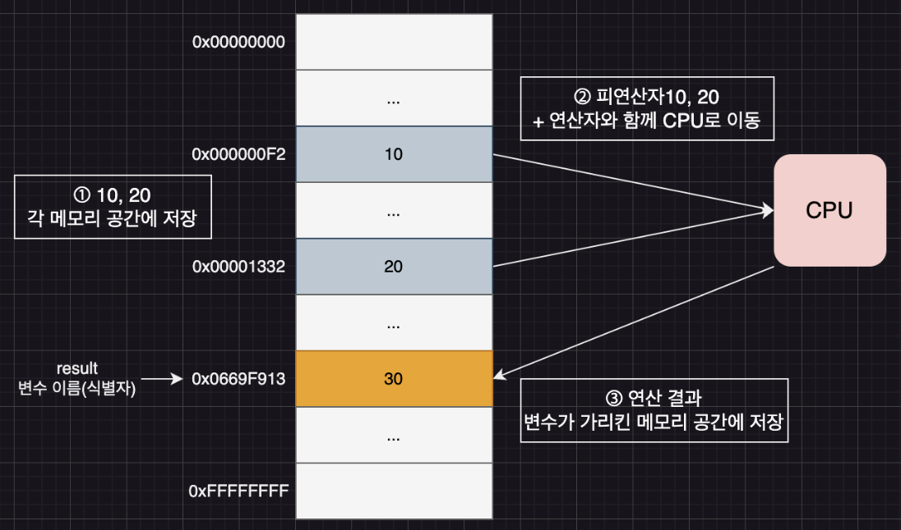
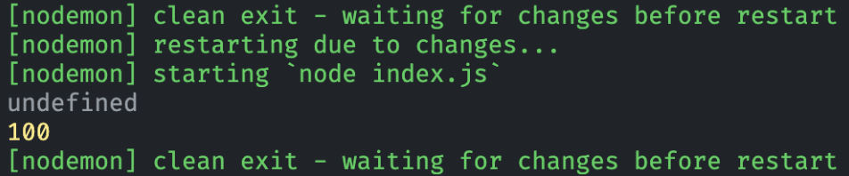
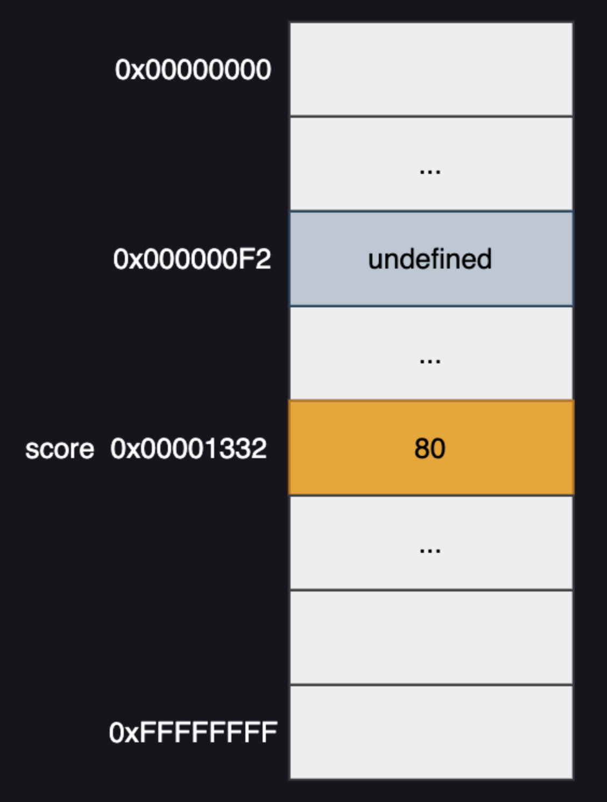
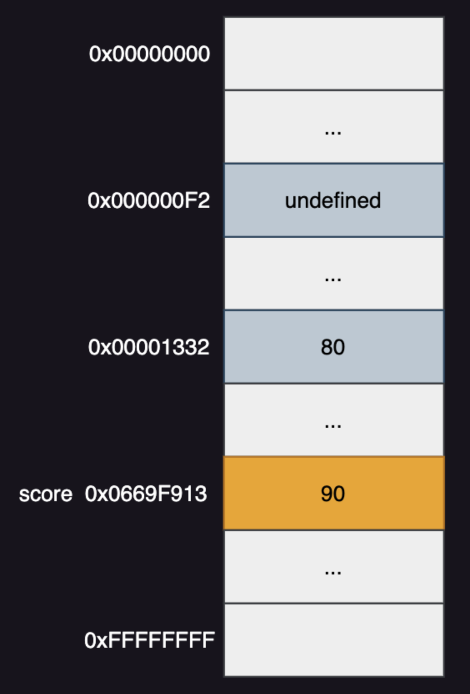
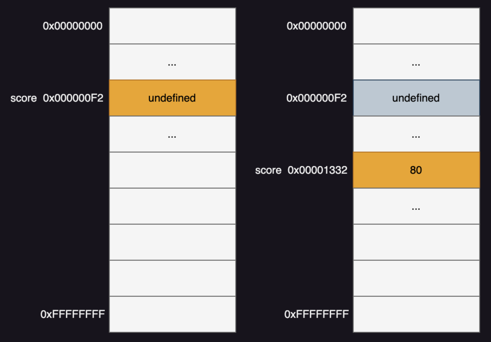
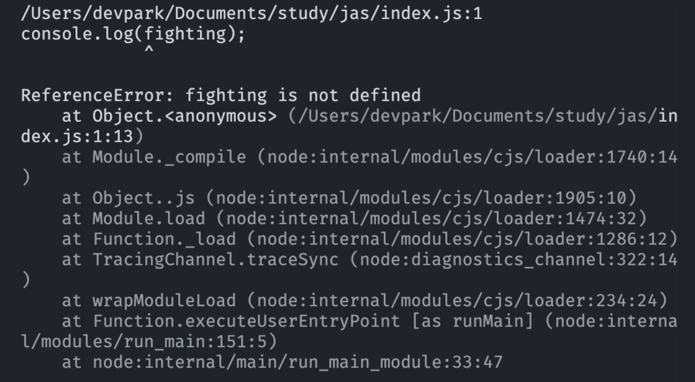

# Modern JavaScript - 4장. 변수

### 변수(Variable)

- **사용 가능한 메모리 공간의 주소를 참조해서 이를 식별할 수 있는 수**
- **메모리 주소를 직접적으로 참조하는 행위는 위험함.** 자바스크립트를 해석하고 실행하는 엔진이 탑재된 애플리케이션뿐만 아니라 운영체제, 시스템 프로그램, 타 응용 프로그램을 실행하기 위해 사용 중인 메모리 공간이 있으므로 우리가 직접 접근하는 행위는 위험하다.
- 변수를 가지고 사용 가능한 메모리 주소를 참조하여 안전하게 값을 이용할 수 있다.

### 표현식 해석 방법

```javascript
10 + 20;
```

1. 자바스크립트 엔진이 위 표현식을 10, 20, + 로 분리
2. 10, 20, + 각각의 의미와, 10 + 20 의 의미 해석
3. 10, 20을 사용 가능한 메모리 셀에 저장
4. CPU가 메모리 셀에 저장되어 있던 10, 20을 인출하여 + 연산을 수행
5. 수행 결과를 사용 가능한 메모리 셀에 저장

### 변수와 메모리

- 메모리란 데이터를 저장할 수 있는 메모리 셀의 집합체
- 메모리 셀 하나의 크기는 1바이트(8비트)
- 컴퓨터는 메모리 셀의 크기, 즉 1바이트 단위로 데이터를 저장하거나 읽어 들인다.

### 값 생성 및 변수 할당 과정

```javascript
var result = 10 + 20;
```

<div align="center">
	
</div>

### 식별자(Identifier)

- 어떤 값을 구별해서 식별할 수 있는 고유한 이름
- 값은 메모리 공간에 2진수로 저장, 식별자는 값이 아닌 해당 메모리 공간의 주소를 기억(저장)

### 값 할당(Assignment)

- 선언된 변수에 값을 저장하는 행위
- 변수 선언은 소스코드 분석 시점에서 진행
- 값 할당은 소스코드가 순차적으로 실행되는 시점인 런타임에서 진행

  ```javascript
  console.log(score);

  var score;
  score = 100;

  console.log(score);
  ```

<div align="center">
	
</div>

### 값 재할당

- 말 그대로 선언된 변수에 값을 재할당 가능
- const 키워드로 선언된 변수는 재할당 불가능

### 변수 선언 • 할당 • 재할당 메모리 그림

**변수 선언**

<div align="center">
	
</div>

**변수 할당**

<div align="center">
	
</div>

**변수 재할당**

<div align="center">
	
</div>

### 변수 선언

- 변수를 생성하는 행위
- 값을 저장하기 위한 메모리 공간을 확보하고 변수 이름과 확보된 메모리 공간의 주소를 연결해서 값을 저장할 수 있게 준비하는 것
- 변수를 사용하려면 반드시 선언이 필요하다. 변수 선언을 위한 키워드는 var, let, const가 있다.

### 변수 초기화

- 초기화(Initialization): 변수가 선언된 이후 값을 할당
- 타 언어에서는 변수 선언만 하면 해당 변수에 쓰레기값이 저장되어 있음
- 그러나 자바스크립트는 변수 선언만 한다면 **undefined**로 초기화

### 변수 선언 후 할당 === 변수 초기화문(in 자바스크립트)

- var, let, const 모두 타 프로그래밍 언어처럼 선언 및 초기화 작업이 없음
- 항상 변수를 선언하면 undefined로 초기화. 그 다음에 다른 공간에 값을 할당

  ```javascript
  var score = 80;
  ```

<div align="center">
	
</div>

- 참조되지 않는 메모리 공간은 가비지 콜렉터(Garbage Collector, GC)에 의해 해제

### 변수 호이스팅(var 키워드)

- 변수 선언문이 코드의 선두로 끌어 올려진 것처럼 동작하는 자바스크립트 엔진 고유 특징
- 자바스크립트 엔진은 소스코드 분석 -> 소스코드 실행 순으로 진행(⎡모던 자바스크립트 Deep Dive⎦교재에서 소스코드 분석을 소스코드 평가라 부름)
- 소스코드 분석 시, 모든 선언문을 소스코드에서 찾아내 먼저 실행
- 소스코드 분석이 끝나면 모든 선언문을 제외하고 소스코드를 한 줄씩 순차적으로 실행

### 호이스팅 예시

- 선언하지 않은 변수를 사용하면 ReferenceError 에러 메시지 발생

  ```javascript
  console.log(fighting); // ReferenceError: fighting is not defined
  fighting = 2025;
  ```

<div align="center">
	
</div>

- 변수 사용을 우선 하고 변수 선언을 나중에 했을 땐 아래 예시에 대한 결과로 undefined가 나옴

      ```javascript
      console.log(fighting);
      var fighting = 2025;
      ```

<div align="center">
	
</div>

### 식별자 네이밍 규칙

- 특수문자를 제외한 문자, 숫자, 언더스코어(\_), 달러 기호($) 가능
- 숫자로 시작하는 건 불가능
- 예약어(=키워드)로 지정된 이름 식별자 불가능(아래 표에서 ✅ 표시된 예약어는 식별자로 사용 가능하지만 strict mode에서 불가능)

| await        | break     | case          | catch  | class      | const      |
| ------------ | --------- | ------------- | ------ | ---------- | ---------- |
| continue     | debugger  | default       | delete | do         | else       |
| enum         | export    | extends       | false  | finally    | for        |
| function     | if        | implements ✅ | import | in         | instanseof |
| interface ✅ | let ✅    | new           | null   | package ✅ | private ✅ |
| protected ✅ | public ✅ | return        | super  | static ✅  | switch     |
| this         | throw     | true          | try    | typeof     | var        |
| void         | while     | with          | yield  |            |            |

### 식별자 특징과 주의점

- 대소문자 구분 가능
- 변수의 의미 명확히 작성
- 유니코드 허용 ✅ 권장 ❌
- 예시

  ```javascript
  var first-name;   // SyntaxError: Unexprected token -
  var 1st;          // SyntaxError: Invalid or unexprected token
  var this;         // SyntaxError: Unexpected token this

  var x = 3;        // KO. x 변수의 의미 모름
  var score = 100;  // OK. score 변수는 점수를 의미
  ```

### 네이밍 컨벤션

- ECMAScript 사양에 정의되어 있는 객체 및 함수들은 카멜 케이스와 파스칼 케이스를 사용
- 아래는 4가지 주요 네이밍 컨벤션을 소개

  ```javascript
  // 카멜 케이스(camelCase)
  var firstName;

  // 스네이크 케이스(snake_case)
  var first_name;

  // 파스칼 케이스(PascalCase)
  var FirstName;

  // 헝가리언 케이스(typeHungarianCase)
  var strFirstName;
  var $elem = document.getElementById("myId"); // DOM 노드
  var observable$ = fromEvent(document, "click"); // RxJS 옵저버블
  ```

---

**참고 자료**

- 모던 자바스크립트 딥 다이브 4장
