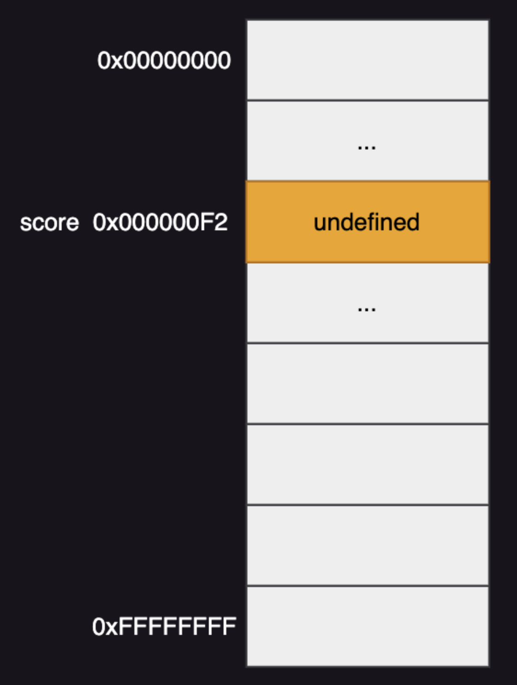
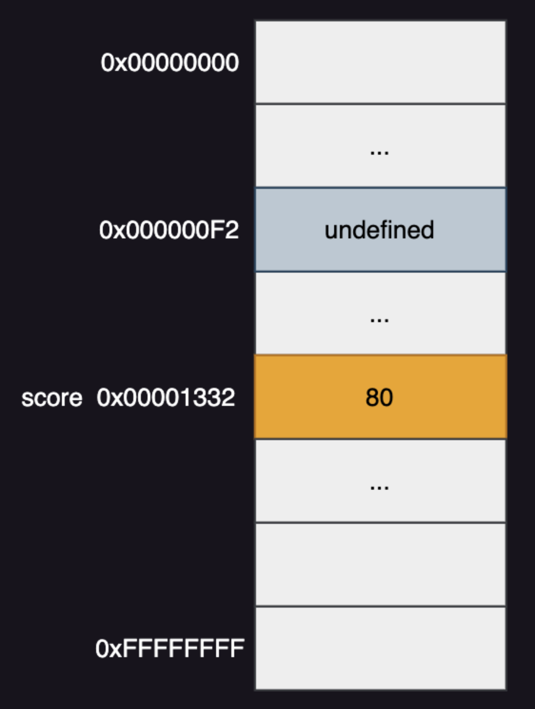
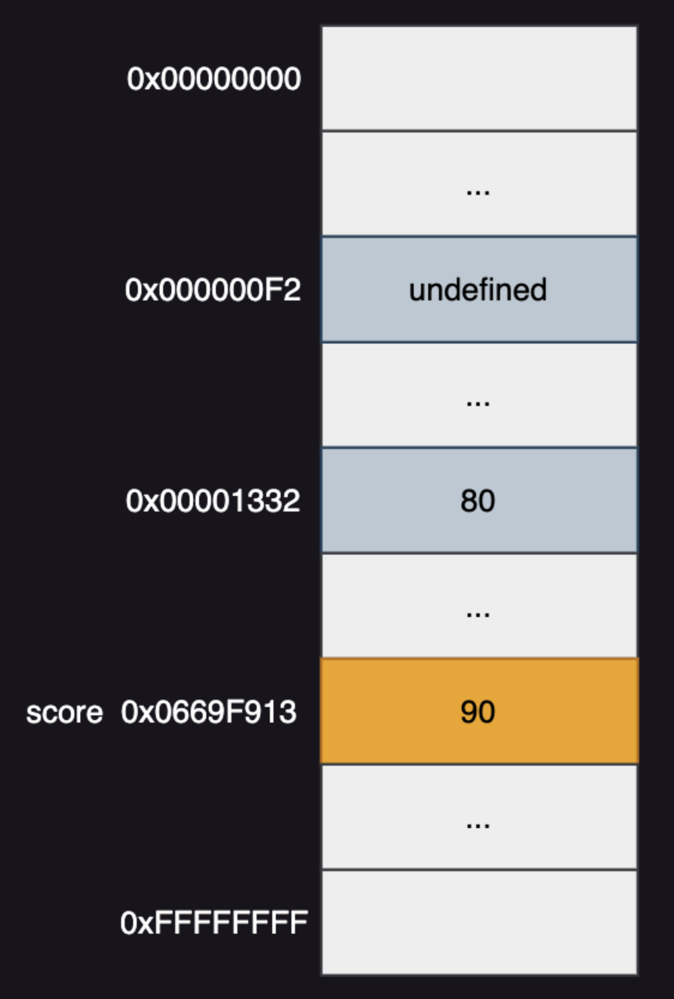
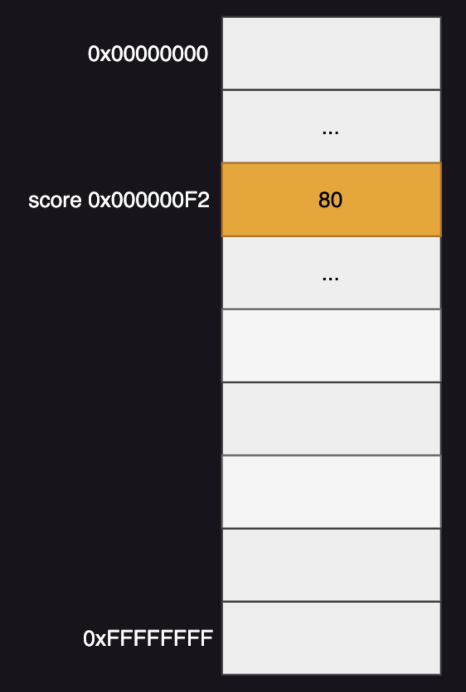
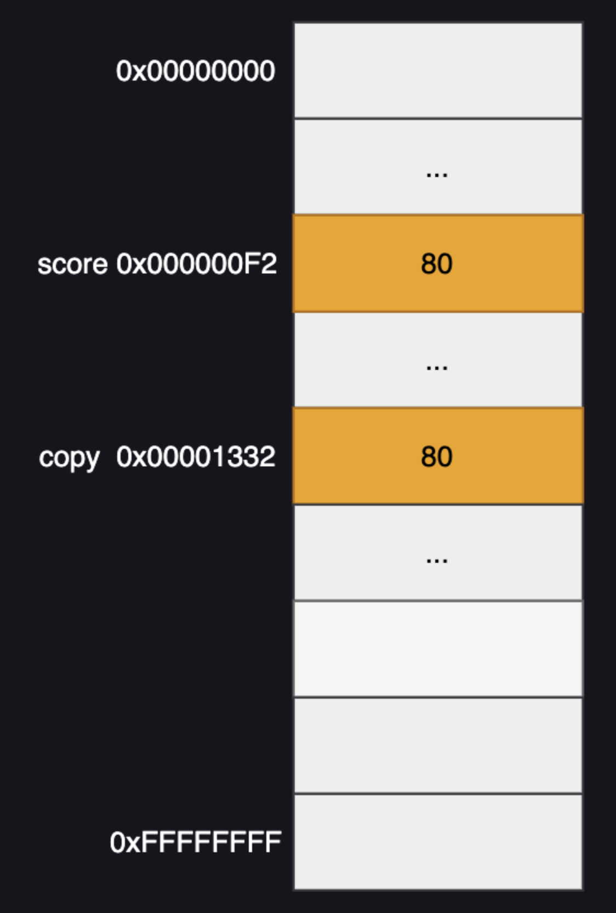
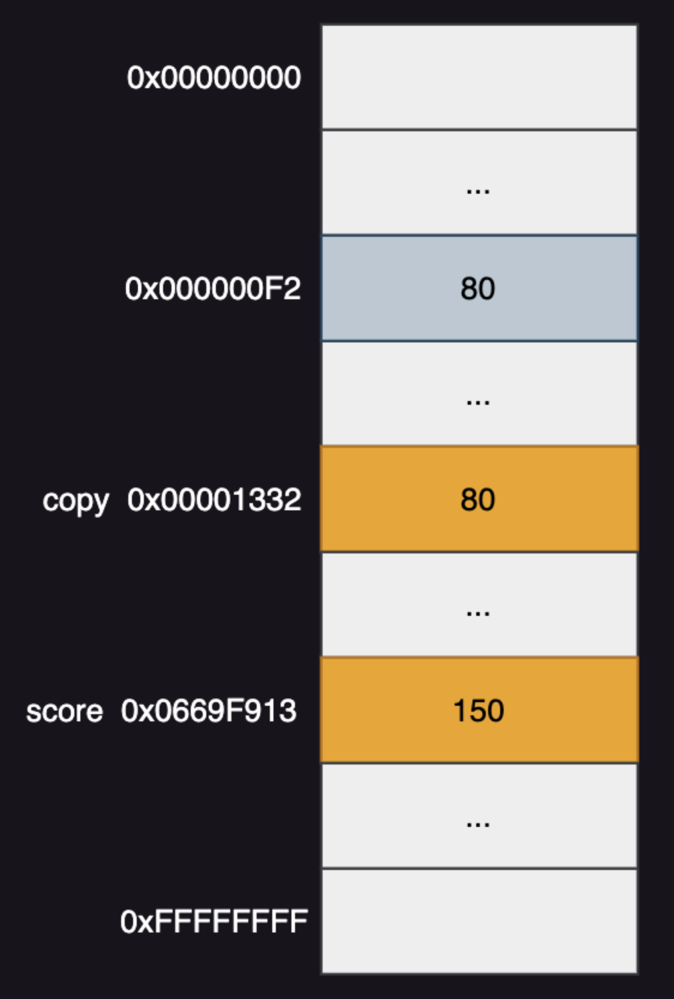
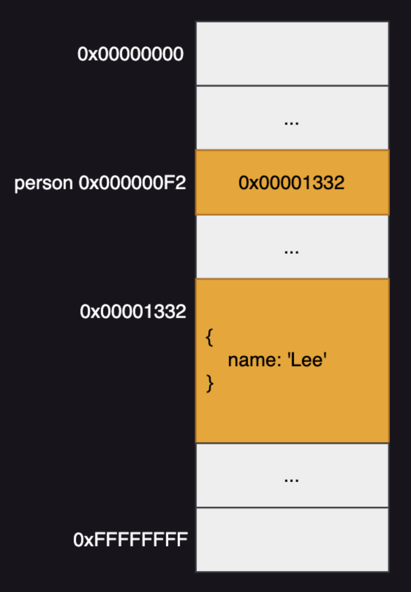
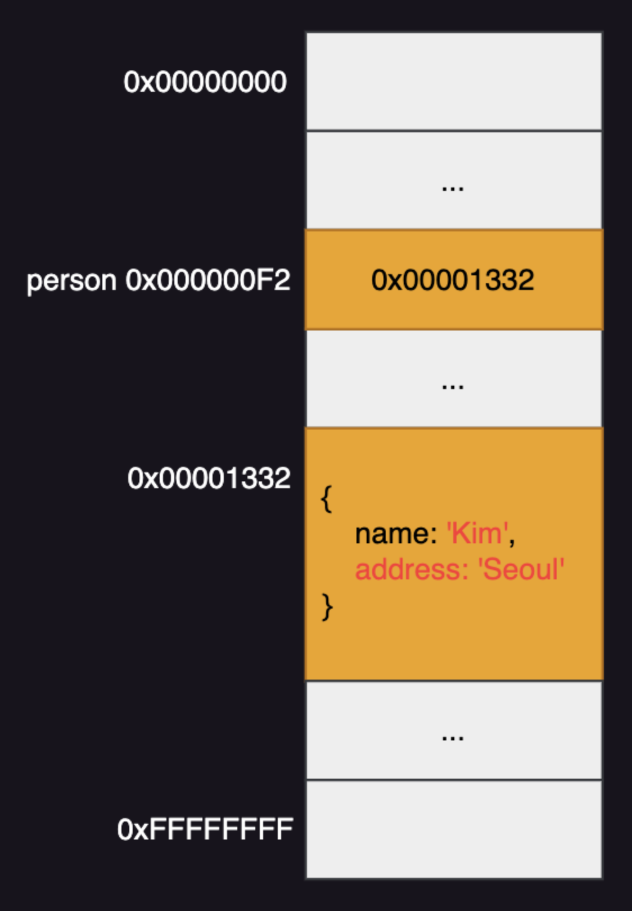
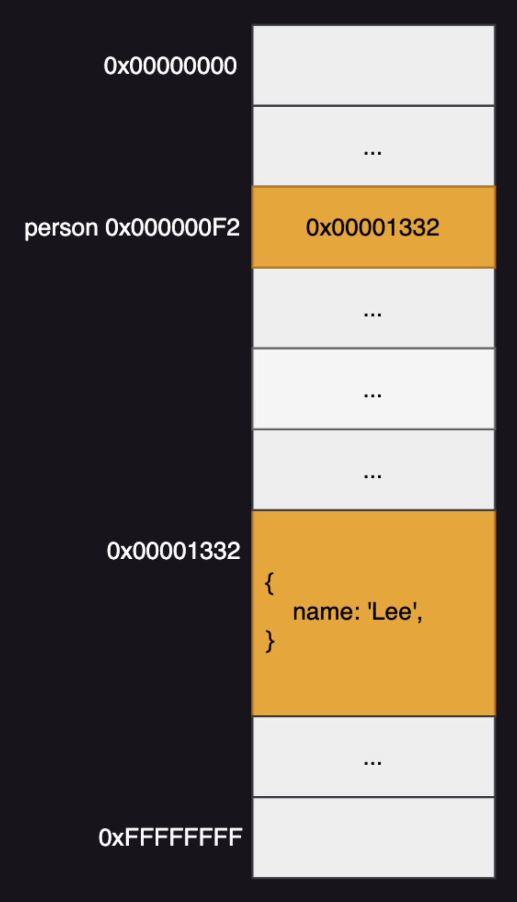
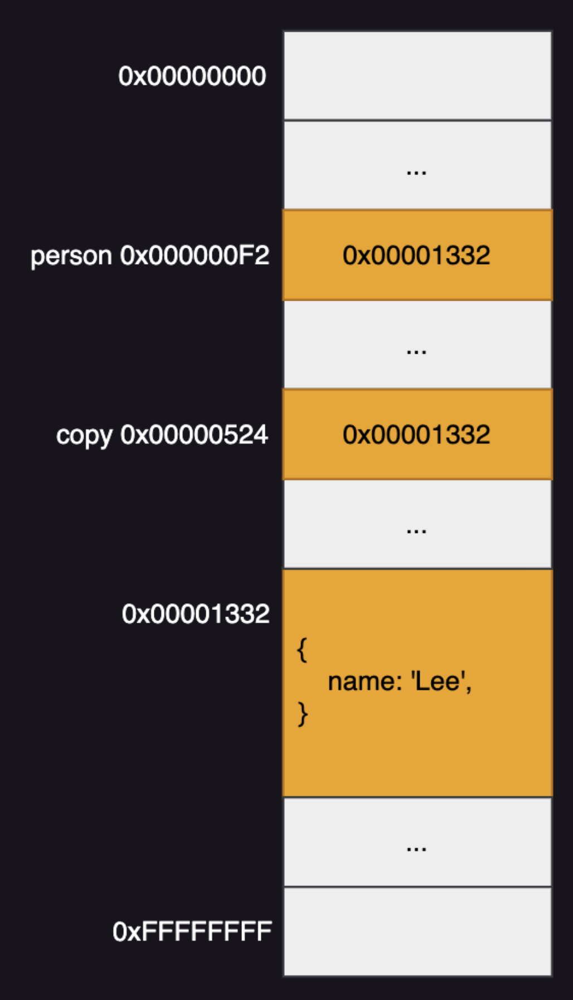

# Modern JavaScript - 11장. 원시 값과 객체의 비교

### 원시 타입 VS 객체 타입

**원시 타입**

- 원시 값(변경 불가능한 값)을 가리키는 변수 타입
- 원시 값을 갖는 변수를 다른 변수에 할당하면 원시 값이 복사 되어 전달(값에 의한 전달 pass by value)

**객체 타입**

- 변경 가능한 값
- 즉, 객체에 대한 참조값을 가리키고 객체 참조로 객체에 등록된 값을 변경할 수 있는 변수 타입
- 객체를 가리키는 변수를 다른 변수에 할당하면 원본의 참조 값이 복사 되어 전달(참조에 의한 전달 pass by reference)
- 자바스크립트의 객체 관리 방식
  - 해시 테이블과 유사하면서 해당 자료구조보다 성능이 뛰어난 자료구조로 객체 관리
  - 자바, C++과 같은 클래스 기반 객체지향 프로그래밍 언어는 사전에 정의된 클래스를 기반으로 객체를 생성
  - 자바스크립트는 클래스 없이 객체 생성 가능, 객체가 생성된 이후에도 프로퍼티 및 메서드 추가 가능, 이러한 동작은 사용성에서 좋지만 성능은 클래스 기반 객체지향 언어보다 떨어짐

### 원시 타입 변수 선언 • 원시 값 할당 • 재할당

**변수 선언**

```javascript
var score;
```

<div align="center">
	
</div>

**원시 값 할당**

```javascript
score = 80;
```

<div align="center">
	
</div>

**원시 값 재할당**

```javascript
score = 90;
```

<div align="center">
	
</div>

### 값에 의한 전달(pass by value)

- 자바스크립트는 한 변수가 다른 변수의 값에 의한 전달을 받을 때 다른 변수의 메모리 주소에 접근해서 그 주소에 저장된 값을 전달받는다.

**변수 score 선언 및 할당**

```javascript
var score = 80;
```

<div align="center">
	
</div>

모던 자바스크립트 4장의 '변수 선언 및 초기화'에 나타난 메모리 저장 방식의 단계를 생략하였다. 선언 및 초기화 작업은 변수가 가리키는 메모리 셀에 값을 바로 저장하지 않는 점을 명심하자.

**변수 copy 선언 후 복사**

```javascript
var copy = score;
```

<div align="center">
	
</div>

**변수 score 값 재할당**

```javascript
score = 150;
```

<div align="center">
	
</div>

### 객체 타입 변수 선언과 프로퍼티 생성

**변수 선언**

```javascript
var person = {
  name: "Lee",
};

console.log(person); // {name: "Lee"}
```

<div align="center">
	
</div>

**프로퍼티 생성**

```javascript
var person = {
  name: "Lee",
};
person.name = "Kim";
person.address = "Seoul";
console.log(person); // {name: "Kim", address: "Seoul"}
```

<div align="center">
	
</div>

### 참조에 의한 전달(pass by reference)

- 객체를 가리키는 변수를 다른 변수에 할당하면 원본의 참조 값이 복사되어 전달

```javascript
var person = {
  name: "Lee",
};
```

<div align="center">
	
</div>

```javascript
var copy = person;
```

<div align="center">
	
</div>

- 둘이 같은 참조값을 가지고 있기 때문에 한 쪽에서 프로퍼티 조작을 한다면 서로 영향을 받음

```javascript
var person = {
  name: "Lee",
};
var copy = person;
console.log(copy === person);

copy.name = "Kim";
person.address = "Seoul";

// copy와 person은 동일한 객체를 가리킴
console.log(copy); // {name: "Kim", address: "Seoul"}
console.log(person); // {name: "Kim", address: "Seoul"}
```

### 값에 의한 전달 vs 참조에 의한 전달

- 값을 전달하는 지, 실제 객체 정보가 저장된 메모리 주소 참조를 전달하는 지에 따라 pass by value, pass by reference라 부름
- 그러나 이 둘은 다른 변수의 저장된 값을 전달한다는 점이 같기 때문에 **값에 의한 전달**로 통일해서 부르기도 한다.

### 얕은 복사(shallow copy)

- 객체를 할당한 변수가 다른 변수에 할당하는 것

```javascript
const obj = { pro: "perty" };
const obj2 = obj;
console.log(obj === obj2); // true
```

- 혹은 객체를 프로퍼티 값으로 가지고 있는 객체 정보를 한 단계까지만 복사하는 것을 의미한다.

### 깊은 복사(deep copy)

- 원시값을 할당한 변수가 다른 변수에 할당하는 것

```javascript
const ori = "gin";
const copy = ori;
console.log(ori === copy); // true
```

- 혹은 중첩 객체를 포함한 객체 정보를 다른 변수에 복사할 때 중첩 객체 정보도 복사하는 것을 의미한다.
- 깊은 복사를 원하면 lodash 라이브러리의 cloneDeep() 메서드를 사용한다.

```javascript
const o = { x: { y: 1 } };

// 얕은 복사
const c1 = { ...o };
console.log(c1 === o); // false
console.log(c1.x === o.x); // true

// lodash의 cloneDeep을 사용한 깊은 복사
// "npm install lodash"로 lodash 설치한 후, Node.js 환경에서 실행
const _ = require("lodash");
// 깊은 복사
const c2 = _.cloneDeep(o);
console.log(c2 === o); // false
console.log(c2.x === o.x); // false
```
