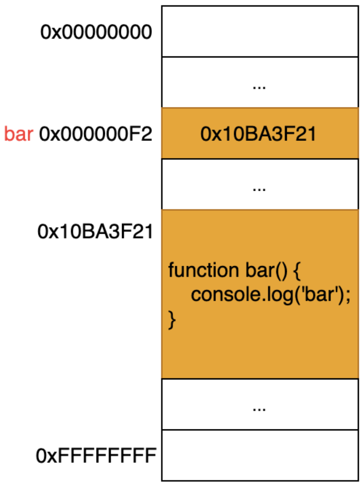
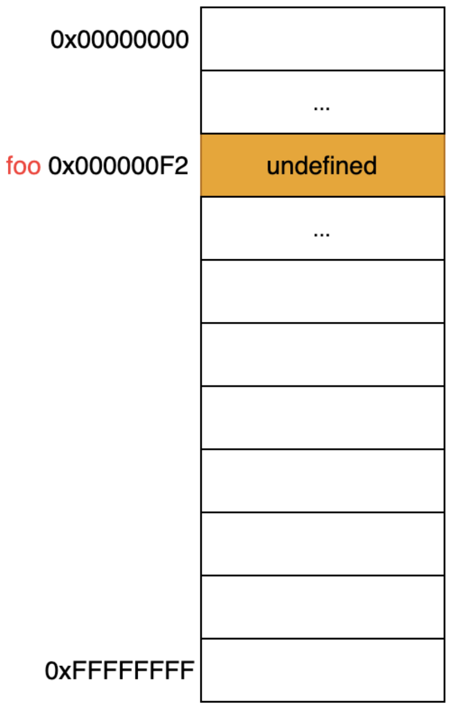
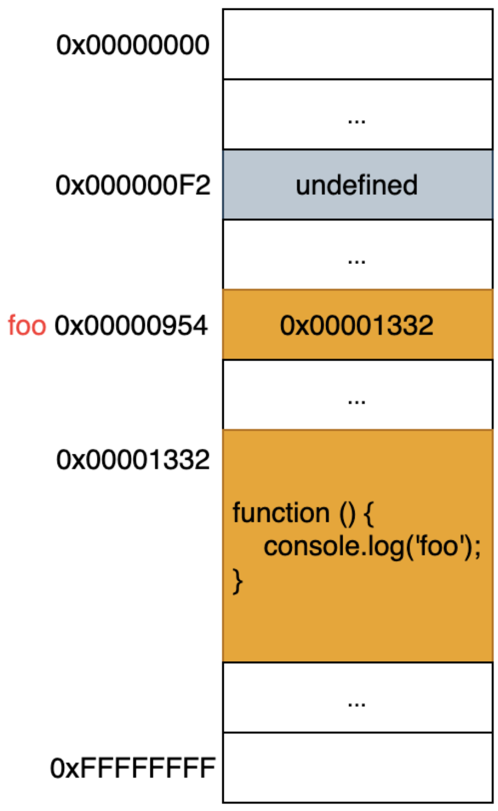

# Modern JavaScript - 12장. 함수

### 함수

- 객체 타입 중 하나
- 입력을 받아 일련의 과정을 거쳐 출력을 반환
- 코드 중복 억제, 재사용성 향상, 유지보수 편의성 -> 신뢰성 증가, 코드 가독성 증가
- 자바스크립트 언어를 비롯한 모든 프로그래밍 언어의 함수는 일련의 과정을 문(statement)으로 구현하고 코드 블록으로 감싸서 하나의 실행 단위로 정의한 것이다.

```javascript
// 함수 정의
function add(x, y) {
  // 함수 이름, 매개변수
  return x + y; // 반환문, return 키워드 다음 부분 -> 반환값
}

// 함수 호출
add(2, 5); // 인수
```

- 자바스크립트에서는 함수 선언문이 평가되면 식별자가 암묵적으로 생성되고 함수 객체가 할당된다.
- 따라서 ECMAScript 사양에서도 변수에는 선언, 함수에는 정의라 표현한다.

### 함수 정의 방법

| 함수 정의 방식       | 예시                                                |
| -------------------- | --------------------------------------------------- |
| 함수 선언문          | function add(x, y) {<br> return x + y;<br>}         |
| 함수 표현식          | var add = function (x, y) {<br> return x + y;<br>}; |
| Function 생성자 함수 | var add = new Function('x', 'y', 'return x + y');   |
| 화살표 함수(ES6)     | var add = (x, y) => x + y;                          |

**함수 선언문**

- 함수 이름 생략 ❌
- 표현식이 아닌 문
- 크롬 개발자 도구 콘솔에서 undefined 출력
- 함수 선언문이 함수 선언문 이름을 식별자로 암묵적 생성
- 함수 호이스팅 발생
- 암묵적으로 식별자가 생성돼서 선언 이전 코드에서 함수 호출 시 그 함수가 실행된다.

**함수 표현식**

- 값으로 평가될 수 있는 표현식인 문
- 함수 리터럴로 생성한 함수 객체를 변수에 할당 가능
- 함수 호이스팅 적용 ❌, 변수 호이스팅 ⭕️
- 함수가 호출되기 전에 반드시 함수를 선언해야 하는 규칙을 보장
- JSON 창시자 더글라스 크락포드가 함수 선언문 대신 함수 표현식을 쓸 것을 권장

```javascript
// 함수 참조
console.dir(add);
console.dir(sub);

// 함수 호출
console.log(add(2, 5));
console.log(sub(2, 5));

// 함수 선언문
function add(x, y) {
  return x + y;
}

// 함수 표현식
var sub = function (x, y) {
  return x - y;
};
```

**Function 생성자 함수**

**화살표 함수**

### 메모리에서 함수 선언문 vs 함수 표현식

**함수 선언문**

<div align="center">
	
</div>

**함수 표현식**

1. 실행 전

<div align="center">
	
</div>

2. 실행 후

<div align="center">
	
</div>

### 함수 호출

- 보통 정의된 함수의 매개변수 개수와 일치하도록 값을 입력하여 함수 호출
- 매개변수 개수보다 적게 입력하면 할당되지 않은 매개변수 값은 undefined
- 매개변수 개수보다 많이 입력하면 뒤에 입력한 인수 무시
- 매개변수 스코프는 함수 내부

```javascript
function add(x, y) {
  console.log(x, y);
  return x + y;
}

console.log(add(2, 5)); // 7
console.log(add(2)); // NaN
console.log(add(2, 5, 10)); // 7
console.log(x, y); // ReferenceError: ...
```

### 함수 설계 주의 사항

- 함수의 매개변수 최대 개수는 제한 없음. 그러나 함수의 매개변수를 최대 3개 이상으로 설정하는 것을 지양. 사용법을 어렵게 만들고 실수 가능성 증가
- 객체를 받도록 매개변수를 설정한 경우 함수 내부에서 객체 프로퍼티를 조작하는 명령문 작성도 지양
- 반환 대상이 없거나 반환문 자체가 없는 함수 호출 결과는 undefined가 나옴

### 함수 리터럴

- 객체 타입의 값
- function 키워드, 함수 이름, 매개변수 이름, 함수 몸체로 구성된다.

```javascript
var f = function add(x, y) {
  return x + y;
};
```

### 함수 리터럴 구성 요소 설명

1. 함수 이름

- 함수 이름은 함수 몸체 내에서만 참조할 수 있는 식별자다.
- 함수 이름은 생략 가능하다. 생략하면 익명 함수, 생략하지 않으면 기명 함수이다.

2. 매개변수 목록

- 0개 이상의 매개변수를 소괄호로 감싸고 쉼표로 구분
- 각 매개변수에는 함수를 호출할 때 지정한 인수가 순서대로 할당된다. 즉, 매개변수 목록은 순서에 의미가 있다.
- 매개변수는 함수 몸체 내에서 변수와 동일하게 취급된다.

3. 함수 몸체

- 함수가 호출되었을 때 일괄적으로 실행된 문들은 하나의 실행 단위로 정의한 코드 블록이다.
- 함수 몸체는 함수 호출에 의해 실행된다.

### 다양한 함수의 형태

1. 즉시 실행 함수(IIFE, Immediately Invoked Function Expression)

- 함수 정의와 동시에 즉시 호출되는 함수
- 단 한 번만 호출되며 다시 호출 불가능
- 익명 함수 사용이 일반적. 기명 함수 사용도 가능
- 그룹 연산자 내의 기명 함수는 함수 선언문이 아니라 함수 리터럴로 평가되며 함수 이름은 함수 몸체에서만 참조할 수 있는 식별자이므로 즉시 실행 함수를 다시 호출할 수 없음

```javascript
// 익명 함수
(function () {
  var a = 3;
  var b = 5;
  return a * b;
})();

// 기명 함수. 함수 선언문이 아닌 함수 리터럴로 평가된다.
(function foo() {
  var a = 3;
  var b = 5;
  return a * b;
})();

foo(); // ReferenceError: foo is not defined
```

- 일반 함수처럼 값 반환 가능, 인수 전달 가능

```javascript
var res = (function () {
  var a = 3;
  var b = 5;
  return a * b;
})();

console.log(res); // 15

res = (function (a, b) {
  return a * b;
})(3, 5);

console.log(res); // 15
```

2. 재귀 함수(recursive function)

- 자기 자신을 호출하는 함수
- 탈출 조건을 반드시 만들어야 재귀 함수를 무한으로 호출하지 않음
- 탈출 조건이 없으면 스택 오버플로(stack overflow) 에러 발생
- 함수 표현식으로 정의한 함수 내부에서는 함수 이름을 물론 함수를 가리키는 식별자로도 자기 자신을 재귀 호출
- 단, 함수 외부에서 함수를 호출할 때 반드시 함수를 가리키는 식별자로 해야 함

```javascript
var factorial = function foo(n) {
  // 탈출 조건: n이 1 이하일 때 재귀 호출을 멈춤
  if (n <= 1) return 1;
  // 함수를 가리키는 식별자로 자기 자신을 재귀 호출
  return n * factorial(n - 1);

  // 함수 이름으로 자기 자신을 재귀 호출 가능
  // console.log(factorial === foo);  // true
  // return n * foo(n - 1);
};

console.log(factorial(5)); // 5! = 5 * 4 * 3 * 2 * 1 = 120
```

3. 중첩 함수(nested function)

- 함수 내부에 정의된 함수
- 내부 함수(inner function)라고도 부름
- 일반적으로 중첩 함수는 자신을 포함하는 외부 함수를 돕는 헬퍼 함수의 역할을 함

```javascript
function outer() {
  var x = 1;

  // 중첩 함수
  function inner() {
    var y = 2;
    // 외부 함수의 변수를 참조
    console.log(x + y);
  }

  inner();
}

outer();
```

4. 순수 함수

- 어떤 외부 상태에 의존하지도 않고 변경하지도 않는 함수
- 부수 효과가 없는 함수

```javascript
var count = 0; // 현재 카운트를 나타내는 상태

// 순수 함수 increase는 동일한 인수가 전달되면 언제나 동일한 값을 반환
function increase() {
  return ++count;
}

// 순수 함수가 반환한 결과값을 변수에 재할당해서 상태를 변경
count = increase(count);
console.log(count); // 1

count = increase(count);
console.log(count); // 2
```

5. 비순수 함수

- 외부 상태에 의존하거나 외부 상태를 변경하는 함수
- 부수 효과가 존재하는 함수

```javascript
var count = 0; // 현재 카운트를 나타내는 상태: increase 함수에 의해 변화

// 비순수 함수
function increase() {
  return ++count; // 외부 상태에 의존하며 외부 상태를 변경
}

// 비순수 함수는 외부 상태(count)를 변경하므로 상태 변화를 추적하기 어려움
increase();
console.log(count); // 1

increase();
console.log(count); // 2
```

6. 콜백 함수(callback function)

### 콜백 함수

- 함수의 매개변수를 통해 다른 함수의 내부로 전달되는 함수
- 이 때, 매개변수를 통해 함수의 외부에서 콜백 함수를 전달받은 함수를 고차 함수(Higher-Order Function, HOF)라고 부름

### 콜백 함수 예시

- 현재 repeat() 함수는 console.log()에 강하게 의존하고 있어 다른 일을 할 수 없음
- 따라서 repeat 함수의 반복문 내부에서 다른 일을 하고 싶다면 함수를 새롭게 정의해야만 함

```javascript
function repeat1(n) {
  for (var i = 0; i < n; i++) console.log(i);
}

repeat1(5); // 0 1 2 3 4

function repeat2(n) {
  for (var i = 0; i < n; i++) {
    if (i % 2) console.log(i);
  }
}

repeat2(5); // 1 3
```

- 매번 새롭게 정의된 함수를 찍어내면서 각 함수 간의 불필요한 중복을 발생함
- 함수의 변하지 않는 공통 로직은 미리 정의해 두고, 경우에 따라 변경되는 로직은 추상화해서 함수 외부에서 함수 내부로 전달한다.

```javascript
// 외부에서 전달받은 f를 n만큼 반복 호출
function repeat(n, f) {
	for (var i = 0; i < n; i++) {
		f(i);  // i를 전달하면서 f를 호출
	}
}

var logAll = ;

repeat(5, function (i) {
	console.log(i);
});

var logOdds = function (i) {
	if (i % 2) console.log(i);
};

repeat(5, logOdds);
```

- 위 repeat 함수는 경우에 따라 변경되는 일을 함수 f로 추상화했고 이를 외부에서 전달받음
- repeat 함수는 더 이상 내부 로직에 강력히 의존하지 않고 외부에서 로직의 일부분을 함수로 전달받아 수행하므로 더욱 유연해짐

### 고차 함수

- 매개변수를 통해 함수의 외부에서 콜백 함수를 전달받은 함수를 고차함수라 부름
- 함수형 프로그래밍 패러다임에서 매개변수를 통해 함수를 전달받거나 반환값으로 함수를 반환하는 함수도 고차함수라 부른다.
- 즉, 고차 함수는 콜백 함수를 자신의 일부분으로 합성한다.
- 고차 함수는 매개변수를 통해 전달받은 콜백 함수의 호출 시점을 결정해서 호출한다. 다시 말해, 콜백 함수는 고차 함수에 의해 호출되며 이때 고차 함수는 필요에 따라 콜백 함수에 인수를 전달할 수 있다.
- 따라서 고차 함수에 콜백 함수를 전달할 때 콜백 함수를 호출하지 않고 함수 자체를 전달해야 한다.

### 콜백 함수의 활용

- 비동기 처리(이벤트 처리, Ajax 통신, 타이머 함수 등)
- 배열 고차 함수
