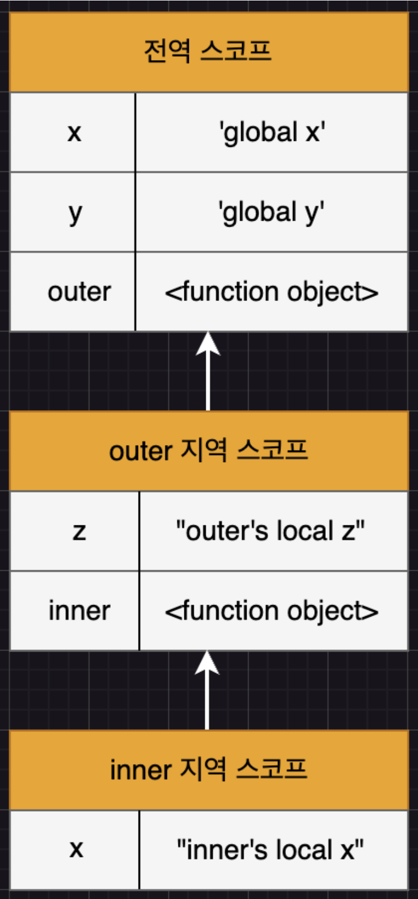

# Modern JavaScript - 13장. 스코프

### 스코프

- 모든 식별자(변수 이름, 함수 이름, 클래스 이름 등)는 자신이 선언된 위치에 의해 다른 코드가 식별자 자신을 참조할 수 있는 유효 범위를 가짐
- 즉, 스코프는 식별자가 유효한 범위를 말한다.
- 다른 코드가 특정 식별자를 참조할 때 가장 가까운 구간을 선택하기 위해 스코프를 참고
- 자바스크립트 엔진이 식별자를 검색할 때 사용하는 규칙

### 스코프 종류

### 스코프 종류

```javascript
var x = "global x";
var y = "global y";

function outer() {
	var z = "outer's local z";

	console.log(x);  // "global x"
	console.log(y);  // "global y"
	console.log(z);  // "outer's local z"
	
	function inner() {
		var x = "inner's local x";
		
		console.log(x);  // "inner's local x"
		console.log(y);  // "global y"
		console.log(z);  // "outer's local z"
	}
	
	inner();
}
outer();

console.log(x);  // "global x"
console.log(z);  // ReferenceError: z is not defined
```

1. 전역 스코프
- 코드의 가장 바깥 영역
- 전역 스코프에 선언된 변수들을 **전역 변수**라 부름

2. 지역 스코프
- 함수 코드 블록 내부 영역
- 지역 스코프 안에 선언된 변수들을 **지역 변수**라 부른다.
- 자신의 지역 스코프와 하위 지역 스코프에서 유효하다.
- 위의 예시에서 outer() 함수와 inner() 함수 영역이 지역 스코프다.

### 스코프 체인

- 함수의 중첩과 함께 스코프도 중첩
- 스코프가 계층적으로 연결되는 것을 스코프 체인이라 부른다.
- 변수를 참조할 때 자바스크립트 엔진은 스코프 체인을 통해 변수를 참조하는 코드의 스코프에서 시작하여 상위 스코프 방향으로 이동하면 선언된 변수를 검색한다.
- 스코프 체인은 물리적인 실체로 존재한다. 자바스크립트 엔진은 코드를 실행하기 전에 렉시컬 환경을 생성한다. 변수 선언이 실행되면 변수 식별자가 이 자료구조에 키로 등록되고, 변수 할당이 일어나면 이 자료구조의 변수 식별자에 해당하는 값을 변경한다. 변수의 검색도 이 자료구조 상에서 이뤄진다.

<div align="center">
	
</div>

### 스코프 종류

1. 함수 레벨 스코프

- 함수 코드 블록에서만 한정된 지역 스코프

2. 블록 레벨 스코프

- 함수와 더불어서 모든 코드 블록 내부(if, for, while, try/catch 등)에서 생성되는 지역 스코프

### var 키워드

- var 키워드로 선언된 변수는 함수 레벨 스코프에 따라 참조가 다름
- 그러나 블록 레벨 스코프를 무시. 어떤 지역 스코프에서 전역 스코프 안에 선언된 변수를 재선언 후 할당을 하면 전역 스코프 변수는 지역 스코프에서 할당 받은 값을 가지게 됨

```javascript
var i = 10;

for (var i=0; i<5; i++) {
	console.log(i);  // 0 1 2 3 4
}

console.log(i); // 5
```

### 렉시컬(Lexical) 환경

- 코드가 어디에서 실행되며 주변에 어떤 코드가 있는 지를 내포하고 있는 환경
- 코드 문맥은 렉시컬 환경으로 이루어지고 이를 구현한 것이 실행 컨텍스트(execution context)

### 렉시컬 스코프

- 정적 스코프
- 함수 정의가 평가되는 시점에 상위 스코프가 정적으로 결정
- 자바스크립트를 비롯한 대부분의 프로그래밍 언어가 채택한 스코프 방식
- 반대 개념으로 동적 스코프가 있음. 함수가 호출되는 시점에 동적으로 상위 스코프를 결정

```javascript
var x = 1;

function foo() {
	var x = 10;
	bar();
}

function bar() {
	console.log(x);
}

foo();  // 1
bar();  // 1
```

- bar() 함수가 정의된 곳은 전역 스코프
- 함수가 어떤 스코프에서 호출되든, bar() 가 정의된 곳은 전역 스코프이기 때문에 전역 스코프의 전역 변수 x의 값을 출력