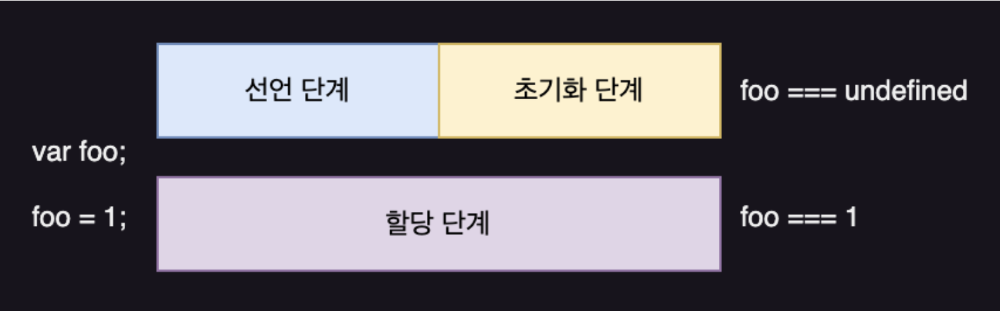
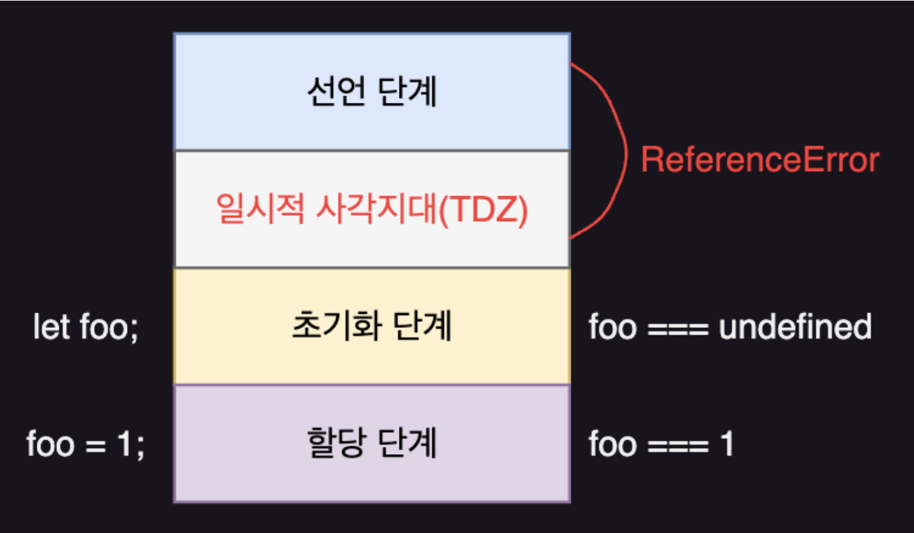

# Modern JavaScript - 15장. let, const 키워드와 블록 레벨 스코프

### var 키워드

1. 변수 중복 선언 허용

   ```javascript
   var x = 1;
   var y = 1;

   var x = 100;
   var y;

   console.log(x); // 100
   console.log(y); // 1
   ```

   - x, y 중복 선언
   - 마지막에 증복 선언된 변수에 할당한 값을 채택
   - 그리고 선언한 변수 중 초기화문을 채택

2. 함수 레벨 스코프

   ```javascript
   function func() {
     var x = 1;
     {
       var y = 2;
       console.log(y);
     }
     console.log(y);
   }
   ```

   - 함수 안에 선언된 변수만 지역 스코프로 인정
   - 블록 레벨 스코프는 무시

3. 변수 호이스팅

   - 자바스크립트 언어는 코드 위에서 선언이 안 된 변수를 접근하더라도 코드 아래에 변수가 선언되어 있다면 호이스팅되는 특성을 가지고 있음
   - 에러를 절대로 발생시키지 않음

### let 키워드

- var 키워드의 문제점 4가지를 해소
  1.  변수 중복 선언 방지
  2.  블록 레벨 스코프 반영
  3.  변수 호이스팅은 여전히 존재하지만 초기화 이전에 변수에 접근하면 ReferenceError 발생
  4.  선언하지 않은 변수에 값을 할당한 암묵적 전역을 방지. 암묵적 전역은 전역 객체 window의 프로퍼티가 됨. let 키워드로 선언한 전역 변수는 전역 객체의 프로퍼티가 아님

```javascript
// var 키워드로 선언된 변수는 런타임 이전에 선언 단계 및 초기화 단계 실행
// 따라서 변수 선언문 이전에 변수 참조
console.log(foo); // undefined

var foo;
console.log(foo); // undefined

foo = 1; // 할당 단계 실행
console.log(foo); // 1
```

<div align="center">
	
</div>

- let 키워드로 선언한 변수는 선언 단계와 초기화 단계 분리되어 진행
- 런타임 이전에 자바스크립트 엔진에 의해 암묵적으로 선언 단계 실행
- 초기화 단계는 변수 선언문에 도달했을 때 실행
- 초기화 단계 이전에 변수에 접근하려고 하면 ReferenceError 발생. let 키워드로 선언한 변수는 스코프의 시작 지점부터 초기화 단계 시작 지점까지 변수 참조 불가능
- 스코프의 시작 지점부터 초기화 단계 시작 지점까지의 구간을 **일시적 사각지대(Temporal Dead Zone, TDZ)** 라고 부름

```javascript
// 런타임 이전에 선언 단계가 실행됨. 아직 변수 초기화 안 됨.
// 초기화 이전의 일시적 사각지대에서는 변수를 참조할 수 없음
console.log(foo); // ReferenceError: foo is not defined

let foo; // 변수 선언문에서 초기화 단계가 실행됨
console.log(foo); // undefined

foo = 1; // 할당 단계 실행
console.log(foo); // 1
```

<div align="center">
	
</div>

- 선언하지 않은 변수에 값을 할당한 암묵적 전역을 방지. let 키워드로 선언한 전역 변수는 전역 객체의 프로퍼티가 아니다.

```javascript
// 해당 예제 브라우저에서 실행해야 함

// 전역 변수
var x = 1;
// 암묵적 전역
y = 2;
// 전역 함수
function foo() {}

// var 키워드로 선언한 전역 변수는 전역 객체 window의 프로퍼티
console.log(window.x);
// 전역 객체 window의 프로퍼티는 전역 변수처럼 사용
console.log(x);

// 암묵적 전역은 전역 객체 window의 프로퍼티
console.log(window.y);
console.log(y);

// 함수 선언문으로 정의한 전역 함수는 전역 객체 window의 프로퍼티
console.log(windiow.foo);
// 전역 객체 window의 프로퍼티는 전역 변수처럼 사용
console.log(foo);
```

### const 키워드

- 상수(재할당이 금지된 변수) 선언을 위해 사용
- 선언과 동시에 초기화 필수

```javascript
const foo = 1;
const bar;      // SyntaxError: Missing initializer in const declaration
```

- let 키워드처럼 호이스팅이 발생하지 않은 것처럼 동작
- 재할당 금지
- const 변수가 객체를 참조한다면 다른 객체 혹은 원시 값으로 재할당은 불가능하지만 객체 내부 조작은 가능
- 즉, const 키워드는 재할당을 금지할 뿐, "불변"을 의미하지 않음

```javascript
const person = {
  name: "Lee",
};

person.name = "Kim";

console.log(person); // {name: "Kim"}
```

### 정리

|       | 재선언 | 재할당 | 초기화 필수 |
| ----- | ------ | ------ | ----------- |
| var   | ✅     | ✅     | ❌          |
| let   | ❌     | ✅     | ❌          |
| const | ❌     | ❌     | ✅          |
