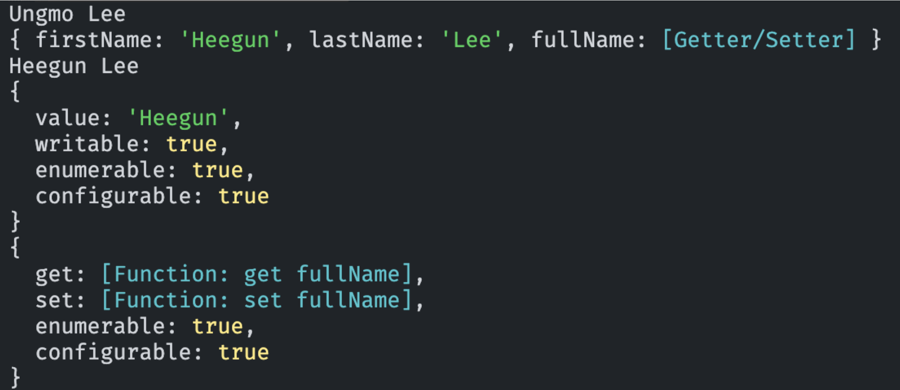

# Modern JavaScript - 16장. 프로퍼티 어트리뷰트

### 내부 슬롯과 내부 메서드

- 자바스크립트 엔진 구현 알고리즘을 설명하기 위한 의사 프로퍼티(pseudo property)와 의사 메서드(pseudo method)
- ECMAScript 사양에서 사용하며 이중 대괄호(\[\[...\]\])로 감싼 이름들이 내부 슬롯과 내부 메서드이다.
- 개발자가 직접 접근하도록 외부로 공개된 객체 프로퍼티가 아니다.
- 단, 아래와 같이 일부 내부 슬롯과 내부 메서드에서 간접적으로 접근할 수 있는 수단을 제공한다.

```javascript
const o = {};

// 내부 슬롯은 자바스크립트 엔진의 내부 로직이므로 직접 접근할 수 없음
// o.[[Prototype]] // -> Uncaught SyntaxError: Unexpected token '['
// 단, 일부 내부 슬롯과 내부 메서드에 한하여 간접적으로 접근할 수 있는 수단을 제공함
o.__proto__; // -> Object.prototype
```

### 프로퍼티 어트리뷰트

- 프로퍼티의 상태를 가리킴
- 자바스크립트 엔진은 프로퍼티를 생성할 때 프로퍼티의 상태를 만들어 냄
- 프로퍼티의 상태 4가지

| 내부 슬롯            | 프로퍼티 설명                          |
| -------------------- | -------------------------------------- |
| \[\[Value\]\]        | 프로퍼티의 값(value)                   |
| \[\[Writable\]\]     | 프로퍼티의 값 갱신 가능 여부(writable) |
| \[\[Enumerable\]\]   | 프로퍼티의 열거 가능 여부(enumerable)  |
| \[\[Configurable\]\] | 재정의 가능 여부(configurable)         |

### 프로퍼티 디스크립터 객체

- 프로퍼티 어트리뷰트의 정보를 담고 있는 객체

```javascript
const person = {
  name: "Lee",
};
console.log(Object.getOwnPropertyDescriptor(person, "name"));
// {value: 'Lee', writable: true, enumerable: true, configurable: true}
```

- Object.getOwnPropertyDescriptor 메서드나 Object.getOwnPropertyDescriptors 메서드를 통해 얻을 수 있음

```javascript
const person = {
  name: "Lee",
};

// 프로퍼티 동적 생성
person.age = 20;

// 모든 프로퍼티의 프로퍼티 어트리뷰트 정보를 제공하는 프로퍼티 디스크립터 객체들 반환
console.log(Object.getOwnPropertyDescriptors(person));
/*
{
	name: {value: "Lee", writable: true, enumerable: true, configurable: true},
	age: {value: 20, writable: true, enumerable: true, configurable: true}
}
*/
```

### 데이터 프로퍼티(data property)

- 키와 값으로 구성된 일반적인 프로퍼티

| 프로퍼티 어트리뷰트  | 프로퍼티 디스크립터 객체의 프로퍼티 | 설명                                                                                                                                                                                                                                                    |
| -------------------- | ----------------------------------- | ------------------------------------------------------------------------------------------------------------------------------------------------------------------------------------------------------------------------------------------------------- |
| \[\[Value\]\]        | value                               | • 프로퍼티 키를 통해 값에 접근하면 반환되는 값.<br>• 값을 변경하면 \[\[Value\]\]에 값을 재할당.<br>• 프로퍼티가 없으면 프로퍼티를 동적 생성하고 생성된 프로퍼티의 \[\[Value\]\]에 값을 저장.                                                            |
| \[\[Writable\]\]     | writable                            | • 프로퍼티의 값의 변경 가능 여부를 나타내며 불리언 값을 가짐.<br>• \[\[Writable\]\]의 값 false -> 읽기 전용 프로퍼티                                                                                                                                    |
| \[\[Enumerable\]\]   | enumerable                          | • 프로퍼티의 열거 가능 여부를 나타내며 불리언 값을 가짐.<br>• \[\[Writable\]\]의 값 false -> 열거 대상이 안 됨                                                                                                                                          |
| \[\[Configurable\]\] | configurable                        | • 프로퍼티의 재정의 가능 여부를 나타내며 불리언 값을 가짐.<br>• \[\[Configurable\]\]의 값 false -> 해당 프로퍼티 삭제, 프로퍼티 어트리뷰트 값 변경 금지. 단, \[\[Writable\]\]이 true인 경우 \[\[Value\]\]의 변경과 \[\[Writable\]\]을 false로 변경 허용 |

### 접근자 프로퍼티(accessor property)

- 자체적으로 값을 갖지 않고 다른 데이터의 프로퍼티 값을 읽거나 저장할 때 호출되는 접근자 함수로 구성된 프로퍼티

| 프로퍼티 어트리뷰트  | 프로퍼티 디스크립터 객체의 프로퍼티 | 설명                                                                                                                                                                                                                           |
| -------------------- | ----------------------------------- | ------------------------------------------------------------------------------------------------------------------------------------------------------------------------------------------------------------------------------ |
| \[\[Get\]\]          | get                                 | • 접근자 프로퍼티를 통해 데이터 프로퍼티의 값을 읽을 때 호출되는 접근자 함수<br>• 접근자 프로퍼티 키로 프로퍼티 값에 접근하면 프로퍼티 어트리뷰트 \[\[Get\]\]의 값, 즉 getter 함수가 호출되고 그 결과 프로퍼티 값으로 반환     |
| \[\[Set\]\]          | set                                 | • 접근자 프로퍼티를 통해 데이터 프로퍼티의 값을 저장할 때 호출되는 접근자 함수<br>• 접근자 프로퍼티 키로 프로퍼티 값을 저장하면 프로퍼티 어트리뷰트 \[\[Set\]\]의 값, 즉 setter 함수가 호출되고 그 결과가 프로퍼티 값으로 저장 |
| \[\[Enumerable\]\]   | enumerable                          | 데이터 프로퍼티와 동일                                                                                                                                                                                                         |
| \[\[Configurable\]\] | configurable                        | 데이터 프로퍼티와 동일                                                                                                                                                                                                         |

- 접근자 함수를 getter/setter 함수라고도 부름

```javascript
const person = {
  // 데이터 프로퍼티
  firstName: "Ungmo",
  lastName: "Lee",

  // fullName은 접근자 함수로 구성된 접근자 프로퍼티
  // getter 함수
  get fullName() {
    return `${this.firstName} ${this.lastName}`;
  },
  // setter 함수
  set fullName(name) {
    [this.firstName, this.lastName] = name.split(" ");
  },
};

// 데이터 프로퍼티를 통한 프로퍼티 값 참조
console.log(person.firstName + " " + person.lastName);

// 접근자 프로퍼티를 통한 프로퍼티 값 저장
person.fullName = "Heegun Lee";
console.log(person); // {firstName: "Heegun", lastName: "Lee"}

// 접근자 프로퍼티를 통한 프로퍼티 값의 참조
// 접근자 프로퍼티 fullName에 접근하면 getter 함수가 호출됨
console.log(person.fullName);

let descriptor = Object.getOwnPropertyDescriptor(person, "firstName");
console.log(descriptor);

descriptor = Object.getOwnPropertyDescriptor(person, "fullName");
console.log(descriptor);
```

<div align="center">
	
</div>

### 접근자 프로퍼티, 데이터 프로퍼티 구별법

- Object.getOwnPropertyDescriptor 메서드가 반환한 프로퍼티 어트리뷰트를 객체로 표현한 프로퍼티 디스크립터 객체를 확인해보면 접근자 프로퍼티, 데이터 프로퍼티 각각의 프로퍼티 디스크립터가 다름

```javascript
// 일반 객체의 __proto__는 접근자 프로퍼티
Object.getOwnPropertyDescriptor(Object.prototype, "__proto__");

// 함수 객체의 prototype은 데이터 프로퍼티
Object.getOwnPropertyDescriptor(function () {}, "prototype");
```

**Enumerable(열거 가능 여부)**

```javascript
const person = {
  name: 'Lee',
  age: 20
};

// 프로퍼티를 열거 불가능하게 설정
Object.defineProperty(person, 'ssn', {
  value: '123-45-6789',
  enumerable: false  // 열거 불가능
});

Object.defineProperty(person, 'address', {
  value: 'Seoul',
  enumerable: true   // 열거 가능
});

console.log(person); // {name: 'Lee', age: 20, address: 'Seoul'}
// ssn은 열거되지 않음!

// for...in 루프
for (const key in person) {
  console.log(key); // name, age, address만 출력 (ssn은 출력 안됨)
}

// Object.keys()
console.log(Object.keys(person)); // ['name', 'age', 'address']

// 하지만 직접 접근은 가능
console.log(person.ssn); // '123-45-6789'
```

- enumerable: false일 때는 Object.keys(), for...in, JSON.stringify() 등에서 제외됩니다.

**Configurable(재정의 가능 여부)**

```javascript
const product = {
  name: 'Laptop'
};

// configurable: false로 설정
Object.defineProperty(product, 'price', {
  value: 1000000,
  writable: true,
  enumerable: true,
  configurable: false  // 재정의 불가능
});

// 값 변경은 가능 (writable이 true이므로)
product.price = 1200000;
console.log(product.price); // 1200000

// 프로퍼티 삭제 시도 - 실패!
delete product.price;
console.log(product.price); // 1200000 (삭제되지 않음)

// 프로퍼티 어트리뷰트 변경 시도 - 에러 발생!
Object.defineProperty(product, 'price', {
  enumerable: false  // TypeError: Cannot redefine property: price
});

// configurable이 false여도 writable을 true -> false 변경은 가능
Object.defineProperty(product, 'price', {
  writable: false  // 이건 가능!
});
```

**접근자 프로퍼티의 Enumerable, Configurable**

```javascript
const person = {
  firstName: 'Ungmo',
  lastName: 'Lee',
  
  // 접근자 프로퍼티 (기본값: enumerable, configurable 모두 true)
  get fullName() {
    return `${this.firstName} ${this.lastName}`;
  },
  set fullName(name) {
    [this.firstName, this.lastName] = name.split(' ');
  }
};

// 접근자 프로퍼티도 열거 가능
console.log(Object.keys(person)); 
// ['firstName', 'lastName', 'fullName']

for (const key in person) {
  console.log(key); // firstName, lastName, fullName 모두 출력
}

// ============================================
// enumerable: false로 설정한 접근자 프로퍼티
// ============================================
const car = {};

Object.defineProperty(car, 'model', {
  value: 'Tesla',
  enumerable: true
});

Object.defineProperty(car, 'year', {
  value: 2024,
  enumerable: true
});

Object.defineProperty(car, 'info', {
  get() {
    return `${this.model} (${this.year})`;
  },
  enumerable: false,  // 열거 불가능
  configurable: true
});

console.log(Object.keys(car)); // ['model', 'year']
console.log(car.info); // 'Tesla (2024)' - 접근은 가능

// ============================================
// configurable: false로 설정한 접근자 프로퍼티
// ============================================
const account = {
  _balance: 1000
};

Object.defineProperty(account, 'balance', {
  get() {
    return this._balance;
  },
  set(value) {
    if (value < 0) {
      throw new Error('잔액은 음수가 될 수 없습니다');
    }
    this._balance = value;
  },
  enumerable: true,
  configurable: false  // 재정의 불가능
});

console.log(account.balance); // 1000
account.balance = 2000;
console.log(account.balance); // 2000

// 삭제 시도 - 실패
delete account.balance;
console.log(account.balance); // 2000 (삭제되지 않음)

// getter/setter 재정의 시도 - 에러 발생
Object.defineProperty(account, 'balance', {
  get() {
    return this._balance * 2;
  }
}); // TypeError: Cannot redefine property: balance
```

**정리 📚**

| 속성 | 값 | 효과 |
|------|-----|------|
| enumerable | true | for...in, Object.keys(), JSON.stringify() 등에 포함 |
| | false | 열거 대상에서 제외 (직접 접근은 가능) |
| configurable | true | 프로퍼티 삭제, 어트리뷰트 변경 가능 |
| | false | 프로퍼티 삭제 불가, 어트리뷰트 변경 불가<br>(단, writable: true → false는 가능) |

- 접근자 프로퍼티도 데이터 프로퍼티와 동일하게 enumerable과 configurable 특성을 가지며, 같은 방식으로 동작
- 주로 내부 구현을 숨기거나 중요한 프로퍼티를 보호할 때 이러한 특성을 활용한다.

### 프로퍼티 어트리뷰트 정의

- 새로운 프로퍼티를 추가하면서 프로퍼티 어트리뷰트를 명시적으로 정의
- Object.defineProperty 메서드로 프로퍼티를 정의할 때 프로퍼티 디스크립터 객체의 프로퍼티를 일부 생략 가능. 그러나 생략할 시, 생략된 프로퍼티에 대해 false 값을 저장

**Object.defineProperty() 메서드 예시**

```javascript
const person = {};

Object.defineProperty(person, 'firstName', {
	value: 'Ungmo',
	writable: true,
	enumerable: true,
	configurable: true
});

Object.defineProperty(person, 'lastName', {
	value: 'Lee'
})

let descriptor = Object.getOwnPropertyDescriptor(person, 'firstName');
console.log('firstName', descriptor);

descriptor = Object.getOwnPropertyDescriptor(person, 'lastName');
console.log('lastName', descriptor);

console.log(Object.keys(person));

person.lastName = 'Kim';

delete person.lastName;

descriptor = Object.getOwnPropertyDescriptor(person, 'lastName');
console.log('lastName', descriptor);

Object.defineProperty(person, 'fullName', {
	//getter 함수
	get() {
		return `${this.firstName} ${this.lastName}`;
	},
	//setter 함수
	set(name) {
		[this.firstName, this.lastName] = name.split(' ');
	},
	enumerable: true,
	configurable: true
});

descriptor = Object.getOwnPropertyDescriptor(person, 'fullName');
console.log('fullName', descriptor);

person.fullName = 'Heegun Lee';
console.log(person);
```

**Object.defineProperties() 메서드 예시**

```javascript
const person = {};

Object.defineProperties(person, {
	// 데이터 프로퍼티 정의
	firstName: {
		value: 'Ungmo',
		writable: true,
		enumerable: true,
		configurable: true
	},
	lastName: {
		value: 'Lee',
		writable: true,
		enumerable: true,
		configurable: true
	},
	fullName: {
		get() {
			return `${this.firstName} ${this.lastName}`;
		},
		set(name) {
			[this.firstName, this.lastName] = name.split(' ');
		}
		enumerable: true,
		configurable: true
	},
});

person.fullName = 'Heegun Lee';
console.log(person);
```

### 객체 변경 방지 메서드 개요

| 구분       | 메서드                      | 프로퍼티 추가 | 프로퍼티 삭제 | 프로퍼티 값 읽기 | 프로퍼티 값 쓰기 | 프로퍼티 어트리뷰트 재정의 |
| -------- | ------------------------ | ------- | ------- | --------- | --------- | -------------- |
| 객체 확장 금지 | Object.preventExtensions | ❌       | ✅       | ✅         | ✅         | ✅              |
| 객체 밀봉    | Object.seal              | ❌       | ❌       | ✅         | ✅         | ❌              |
| 객체 동결    | Object.freeze            | ❌       | ❌       | ✅         | ❌         | ❌              |

### 객체 확장 금지 (Object.preventExtensions)

- 프로퍼티 추가 금지

```javascript
const person = { name: 'Lee' };

console.log(Object.isExtensible(person));

Object.preventExtensions(person);

console.log(Object.isExtensible(person));

person.age = 20;
console.log(person);

delete person.name;
console.log(person);

Object.defineProperty(person, 'age', { value: 20 });
```

### 객체 밀봉 (Object.seal)

- 프로퍼티 읽기, 쓰기만 가능

```javascript
const person = {name: 'Lee'};

console.log(person.isSealed(person));

Object.seal(person);

console.log(Object.isSealed(person));
console.log(Object.getOwnPropertyDescriptors(person));

person.age = 20;
console.log(person);

delete person.name;
console.log(person);

person.name = 'Kim';
console.log(person);

Object.defineProperty(person, 'name', {configurable: true});
```

### 객체 동결 (Object.freeze)

- 프로퍼티 읽기만 가능

```javascript
const person = {name: 'Lee'};

console.log(Object.isFrozen(person));

Object.freeze(person);

console.log(Object.isFrozen(person));

console.log(Object.getOwnPropertyDescriptors(person));

person.age = 20;
console.log(person);

delete person.name;
console.log(person);

person.name = 'Kim';
console.log(person);

Object.defineProperty(person, 'name', {configurable: true});
```

### 불변 객체

- 중첩 객체에도 동결을 부여하고 싶다면 재귀적으로 Object.freeze 메서드 호출

```javascript
function deepFreeze(target) {
	if (target && typeof target === 'object' && !Object.isFrozen(target)) {
		Object.freeze(target);
		Object.keys(target).forEach(key => deepFreeze(target[key]));
	}
	return target;
}

const person = {
	name: 'Lee',
	address: {city: 'Seoul'}
};

deepFreeze(person);

console.log(Object.isFrozen(person));
console.log(Object.isFrozen(person.address));

person.address.city = 'Busan';
console.log(person);
```
