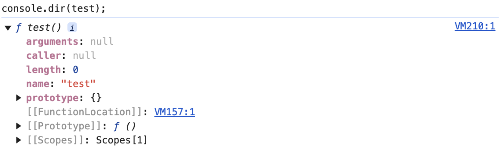
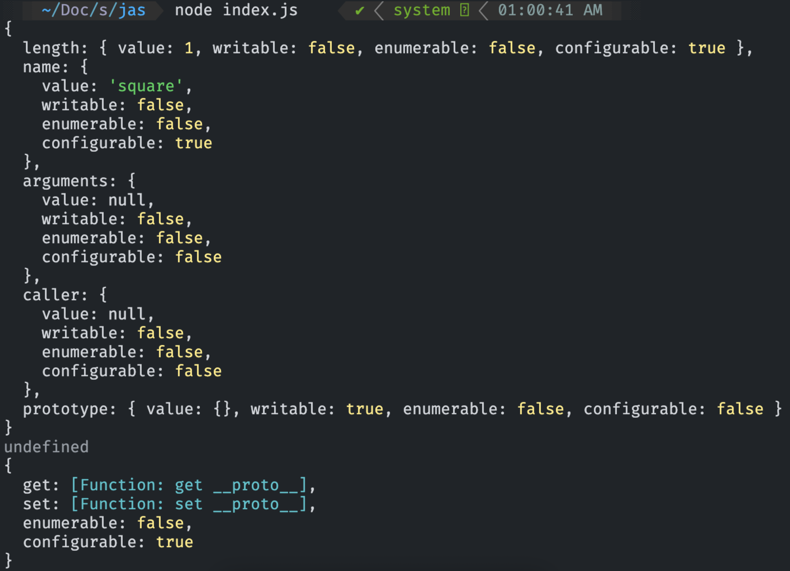
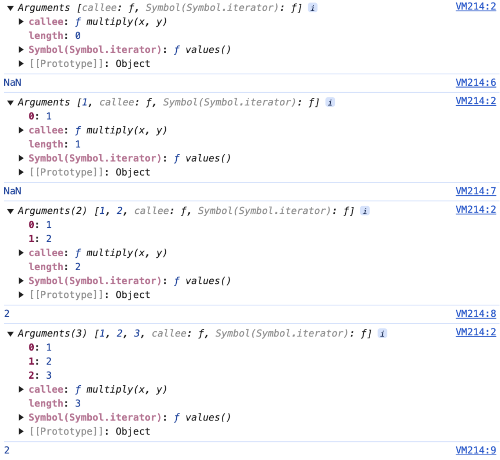

# Modern JavaScript - 18장. 함수와 일급 객체

### 일급 객체

- 일급 객체를 만족하는 조건(4개 중 하나만 충족해도 일급 객체)
  1.  런타임에서 무명의 리터럴로 생성 가능
  2.  변수나 자료구조(객체, 배열 등)에 저장
  3.  함수의 매개변수에 전달
  4.  함수의 반환값으로 사용

```javascript
// 1. 함수는 무명의 리터럴로 생성할 수 있다.
// 2. 함수는 변수에 저장할 수 있다.
// 런타임(할당 단계)에 함수 리터럴이 평가되어 함수 객체가 생성되고 변수에 할당됨
const increase = function (num) {
  return ++num;
};

const decrease = function (num) {
  return --num;
};

// 2. 함수는 객체에 저장할 수 있다.
const auxs = { increase, decrease };

// 3. 함수는 매개변수에게 함수를 전달할 수 있다.
const increaser = makeCounter(auxs.increase);
console.log(increaser()); // 1
console.log(increaser()); // 2

const decreaser = makeCounter(auxs.decrease);
console.log(decreaser()); // -1
console.log(decreaser()); // -2

// 4. 함수의 반환값으로 사용할 수 있다.
function makeCounter(aux) {
  let num = 0;

  return function () {
    num = aux(num);
    return num;
  };
}
```

- 일급 객체로서의 함수는 일급 객체의 4가지 특성을 가지고 함수형 프로그래밍을 할 수 있다.

### 함수 객체의 프로퍼티 개요

- 브라우저 콘솔에서 console.dir 메서드를 사용하여 함수 객체의 내부를 확인할 수 있다.

```javascript
function test() {
  return "check properties";
}

console.dir(test);
```

<div align="center">
	
</div>

- 또한 함수의 모든 프로퍼티의 프로퍼티 어트리뷰트를 확인하고 싶다면 Object.getOwnPropertyDescriptors 메서드를 호출하면 된다.

```javascript
function square(number) {
  return number * number;
}

console.log(Object.getOwnPropertyDescriptors(square));
console.log(Object.getOwnPropertyDescriptor(square, "__proto__"));
console.log(Object.getOwnPropertyDescriptor(Object.prototype, "__proto__"));
```

<div align="center">
	
</div>

- arguments, caller, length, name, prototype 프로퍼티는 함수 객체만이 가지는 프로퍼티이다.

### arguments 프로퍼티

- arguments 프로퍼티 값은 arguments 객체이다.
- 해당 객체는 함수 호출 시 전달된 인수들의 정보를 담고 있는 순회 가능한 유사 배열 객체이며, 함수 내부에서 지역 변수처럼 사용된다.
- 함수 외부에서 참조할 수 없다.
- 함수의 매개변수와 인수의 개수 일치 여부를 확인하지 않는다.

```javascript
function multiply(x, y) {
  console.log(arguments);
  return x * y;
}

console.log(multiply());
console.log(multiply(1));
console.log(multiply(1, 2));
console.log(multiply(1, 2, 3));
```

<div align="center">
	
</div>

### arguments 객체를 통한 가변 인자 함수 구현

- 매개변수 개수를 확정할 수 없는 가변 인자 함수를 구현할 때 유용하다.

```javascript
function sum() {
  let res = 0;

  for (let i = 0; i < arguments.length; i++) {
    res += arguments[i];
  }
  return res;
}

console.log(sum()); // 0
console.log(sum(1, 2)); // 3
console.log(sum(1, 3, 5)); // 9
```

### 유사 배열 객체

- 유사 배열 객체는 length 프로퍼티를 가진 객체로 for문으로 순회할 수 있는 객체이다.
- arguments 객체는 배열 형태로 인자 정보를 담고 있지만 실체는 유사 배열 객체이다.
- 배열 메서드를 사용할 수 없기 때문에 Function.prototype.call, Function.prototype.apply를 사용해 간접 호출해야 배열 메서드를 사용할 수 있다.

```javascript
function sum() {
  // arguments 객체를 배열로 반환
  const array = Array.prototype.slice.call(arguments);
  return array.reduce(function (pre, cur) {
    return pre + cur;
  }, 0);
}

console.log(sum(1, 2)); // 3
console.log(sum(1, 2, 3, 4, 5)); // 15
```

### caller 프로퍼티

- 함수 자신을 호출한 함수를 가리킨다.
- ECMAScript 사양에 포함되지 않은 비표준 프로퍼티
- 이 책이 쓰여졌던 시점에도, 현재도 비표준이다. strict mode라면 해당 프로퍼티에 접근하면 오류가 발생한다.

### length 프로퍼티

- 함수를 정의할 때 선언한 매개변수의 개수

### name 프로퍼티

- 함수 이름
- ES6 이후에 표준으로 전환된 프로퍼티
- ES5의 name 프로퍼티는 익명 함수 표현식에 대한 값 -> 빈 문자열, ES6에서는 함수 객체를 가리키는 식별자를 값으로 가진다.
- 기명 함수 표현식에 대한 name 프로퍼티 값은 기명 함수 이름이다. 함수 객체를 가리키는 식별자를 값으로 가지지 않는다.

```javascript
// 기명 함수 표현식
var a = function b() {};
console.log(a.name); // b

// 익명 함수 표현식
var p = function () {};
console.log(p.name); // ES5: "", ES6: p

// 함수 선언문
function papa() {}
console.log(papa.name); // papa
```

### \_\_proto\_\_ 접근자 프로퍼티

- 모든 객체가 \[\[Prototype\]\]이라는 내부 슬롯을 가리킴
- \[\[Prototype\]\] 내부 슬롯은 객체지향 프로그래밍의 상속을 구현하는 프로토타입 객체를 가리킴
- \_\_proto\_\_ 프로퍼티는 \[\[Prototype\]\] 내부 슬롯이 가리키는 프로토타입 객체에 접근하기 위해 사용하는 접근자 프로퍼티
- 프로토타입 객체에 간접적으로 접근할 수 있음

```javascript
const obj = { a: 1 };
console.log(obj.__proto__ === Object.prototype);

console.log(obj.hasOwnProperty("a"));
console.log(obj.hasOwnProperty("__proto__"));
```

### prototype 프로퍼티

- 생성자 함수로 호출할 수 있는 함수 객체
- constructor 만이 소유하는 프로퍼티
- 일반 객체 및 생성자 함수로 호출할 수 없는 non-constructor에는 prototype 프로퍼티가 없음

```javascript
// 함수 객체는 prototype 프로퍼티를 소유한다.
(function () {}).hasOwnProperty("prototype");

// 일반 객체는 prototype 프로퍼티를 소유하지 않는다.
({}).hasOwnProperty("prototype");
```

- prototype 프로퍼티는 함수가 객체를 생성하는 생성자 함수로 호출될 때 생성자 함수가 생성할 인스턴스의 프로토타입 객체를 가리킴
