# Modern JavaScript - 19장. 프로토타입

### 객체지향 프로그래밍

- 실제 세상을 반영하거나 새로운 세계를 창조하기 위한 프로그래밍 패러다임
- 객체의 정보들을 모두 반영하지 않고 애플리케이션에 적합한 특성만을 추출하여 이를 추상화
- 추상화된 객체들 간의 상호작용으로 애플리케이션을 실행
- 객체의 상태를 나타내는 **데이터**, 상태 데이터를 조작하는 **동작**을 하나의 논리적인 단위로 묶어 복합적인 자료구조를 정의
- 이때 데이터는 **프로퍼티(property)**, 동작은 **메서드(method)**라 부른다.
- 객체를 생성하기 위한 개념 자체를 **클래스(class)**라고 한다. 프로그램에서 해당 클래스를 기반으로 생성된 객체를 **인스턴스(instance)**라고 한다.
- 다른 유명한 객체지향 프로그래밍 언어와 달리 자바스크립트는 '프로토타입 기반' 언어이다.

### 상속

- 객체지향 프로그래밍(OOP)의 4가지 특징 중 하나
- 어떤 객체의 프로퍼티 혹은 메서드를 다른 객체가 상속받아 그대로 사용할 수 있는 것
- 자바스크립트는 프로토타입 기반으로 상속을 구현하여 불필요한 중복을 제거

### 인스턴스 메서드

```javascript
function Circle(radius) {
  this.radius = radius;
  this.getArea = function () {
    return Math.PI * this.radius ** 2;
  };
}

const circle1 = Circle(1);
const circle2 = Circle(2);

console.log(circle1.getArea === circle2.getArea); // false
console.log(circle1.getArea());
console.log(circle2.getArea());
```

<div align="center">
	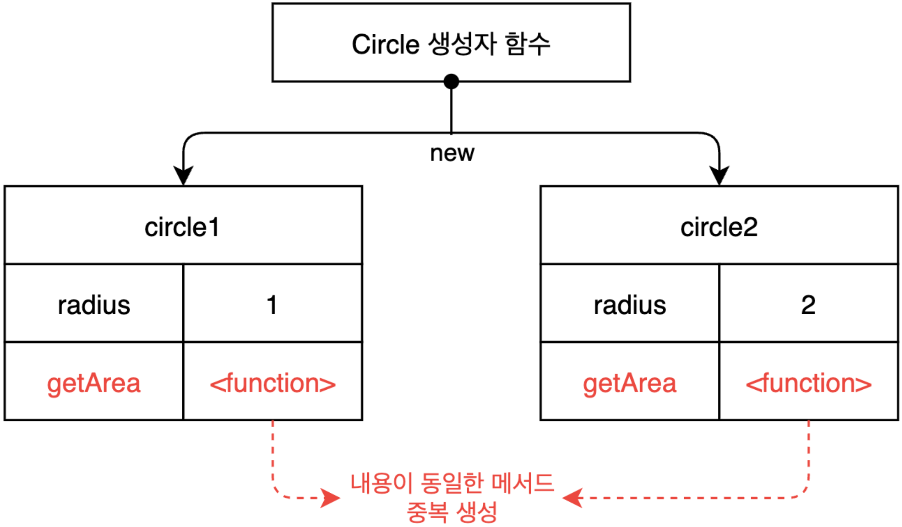
</div>

- Circle 생성자 함수 기반의 객체는 getArea() 메서드를 중복 생성하면서 중복 소유한다.
- 특정 생성자 함수의 모든 인스턴스가 동일한 메서드를 중복 소유한다면 메모리 낭비를 초래한다.

### 프로토타입

```javascript
function Circle(radius) {
  this.radius = radius;
}

Circle.prototype.getArea = function () {
  return Math.PI * this.radius ** 2;
};

const circle1 = new Circle(1);
const circle2 = new Circle(2);

console.log(circle1.getArea === circle2.getArea); // true
console.log(circle1.getArea());
console.log(circle2.getArea());
```

<div align="center">
	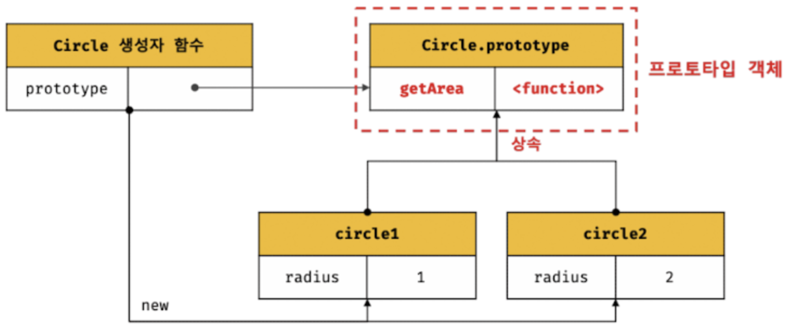
</div>

- 모든 생성자 함수의 인스턴스가 메서드를 공유할 수 있도록 프로토타입 기반으로 상속을 구현한다.
- 위 예시를 가지고 설명하면, Circle 생성자 함수의 모든 인스턴스는 자신의 프로토타입, 즉 상위 객체 역할을 하는 Circle.prototype의 모든 프로퍼티와 메서드를 상속받는다.
- getArea 메서드는 단 하나만 생성되어 프로토타입인 Circle.prototype의 메서드로 할당되어 있다.
- 따라서 Circle 생성자 함수가 생성하는 모든 인스턴스는 getArea 메서드를 상속받아 사용할 수 있다.
- 자신의 상태를 나타내는 radius만 개별적으로 가진다.

### 프로토타입 객체

- 어떤 객체의 상위 객체의 역할을 하는 객체로서
- 다른 객체 공유 프로퍼티, 메서드를 제공
- 프로토타입을 상속받은 하위 객체는 상위 객체의 프로퍼티를 자신의 프로퍼티처럼 자유롭게 사용할 수 있다.

### \[\[Prototype\]\]

- 모든 객체는 \[\[Prototype\]\] 내부 슬롯을 가진다. 이 내부 슬롯 값은 프로토타입의 참조(null인 경우도 있음)이다.
- 해당 내부 슬롯에 저장되는 프로토타입은 객체 생성 방식에 의해 결정된다.
- 즉, 객체가 생성될 때 객체 생성 방식에 따라 프로토타입이 결정되고 \[\[Prototype\]\]에 저장된다.
- 예를 들어, 객체 리터럴에 의해 생성된 객체의 프로토타입은 Object.prototype이고 생성자 함수에 의해 생성된 객체의 프로토타입은 생성자 함수의 prototype 프로퍼티에 바인딩되어 있는 객체다.
- 모든 객체는 하나의 프로토타입을 갖는다. 그리고 모든 프로토타입은 생성자 함수와 연결되어 있다.

<div align="center">
	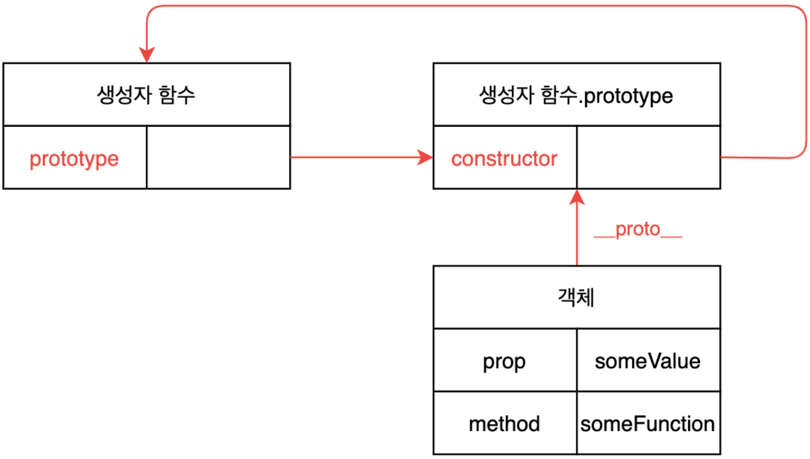
</div>

### \_\_proto\_\_ 프로퍼티

1. \_\_proto\_\_는 접근자 프로퍼티

   - \[\[Prototype\]\] 내부 슬롯에는 직접 접근할 수 없다. 대신 \_\_proto\_\_ 접근자 프로퍼티를 통해 자신의 프로토타입에 간접적으로 접근할 수 있다.

<div align="center">
	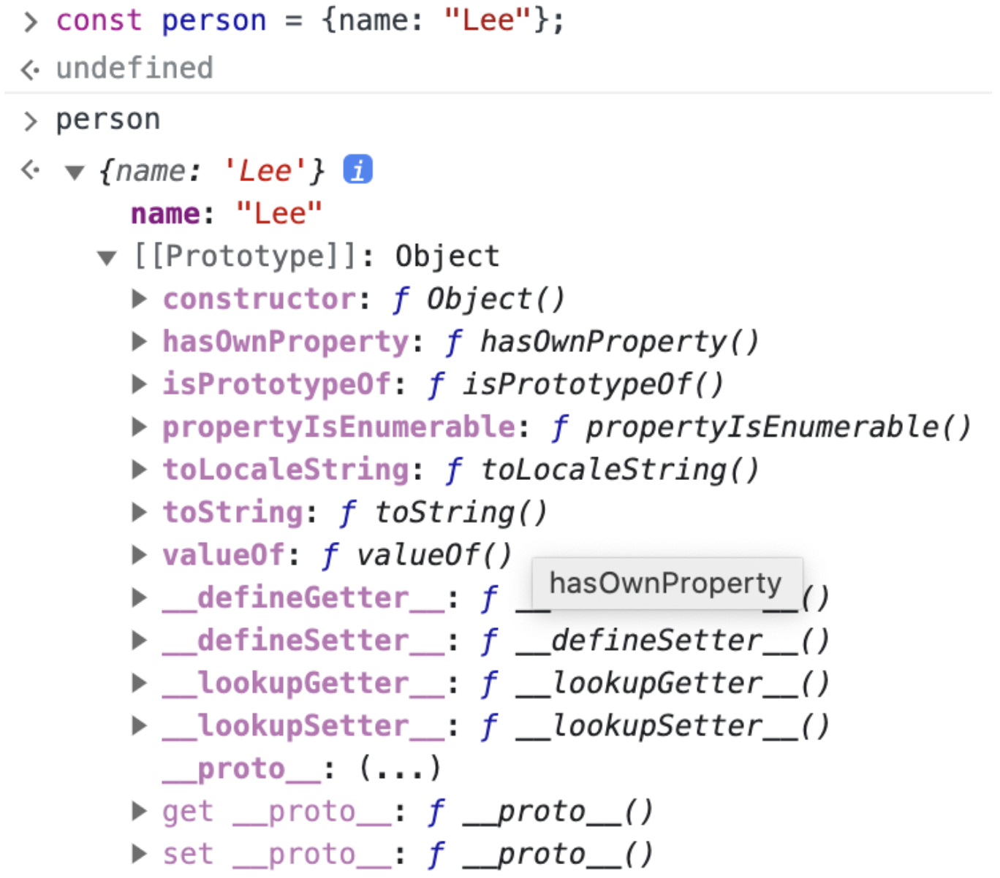
</div>

2. \_\_proto\_\_는 접근자 프로퍼티는 상속을 통해 사용된다.

   - 객체가 직접 소유하는 프로퍼티가 아니라 Object.prototype 프로퍼티다. 모든 객체는 상속을 통해 Object.prototype.\_\_proto\_\_ 접근자 프로퍼티를 사용할 수 있다.

   ```javascript
   const person = { name: "Lee" };
   console.log(person.hasOwnProperty("__proto__")); // false
   console.log(Object.getOwnPropertyDescriptor(Object.prototype, "__proto__"));
   // {enumerable: false, configurable: true, get: ƒ, set: ƒ}
   console.log({}.__proto__ === Object.prototype); // true
   ```

3. \_\_proto\_\_는 접근자 프로퍼티를 통해 프로토타입에 접근하는 이유

   - 프로토타입에 접근하기 위해 \_\_proto\_\_ 접근자 프로퍼티를 사용하는 이유는 상호 참조에 의해 프로토타입 체인이 생성되는 것을 방지하기 위해서다.

   ```javascript
   const parent = {};
   const child = {};
   child.__proto__ = parent;
   parent.__proto__ = child; // TypeError: Cyclic __proto__ value
   ```

   - 프로토타입 체인은 단방향 링크드 리스트로 구현되어야 한다. 순환 참조하는 프로토타입 체인이 만들어지면 프로토타입 종점이 존재하지 않기 때문에 프로토타입 체인에서 프로퍼티를 검색할 때 무한 루프에 빠진다.

4. \_\_proto\_\_ 접근자 프로퍼티를 코드 내에서 직접 사용하는 것은 권장하지 않는다.

   - 모든 객체가 해당 접근자 프로퍼티를 사용하는 것은 아니다.
   - 직접 상속을 통해 Object.prototype을 상속받지 않는 객체를 생성할 수 있기 때문에 해당 프로퍼티를 사용할 수 없는 경우가 있다.

   ```javascript
   const obj = Object.create(null);
   console.log(obj.__proto__); // undefined
   console.log(Object.getPrototypeOf(obj)); // null
   ```

   - 프로토타입의 참조를 취득하고 싶은 경우 Object.getPrototypeOf 메서드(ES5)를 사용하고, 프로토타입을 교체하고 싶은 경우 Object.setPrototypeOf 메서드(ES6)를 사용할 것을 권장한다.

   ```javascript
   const obj = Object.create(null);
   const safeObj = {};
   const parent = { x: 1 };

   Object.getPrototypeOf(obj);
   Object.getPrototypeOf(safeObj);
   Object.setPrototypeOf(safeObj, parent);

   console.log(safeObj.x);
   ```

### 함수 객체의 prototype 프로퍼티

- 함수 객체만이 소유하는 prototype 프로퍼티는 생성자 함수가 생성할 인스턴스의 프로토타입을 가리킨다.

```javascript
// 함수 객체는 prototype 프로퍼티 소유
(function () {}).hasOwnProperty("prototype"); // true

// 일반 객체는 prototype 프로퍼티 소유하지 않는다.
({}).hasOwnProperty("prototype"); // false
```

- 그러나 non-constructor인 화살표 함수와 ES6의 메서드 축약 표현으로 정의한 메서드는 prototype 프로퍼티를 소유하지 않으며 프로토타입도 생성하지 않는다.
- 생성자 함수로 호출하기 위해 정의하지 않은 일반 함수(함수 선언문, 함수 표현식)도 prototype 프로퍼티를 소유하지만 객체를 생성하지 않는 일반 함수의 prototype 프로퍼티는 아무런 의미가 없다.
- 모든 객체들이 가지고 있는(엄밀히 말하면 Object.prototype으로 부터 상속받은) \_\_proto\_\_ 접근자 프로퍼티와 함수 객체만이 가지고 있는 prototype 프로퍼티는 결국 동일한 프로토타입을 가리킨다.

| 구분                          | 소유        | 값                | 사용 주체   | 사용 목적                                                                    |
| ----------------------------- | ----------- | ----------------- | ----------- | ---------------------------------------------------------------------------- |
| \_\_proto\_\_ 접근자 프로퍼티 | 모든 객체   | 프로토타입의 참조 | 모든 객체   | 객체가 자신의 프로토타입의 접근 또는 교체하기 위해 사용                      |
| prototype 프로퍼티            | constructor | 프로토타입의 참조 | 생성자 함수 | 생성자 함수가 자신이 생성할 객체(인스턴스)의 프로토타입을 할당하기 위해 사용 |

```javascript
function Person(name) {
  this.name = name;
}
const me = new Person("Lee");
console.log(Person.prototype === me.__proto__); // true
```

<div align="center">
	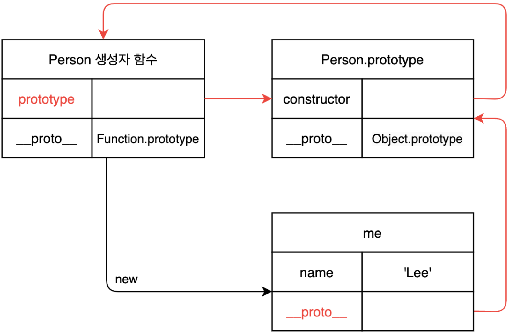
</div>

### 프로토타입의 constructor 프로퍼티

- 모든 프로토타입은 constructor 프로퍼티를 가진다.
- constructor 프로퍼티는 prototype 프로퍼티로 자신을 참조하고 있는 생성자 함수를 가리킨다.

```javascript
function Person(name) {
  this.name = name;
}
const me = new Person("Lee");
console.log(me.constructor === Person); // true
```

<div align="center">
	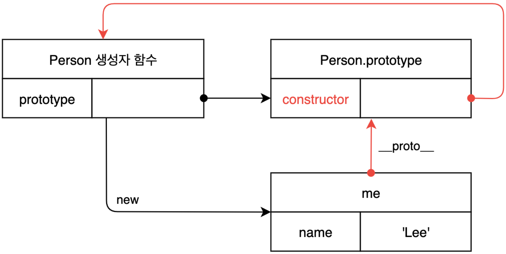
</div>

### 객체 리터럴에 의한 객체 생성 방식

- new 연산자와 함께 생성자 함수를 호출하는 방식이 아닌 리터럴 표기법으로 인스턴스를 생성할 수 있다.

```javascript
// 객체 리터럴
const obj = {};

// 함수 리터럴
const add = function (a, b) {
  return a + b;
};

// 배열 리터럴
const arr = [1, 2, 3];

// 정규 표현식 리터럴
const regexp = /is/gi;
```

- 해당 방식에도 객체의 프로토타입은 존재한다. 그러나 프로토타입의 constructor 프로퍼티가 가리키는 생성자 함수가 반드시 객체를 생성한 생성자 함수라고 단정할 수 없다.

```javascript
const obj = {};

console.log(obj.constructor === Object);
```

- 위 예제의 obj 객체는 Object 생성자 함수로 생성한 객체가 아니라 객체 리터럴에 의해 생성된 객체다. 하지만 obj 객체는 Object 생성자 함수와 constructor 프로퍼티로 연결되어 있다.
- 객체 리터럴에 의한 객체 생성은 Object 생성자 함수로 생성되는 것이 아니다. ECMAScript 사양에 따르면 Object 생성자 함수의 인수에 null 또는 undefined를 전달하면서 호출하면 내부적으로 추상 연산 OrdinaryObjectCreate를 호출하여 Object.prototype을 프로토타입으로 갖는 빈 객체를 생성한다.

**추상 연산**: ECMAScript 사양에서 내부 동작과 구현 알고리즘을 표현한 것이다. ECMAScript 사양에서 설명을 위해 사용되는 함수와 유사한 의사코드이다.

- 객체 리터럴이 평가될 때는 다음과 같이 OrdinaryObjectCreate를 호출하여 빈 객체를 생성하고 프로퍼티를 추가하도록 정의되어 있다.
- 이처럼 Object 생성자 함수 호출과 객체 리터럴의 평가는 추상 연산 OrdinaryObjectCreate를 호출하여 빈 객체를 생성하는 점에서 동일하나 new.target 확인이나 프로퍼티를 추가하는 처리 등 세부 내용은 다르다. 따라서 객체 리터럴에 의해 생성된 객체는 Object 생성자 함수가 생성한 객체가 아니다.

### 함수 리터럴에 의한 객체 생성 방식

- Function 생성자 함수를 호출하여 생성한 함수는 렉시컬 스코프를 만들지 않고 전역 함수인 것처럼 스코프를 생성하며 클로저도 만들지 않는다.
- 따라서 함수 선언문과 함수 표현식을 평가하여 함수 객체를 생성한 것은 Function 생성자 함수가 아니다.
- 하지만 constructor 프로퍼티를 통해 확인해보면 foo 함수의 생성자 함수는 function 생성자 함수다.

```javascript
function foo() {}

console.log(foo.constructor === Function); // true
```

### 리터럴 표기법에 의한 객체 생성 방식 정리

- 리터럴 표기법에 의해 생성된 객체도 상속을 위해 프로토타입이 필요하다. 따라서 리터럴 표기법에 의해 생성된 객체도 가상의 생성자 함수를 갖는다.
- **프로토타입은 생성자 함수와 더불어 생성되며 prototype.constructor 프로퍼티에 의해 연결되어 있기 때문이다.**
- **프로토타입과 생성자 함수는 단독으로 존재할 수 없고 언제나 쌍으로 존재한다**

| 리터럴 표기법      | 생성자 함수 | 프로토타입         |
| ------------------ | ----------- | ------------------ |
| 객체 리터럴        | Object      | Object.prototype   |
| 함수 리터럴        | Function    | Function.prototype |
| 배열 리터럴        | Array       | Array.prototype    |
| 정규 표현식 리터럴 | RegExp      | RegExp.prototype   |

### 프로토타입의 생성 시점

- 프로토타입은 생성자 함수가 생성되는 시점에 더불어 생성된다.
- 생성자 함수는 사용자가 직접 정의한 생성자 함수와 자바스크립트가 기본적으로 제공하는 빌트인 생성자 함수로 구분할 수 있다.

1. 사용자 정의 생성자 함수와 프로토타입 생성 시점

    - \[\[Construct\]\] 내부 메서드를 갖는 함수 객체, 즉 화살표 함수나 ES6의 메서드 축약 표현의 메서드가 아닌 일반 함수로 정의한 함수 객체는 new 연산자와 함께 생성자 함수로서 호출할 수 있다.
    - 생성자 함수로서 호출할 수 있는 함수, 즉 constructor는 함수 정의가 평가되어 함수 객체를 생성하는 시점에 프로토타입도 더불어 생성된다.

    ```javascript
    console.log(Person.prototype);

    function Person(name) {
      this.name = name;
    }
    ```

    - 자바스크립트 평가 시점에서 Person 함수 객체와 더불어 프로토타입도 같이 생성된다.
    - 생성된 프로토타입은 Person 생성자 함수의 prototype 프로퍼티에 바인딩된다.

    <div align="center">
      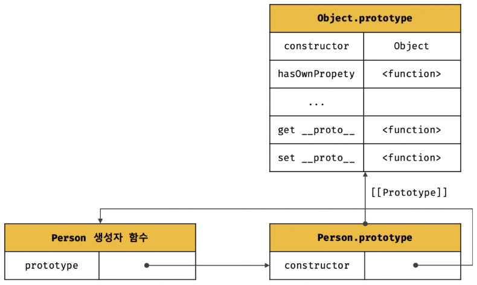
    </div>

2. 빌트인 생성자 함수와 프로토타입 생성 시점

    - 일반 함수와 마찬가지로 빌트인 생성자 함수가 생성되는 시점에 프로토타입이 생성된다.
    - 모든 빌트인 생성자 함수는 전역 객체가 생성되는 시점에 생성된다.
    - 생성된 프로토타입은 빌트인 생성자 함수의 prototype 프로퍼티에 바인딩된다.

    <div align="center">
      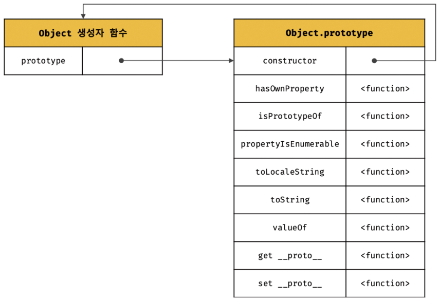
    </div>

**정리**

- 객체가 생성되기 이전에 생성자 함수와 이미 객체화되어 존재한다.
- 이후 생성자 함수 또는 리터럴 표기법으로 객체를 생성하면 프로토타입은 생성된 객체의 \[\[Prototype\]\] 내부 슬롯에 할당된다.
- 이로써 생성된 객체는 프로토타입을 상속받는다.

### 전역 객체

- 코드가 실행되기 이전 단계에 자바스크립트 엔진에 의해 어떤 객체보다도 먼저 생성되는 특수한 객체
- 어떤 객체에도 속하지 않은 최상위 객체
- 전역 객체는 자바스크립트 환경에 따라 지칭하는 이름이 다름
- 브라우저 환경: window(또는 self, this, frames), Node.js 환경: global
- 표준 빌트인 객체, 환경에 따른 호스트 객체, 그리고 var 키워드로 선언한 전역 변수와 전역 함수를 프로퍼티로 가짐
- 전역 객체는 개발자가 의도적으로 생성할 수 없음, 즉 전역 객체를 생성할 수 있는 생성자 함수가 제공되지 않음
- 전역 객체의 프로퍼티를 참조할 때 window(또는 global)를 생략할 수 있음

### globalThis

- ECMAScript2020(ES11)에서 도입된 globalThis는 브라우저 환경과 Node.js환경에서 전역 객체를 가리키던 다양한 식별자를 통일한 식별자
- 표준 사양이므로 표준을 준수하는 모든 환경에서 사용 가능

```javascript
// 브라우저 환경
globalThis === this; // true
globalThis === window; // true
globalThis === self; // true
globalThis === frames; // true

// Node.js 환경(12.0.0 이상)
globalThis === this; // true
globalThis === global; // true
```

### 객체 생성 방식과 프로토타입의 결정

1. 객체 리터럴

- 추상 연산 OrdinaryObjectCreate 호출
- 해당 연산에 전달되는 프로토타입은 Object.prototype
- 즉, 객체 리터럴에 의해 생성되는 객체의 프로토타입은 Object.prototype이다.

```javascript
const obj = { x: 1 };

console.log(obj.constructor === Object); // true
console.log(obj.hasOwnProperty("x")); // true
```

<div align="center">
	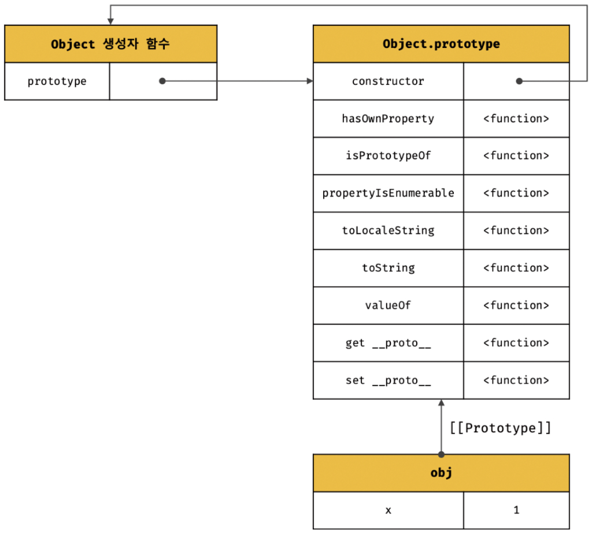
</div>

- obj 객체는 constructor 프로퍼티와 hasOwnProperty 메서드 등을 소유하지 않지만 자신의 프로토타입인 Object.prototype의 constructor 프로퍼티와 hasOwnProperty 메서드를 자신의 자산인 것처럼 자유롭게 사용할 수 있다.
- obj 객체는 자신의 프로토타입인 Object.prototype 객체를 상속받았기 때문이다.

2. Object 생성자 함수

- Object 생성자 함수를 인수 없이 호출하면 빈 객체가 생성된다. 해당 객체 생성 방식도 추상 연산 OrdinaryObjectCreate를 호출한다. 이때도 Object.prototype이 전달된다.

```javascript
const obj = new Object();
obj.x = 1;

console.log(obj.constructor === Object); // true
console.log(obj.hasOwnProperty("x")); // true
```

<div align="center">
	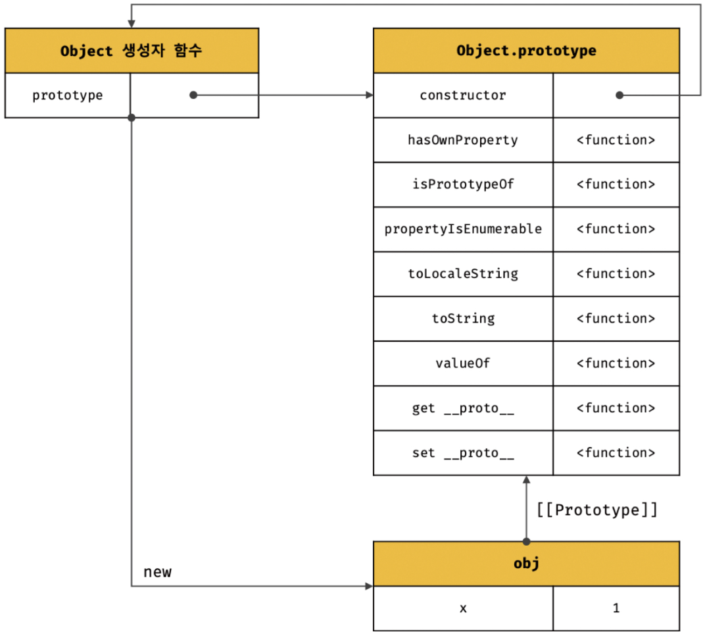
</div>

- 위 코드가 실행되면 추상 연산 OrdinaryObjectCreate에 의해 다음과 같이 Object 생성자 함수와 Object.prototype과 생성된 객체 사이에 연결이 만들어진다. 객체 리터럴에 의해 생성된 객체와 동일한 구조를 가진다.
- 이처럼 Object 생성자 함수에 의해 생성된 obj 객체는 Object.prototype을 프로토타입으로 갖게 되며, 이로써 Object.prototype을 상속받는다.

3. 생성자 함수

- new 연산자와 함께 생성자 함수를 호출하여 인스턴스를 생성하면 다른 객체 생성 방식과 마찬가지로 추상 연산 OrdinaryObjectCreate가 호출된다.
- 이때 추상 연산 OrdinaryObjectCreate에 전달되는 프로토타입은 생성자 함수의 prototype 프로퍼티에 바인딩되어 있는 객체다.
- 즉, 생성자 함수에 의해 생성되는 객체의 프로토타입은 생성자 함수의 prototype 프로퍼티에 바인딩되어 있는 객체다.

```javascript
function Person(name) {
  this.name = name;
}

Person.prototype.sayHello = function () {
  console.log(`Hi! My name is ${this.name}`);
};

const me = new Person("Lee");
const you = new Person("Kim");

me.sayHello(); // Hi! My name is Lee
you.sayHello(); // Hi! My name is Kim
```

<div align="center">
	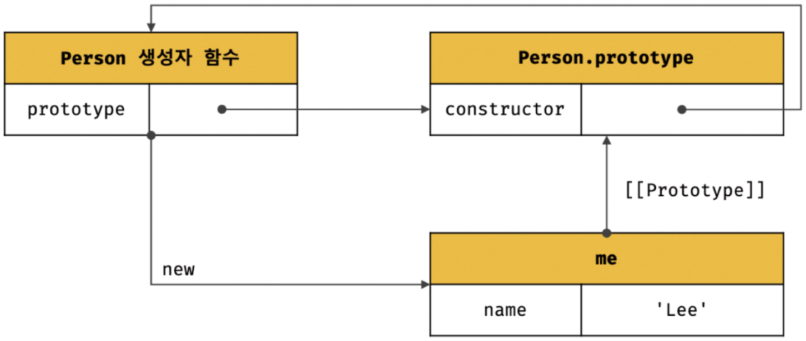
</div>

4. Object.create(직접 상속에서 소개)

5. 클래스(ES6 이후의 문법. 25장 클래스에서 소개)

### 프로토타입 체인

```javascript
function Person(name) {
  this.name = name;
}

// 프로토타입 메서드
Person.prototype.sayHello = function () {
  console.log(`Hi! My name is ${this.name}`);
};

const me = new Person("Lee");
console.log(me.hasOwnProperty("name")); // true
```

- 위 코드에서 me 객체가 호출한 hasOwnProperty 메서드는 me 객체가 Object.prototype을 상속받았기 때문에 사용 가능하다.

```javascript
console.log(Object.getPrototypeOf(me) === Person.prototype); // true
console.log(Object.getPrototypeOf(Person.prototype === Object.prototype)); // true
```

- 위 결과를 통해 me 객체와 해당 객체가 상속받은 프로토타입 객체 정보는 아래 그림처럼 연결할 수 있다.

<div align="center">
	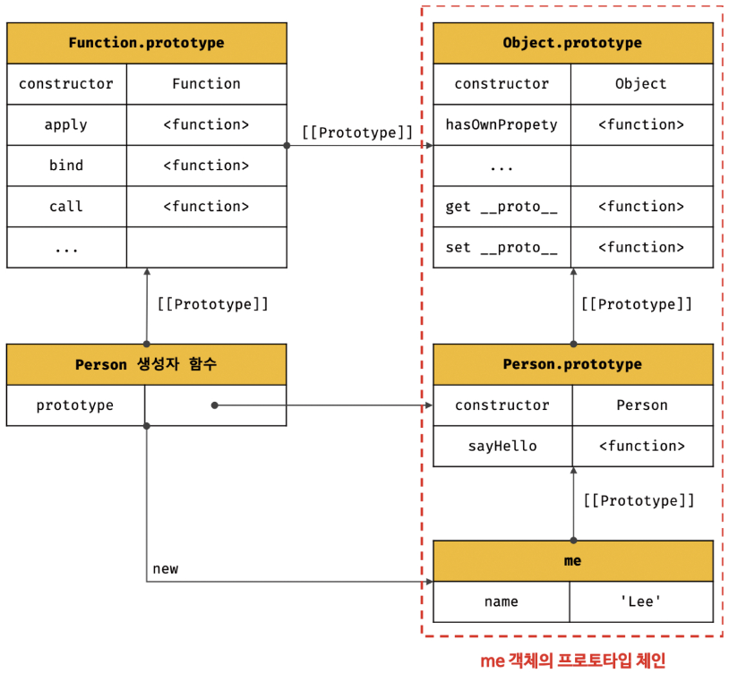
</div>

- 자바스크립트는 객체의 프로퍼티 및 메서드에 접근하려고 할 때 해당 객체에 접근하려는 프로퍼티가 없다면 \[\[Prototype\]\] 내부 슬롯의 참조를 따라 자신의 부모 역할을 하는 프로토타입의 프로퍼티를 순서대로 검색한다. 이를 **프로토타입 체인**이라 부른다.
- 모든 객체들의 최상위 객체는 Object.prototype이다. 즉, Object.prototype은 프로토타입 체인의 종점이 된다.
- 존재하지 않는 프로퍼티 혹은 메서드에 접근을 시도할 때 Object.prototype까지 검색했음에도 불구하고 없으면 undefined를 반환한다.

### 프로토타입 체인과 스코프 체인

- 프로토타입 체인은 **상속과 프로퍼티 검색을 위한 매커니즘**이라 할 수 있다.
- 혼동하기 쉬운 스코프 체인은 프로퍼티가 아닌 **식별자를 검색하기 위한 매커니즘**이다.
- 그러나 이 둘은 서로 연관없이 별도로 동작하는 것이 아니라 서로 협력하여 식별자와 프로퍼티를 검색하는 데 사용된다.

### 오버라이딩과 프로퍼티 섀도잉

```javascript
const Person = (function () {
  // 생성자 함수
  function Person(name) {
    this.name = name;
  }

  // 프로토타입 메서드
  Person.prototype.sayHello = function () {
    console.log(`Hi! My name is ${this.name}`);
  };

  // 생성자 함수 반환
  return Person;
})();

const me = new Person("Lee");

me.sayHello = function () {
  console.log(`Hey! My name is ${this.name}`);
};

me.sayHello(); // Hey! My name is Lee
```

<div align="center">
	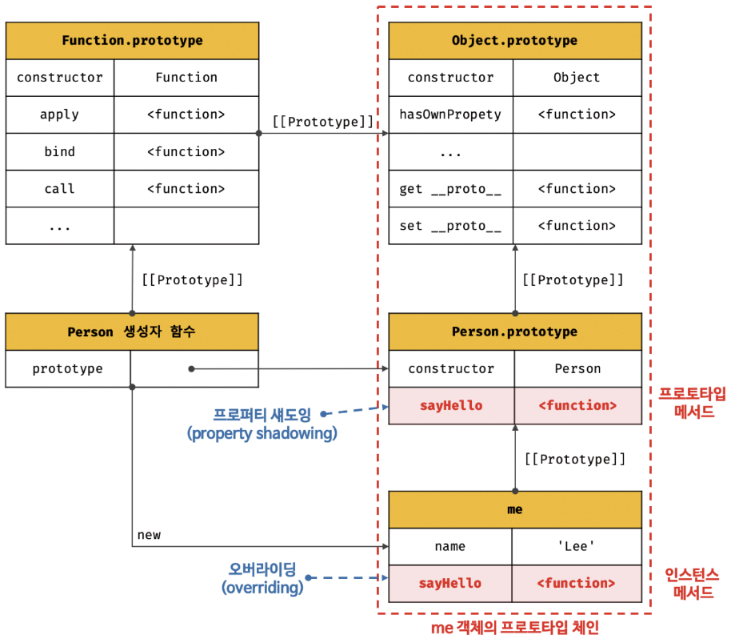
</div>

- 프로토타입이 소유한 프로퍼티를 프로토타입 프로퍼티, 인스턴스가 소유한 프로퍼티를 인스턴스 프로퍼티라 부른다.
- 프로토타입 프로퍼티와 같은 이름의 프로퍼티를 인스턴스에 추가하면 프로토타입 체인을 따라 프로토타입 프로퍼티를 검색하여 프로토타입 프로퍼티를 덮어쓰는 것이 아니라 인스턴스 프로퍼티로 추가한다.
- 이때 인스턴스 메서드 sayHello는 프로토타입 메서드 sayHello를 오버라이딩했고 프로토타입 메서드 sayHello는 가려진다.
- **상속 관계에 의해 프로퍼티가 가려지는 현상**을 **프로퍼티 섀도잉**이라 한다.

**오버라이딩**

- 상위 클래스가 가지고 있는 메서드를 하위 클래스가 재정의하여 사용하는 방식

**오버로드**

- 함수의 이름은 동일하지만 매개변수 타입 또는 개수가 다른 메서드를 구현하고 매개변수에 의해 메서드를 구별하여 호출하는 방식
- 자바스크립트는 오버로드를 지원하지 않지만 arguments 객체를 사용하여 구현할 수 있다.

### 프로퍼티 삭제

- 인스턴스 프로퍼티는 삭제 가능
- 프로토타입 프로퍼티는 해당 프로토타입을 상속받은 하위 객체가 삭제 불가능하다. 즉, get 액세스는 가능하지만 set 액세스는 불가능하다.
- 프로토타입에 직접 접근해서 삭제(set 액세스)할 수 있다.

```javascript
// 인스턴스 메서드 삭제
delete me.sayHello;
// 프로토타입 메서드 호출
me.sayHello();
// 프로토타입 메서드 삭제 시도
delete me.sayHello;
me.sayHello(); // 삭제 실패! 프로토타입 메서드 호출됨
```

### 프로토타입의 교체

- 프로토타입은 임의의 다른 객체로 변경 가능
- 객체 간의 상속 관계를 동적으로 변경할 수 있다.

1. 생성자 함수에 의한 프로토타입 교체

```javascript
const Person = (function () {
  // 생성자 함수
  function Person(name) {
    this.name = name;
  }
  // 생성자 함수의 prototype 프로퍼티를 통해 프로토타입 교체
  Person.prototype = {
    sayHello() {
      console.log(`Hi! My name is ${this.name}`);
    },
  };
  return Person;
})();

const me = new Person("Lee");
```

- constructor 프로퍼티가 존재해야 하는 Person.prototype에 객체 리터럴을 할당한 상황
- constructor 프로퍼티가 없어진 것이다.

<div align="center">
	
</div>

```javascript
// 프로토타입을 교체하면 constructor 프로퍼티와 생성자 함수 간의 연결이 파괴된다.
console.log(me.constructor === Person);
// 프로토타입 체인을 따라 Object.prototype의 constructor 프로퍼티가 검색된다.
console.log(me.constructor === Object);
```

- 위 코드 실행 결과, Person 생성자 함수를 지칭해야 했던 constructor가 없어지고 Object.constructor를 접근하고 있다.
- 다시 살린다면 다음과 같이 작성해서 실행해보면 된다.

```javascript
const Person = (function () {
  // 생성자 함수
  function Person(name) {
    this.name = name;
  }
  // 생성자 함수의 prototype 프로퍼티를 통해 프로토타입 교체
  Person.prototype = {
    // constructor 프로퍼티와 생성자 함수 간의 연결을 설정
    constructor: Person,
    sayHello() {
      console.log(`Hi! My name is ${this.name}`);
    },
  };
  return Person;
})();
```

2. 인스턴스에 의한 프로토타입의 교체

- 인스턴스의 \_\_proto\_\_ 접근자 프로퍼티(또는 Object.setPrototypeOf 메서드)를 통해 프로토타입을 교체할 수 있다.
- 생성자 함수의 prototype 프로퍼티에 다른 임의의 객체를 바인딩하는 것은 미래에 생성할 인스턴스 프로토타입을 교체하는 것이다.
- 반면 \_\_proto\_\_ 접근자 프로퍼티를 통해 프로토타입을 교체하는 것은 이미 생성된 객체의 프로토타입을 교체하는 작업이다.

```javascript
function Person(name) {
  this.name = name;
}
const me = new Person("Lee");

// 프로토타입으로 교체할 객체
const parent = {
  sayHello() {
    console.log(`Hi! My name is ${this.name}`);
  },
};

// me 객체의 프로토타입을 parent 객체로 교체
Object.setPrototypeOf(me, parent);
// 아래 코드와 동일하다.
// me.__proto__ = parent;

me.sayHello(); // Hi! My name is Lee
```

<div align="center">
	
</div>

- constructor 프로퍼티와 생성자 함수 간의 연결이 파괴된다.
- 연결이 파괴된 Person 생성자 함수를 parent 객체에 연결시킨다면 아래와 같이 코드를 작성하면 된다.

```javascript
// 프로토타입으로 교체할 객체
const parent = {
  // constructor 프로퍼티와 생성자 함수 간의 연결을 설정
  sayHello() {
    console.log(`Hi! My name is ${this.name}`);
  },
};
// 생성자 함수의 prototype 프로퍼티와 프로토타입 간의 연결을 설정
Person.prototype = parent;
```

- 프로토타입 교체를 통한 상속 관계를 동적으로 변경하는 것은 좋지 않다.
- 상속 관계를 인위적으로 설정한다면 위 방식보다는 '직접 상속'을 사용하는 것이 더 편리하고 안전하다.
- 또한 클래스(class)를 사용하면 간편하고 직관적으로 상속 관계를 구현할 수 있다.

### instanceof 연산자

- 이항 연산자
- 좌변: 객체를 가리키는 식별자, 우변: 생성자 함수를 가리키는 식별자
- 우변의 피연산자가 함수가 아닌 경우 TypeError 발생
- 우변의 생성자 함수의 prototype에 바인딩된 객체가 좌변의 객체의 프로토타입 체인 상에 존재하면 true, 그렇지 않으면 false로 평가된다.

```javascript
function Person(name) {
  this.name = name;
}

const me = new Person("Lee");
console.log(me instanceof Person); // true
console.log(me instanceof Object); // true
```

### 직접 상속

1. Object.create에 의한 직접 상속

   - 명시적으로 프로토타입을 지정하여 새로운 객체를 생성한다.
   - Object.create 메서드도 다른 객체 생성 방식과 마찬가지로 추상 연산 OrdinaryObjectCreate를 호출한다.

   ```javascript
   /**
   * 지정된 프로토타입 및 프로퍼티를 갖는 새로운 객체를 생성하여 반환한다.
   * @param {Object} prototype - 생성할 객체의 프로토타입으로 지정할 객체
   * @param {Object} [propertiesObject] - 생성할 객체의 프로퍼티를 갖는 객체
   * @returns {Object} 지정된 프로토타입 및 프로퍼티를 갖는 새로운 객체
   */
   Object.create(prototype[, propertiesObject])
   ```

   ```javascript
   let obj = Object.create(null);
   console.log(Object.getPrototypeOf(obj) === null); // true
   console.log(obj.toString()); // TypeError: obj.toString is not a function

   // obj -> Object.prototype -> null
   // obj = {};와 동일
   obj = Object.create(Object.prototype);
   console.log(Object.getPrototypeOf(obj) === Object.prototype); // true

   // obj -> Object.prototype -> null
   // obj = { x: 1 };와 동일
   obj = Object.create(Object.prototype, {
     x: { value: 1, writable: true, enumerable: true, configurable: true },
   });
   // 위 코드는 아래와 동일
   // obj = Object.create(Object.prototype);
   // obj.x = 1;
   console.log(obj.x);
   console.log(Object.getPrototypeOf(obj) === Object.prototype); // true

   const myProto = { x: 10 };
   // 임의의 객체를 직접 상속받는다.
   // obj -> myProto -> Object.prototype -> null
   obj = Object.create(myProto);
   console.log(obj.x);
   console.log(Object.getPrototypeOf(obj) === myProto); // true

   // 생성자 함수
   function Person(name) {
     this.name = name;
   }
   // obj -> Person.prototype -> Object.prototype -> null
   // obj = new Person('Lee')와 동일
   obj = Object.create(Person.prototype);
   obj.name = "Lee";
   console.log(obj.name);
   console.log(Object.getPrototypeOf(obj) === Person.prototype); // true
   ```

   - 해당 메서드의 장점
     - new 연산자 없이 객체 생성 가능
     - 프로토타입을 지정하면서 객체 생성 가능
     - 객체 리터럴에 의해 생성된 객체도 상속받을 수 있음

2. 객체 리터럴 내부에서 \_\_proto\_\_에 의한 직접 상속

   - Object.create 메서드는 두 번째 인자로 새로 생성할 객체의 프로퍼티를 지정하는 것이 귀찮다.
   - ES6에서 객체 리터럴 내부에서 \_\_proto\_\_ 접근자 프로퍼티를 사용하여 직접 상속을 구현할 수 있다.

   ```javascript
   const myProto = { x: 10 };

   const obj = {
     y: 20,
     // obj -> myProto -> Object.prototype -> null
     __proto__: myProto,
   };
   /* 위 코드는 아래와 동일
   const obj = Object.create(myProto, {
     y: { value: 20, writable: true, enumerable: true, configurable: true }
   });
   */

   console.log(obj.x, obj.y); // 10 20
   console.log(Object.getPrototypeOf(obj) === myProto); // true
   ```

### 정적 프로퍼티/메서드

- 생성자 함수로 참조/호출할 수 있는 프로퍼티/메서드

```javascript
// 생성자 함수
function Person(name) {
  this.name = name;
}

// 프로토타입 메서드
Person.prototype.sayHello = function () {
  console.log(`Hi! My name is ${this.name}`);
};

// 정적 프로퍼티
Person.staticProp = "static prop";

// 정적 메서드
Person.staticMethod = function () {
  console.log("staticMethod");
};

const me = new Person("Lee");

Person.staticMethod(); // staticMethod
me.staticMethod(); // TypeError: ...
```

- Person 생성자 함수도 객체이다. 따라서 프로퍼티, 메서드를 추가할 수 있다.
- 이때 Person 생성자 함수 객체가 소유한 프로퍼티/메서드를 정적 프로퍼티/메서드라 부르고, Person 생성자 함수의 인스턴스는 참조/호출이 불가능하다.

<div align="center">
  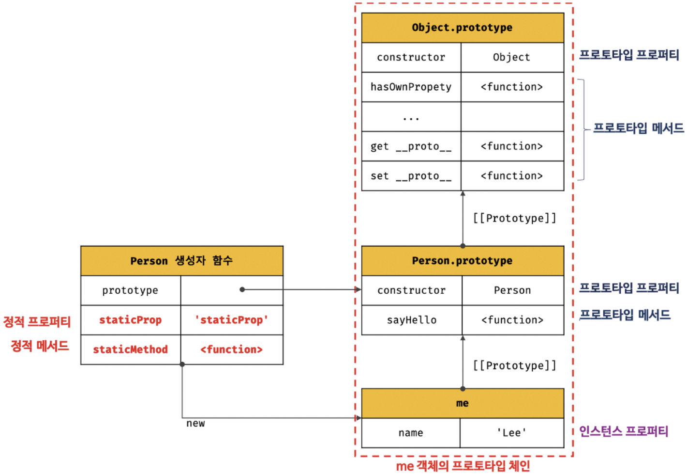
</div>

- 앞에서 살펴본 Object.create 메서드는 Object 생성자 함수의 정적 메서드이다. 반면 Object.prototype.hasOwnProperty 메서드는 Object.prototype의 메서드이다.
- 따라서 Object.create 메서드는 Object 생성자 함수의 인스턴스로 호출할 수 없다. 그러나 Object.prototype.hasOwnProperty 메서드는 모든 객체의 프로토타입 체인의 종점, 즉, Object.prototype의 메서드이므로 모든 객체가 호출할 수 있다.
- 만약 인스턴스/프로토타입 메서드 내에서 this를 사용하지 않는다면 그 메서드는 정적 메서드로 변경할 수 있다.

```javascript
function Foo() {}

// 프로토타입 메서드
// this를 참조하지 않은 프로토타입 메서드는 정적 메서드로 변경하여도 동일한 효과를 얻을 수 있다.
Foo.prototype.x = function () {
  console.log("x");
};

const foo = new Foo();
foo.x();

// 정적 메서드
Foo.x = function () {
  console.log("x");
};

Foo.x();
```

**MDN 문서**

- 아래와 같이 정적 메서드, 프로토타입 메서드를 구분하여 목차에 기술한다.(MDN Array: https://developer.mozilla.org/ko/docs/Web/JavaScript/Reference/Global_Objects/Array)

<div align="center">
  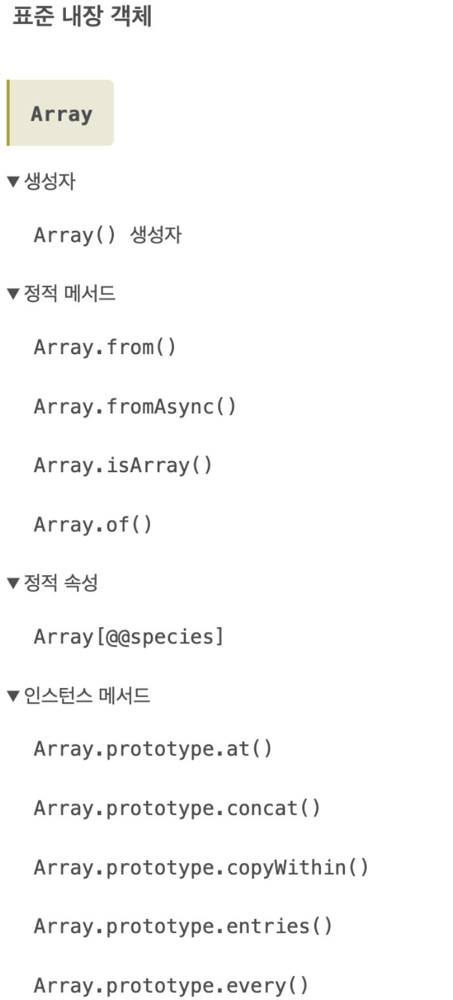
</div>

- 참고로 prototype을 \#으로 표기하는 경우도 있으니 알아두자

### 프로퍼티 존재 확인

1. in 연산자

   - 객체 내에 특정 프로퍼티가 존재하는지 여부를 확인하는 연산자

   ```javascript
   /*
    * key: 프로퍼티 키를 나타내는 문자열
    * object: 객체로 평가되는 표현식
    */
   key in object;
   ```

   ```javascript
   const person = {
     name: "Lee",
     address: "Seoul",
   };

   console.log("name" in person); // true
   console.log("address" in person); // true
   console.log("age" in person); // false
   ```

   - in 연산자는 확인 대상 객체의 프로퍼티뿐만 아니라 상속받은 모든 프로토타입의 프로퍼티를 확인한다.

   ```javascript
   // toString은 Object.prototype 메서드
   console.log("toString" in person); // true
   ```

2. Reflect.has 메서드

   - ES6에 도입된 Reflect.has 메서드를 in 연산자 대신 사용 가능하다.
   - in 연산자와 동일하게 동작한다.

   ```javascript
   const person = { name: "Lee" };
   console.log(Reflect.has(person, "name")); // true
   console.log(Reflect.has(person, "toString")); // true
   ```

### for ... in 문

- 객체의 모든 프로퍼티를 순회하여 열거한다.

```javascript
// for (변수선언문 in 객체) { ... }

const person = {
  name: "Lee",
  address: "Seoul",
};

console.log("toString" in Person); // true

for (const key in person) {
  console.log(key + ": " + person[key]);
}
// name: Lee
// address: Seoul
```

- person 객체의 프로퍼티는 2개이므로 객체를 2번 순회하면서 프로퍼티 키를 key 변수에 할당한 후 코드블록을 실행한다.
- in 연산자처럼 상속받은 프로토타입의 프로퍼티까지 열거한다.
- 이때 프로퍼티 어트리뷰트 중 \[\[Enumerable\]\] 값이 false인 경우 열거의 대상이 되지 않는다.

```javascript
console.log(Object.getOwnPropertyDescriptor(Object.prototype, "toString"));
/*
{
  value: [Function: toString],
  writable: true,
  enumerable: false,
  configurable: true
}
*/
```

- 프로퍼티 키가 Symbol 인 경우는 열거 대상에서 제외된다.

```javascript
const sym = Symbol();
const obj = {
  a: 1,
  [sym]: 10,
};
for (const key in person) {
  console.log(key + ": " + person[key]);
}
// a: 1
```

### Object.keys

- 객체 자신의 열거 가능한 key를 배열로 반환

### Object.values

- ES8에 도입
- 객체 자신의 열거 가능한 value를 배열로 반환

### Object.entries

- ES8에 도입
- 객체 자신의 열거 가능한 키와 값의 쌍의 배열을 배열에 담아 반환

```javascript
const person = {
  name: "Lee",
  address: "Seoul",
  __proto__: { age: 20 },
};

console.log(Object.keys(person));
console.log(Object.values(person));
console.log(Object.entries(person));
```
