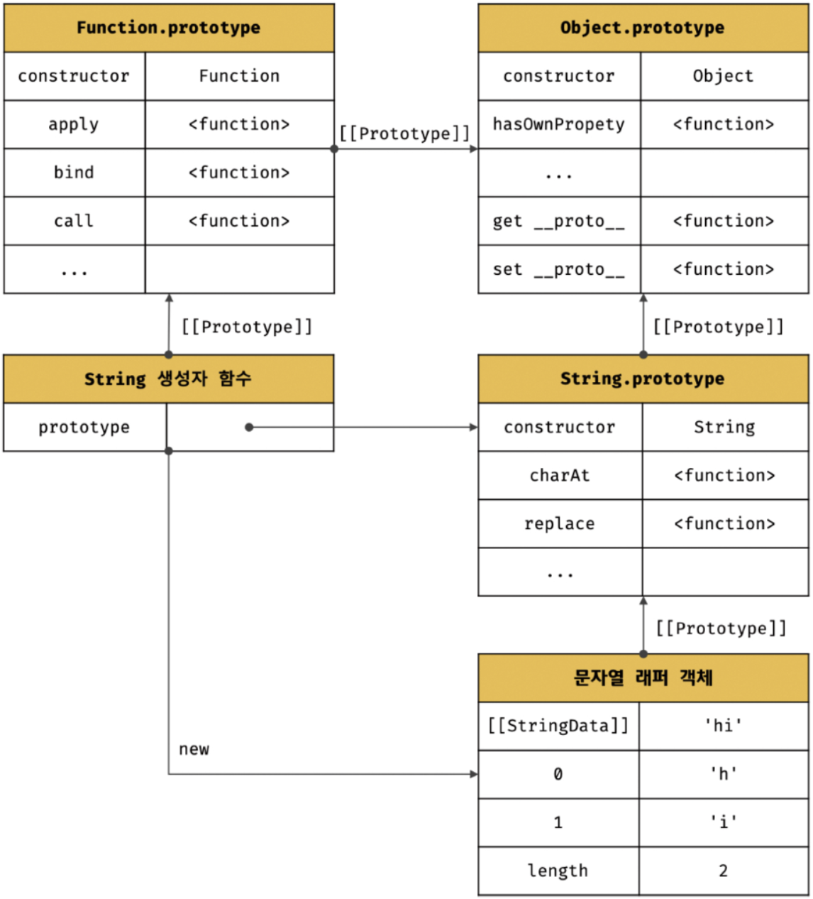

# Modern JavaScript - 21장. 빌트인 객체

### 자바스크립트 객체 분류

1. 표준 빌트인 객체(standard built-in objects/native objects/global objects)

   - ECMAScript 사양에 정의된 객체
   - 애플리케이션 전역의 공통 기능을 제공
   - 자바스크립트 실행 환경과 관계없이 언제나 사용
   - 전역 객체의 프로퍼티로서 제공됨. 어디서나 참조 가능

2. 호스트 객체(host objects)

   - 호스트 객체는 ECMAScript 사양에 정의되어 있지 않음
   - 자바스크립트 실행 환경(브라우저 환경 또는 Node.js 환경)에서 추가로 제공하는 객체
   - 브라우저 환경(클라이언트 사이드 Web API)
     - DOM
     - BOM
     - Canvas
     - XMLHttpRequest
     - fetch
     - requestAnimationFrame
     - SVG
     - Web Storage
     - Web Component
     - Web Worker
   - Node.js 환경(Node.js 고유 API)

3. 사용자 정의 객체(user-defined objects)

   - 표준 빌트인 객체와 호스트 객체처럼 기본 제공되는 객체가 아닌 사용자가 직접 정의한 객체를 말함

### 표준 빌트인 객체

- Object, String, Number, Boolean, Symbol, Date, Math, RegExp, Array, Map/Set, WeakMap/WeakSet, Function, Promise, Reflect, Proxy, JSON, Error 등 40여 개의 표준 빌트인 객체 제공
- Math, Reflect, JSON을 제외한 표준 빌트인 객체는 모두 인스턴스를 생성할 수 있는 생성자 함수 객체
- 생성자 함수 객체인 표준 빌트인 객체 -> **프로토타입 메서드** and **정적 메서드** 제공
- 생성자 함수 객체가 아닌 표준 빌트인 객체(Math, Reflect, JSON) -> **정적 메서드**만 제공

```javascript
const strObj = new String("Lee");
console.log(typeof strObj);

const numObj = new Number(123);
console.log(typeof numObj);

const boolObj = new Boolean(true);
console.log(typeof boolObj);

const func = new Function("x", "return x * x");
console.log(typeof func);

const arr = new Array(1, 2, 3);
console.log(typeof arr);

const regExp = new RegExp(/ab+c/i);
console.log(typeof regExp);

const date = new Date();
console.log(typeof date);
```

- 생성자 함수인 표준 빌트인 객체가 생성한 인스턴스의 프로토타입은 표준 빌트인 객체의 prototype 프로퍼티에 바인딩된 객체

```javascript
// String 생성자 함수에 의해 생성한 String 객체 생성
const strObj = new String("Lee"); // String {"Lee"}

// String 생성자 함수를 통해 생성한 strObj 객체의 프로토타입은 String.prototype이다.
console.log(Object.getPrototypeOf(strObj) === String.prototype); // true
```

- 프로토타입 메서드뿐만 아니라 정적 메서드를 제공함

```javascript
// Number 생성자 함수에 의한 Number 객체 생성
const numObj = new Number(1.5);

// toFixed -> Number.prototype의 프로토타입 메서드
console.log(numObj.toFixed()); // 2

// isInteger는 Number의 정적 메서드
console.log(Number.isInteger(0.5)); // false
```

### 래퍼 객체

- 문자열, 숫자, 불리언 값에 대해 객체처럼 접근하면 생성되는 임시 객체
- 문자열, 숫자, 불리언 등의 원시값이 존재하지만 문자열, 숫자, 불리언 객체를 생성하는 String, Number, Boolean 등의 표준 빌트인 생성자 함수가 존재하는 이유는 원시값을 가지는 식별자가 객체처럼 프로토타입 메서드, 혹은 정적 메서드를 사용할 수 있도록 하기 위함이다.
- 예를 들어, 문자열에 대해 마침표 표기법으로 접근하면 그 순간 래퍼 객체인 String 생성자 함수의 인스턴스가 생성되고 문자열은 래퍼 객체의 \[\[StringData\]\] 내부 슬롯에 할당됨

```javascript
const str = "hi";

// 원시 타입인 문자열이 래퍼 객체인 String 인스턴스로 변환됨
console.log(str.length); // 2
console.log(str.toUpperCase()); // HI

// 래퍼 객체로 프로퍼티에 접근하거나 메서드를 호출한 후, 다시 원시값으로 되돌림
console.log(typeof str); // string
```

- 이때 문자열 래퍼 객체인 String 생성자 함수의 인스턴스는 String.prototype의 메서드를 상속받아 사용할 수 있음

<div align="center">
	
</div>

- 그 후 래퍼 객체가 종료되면 래퍼 객체의 \[\[StringData\]\] 내부 슬롯에 할당된 원시값으로 원래의 상태, 즉 식별자가 원시값을 갖도록 되돌리고 래퍼 객체는 가비지 컬렉션의 대상이 된다.

```javascript
// ① 식별자 str은 문자열을 값으로 가짐
const str = "hello";

// ② 식별자 str은 암묵적으로 생성된 래퍼 객체를 가리킴
// 식별자 str의 값 'hello'는 래퍼 객체의 [[StringData]] 내부 슬롯에 할당됨
// 래퍼 객체에 name 프로퍼티가 동적 추가됨
str.name = "Lee";

// ③ 식별자 str은 다시 원래의 문자열, 즉 래퍼 객체의 [[StringData]] 내부 슬롯에 할당된 원시값을 갖는다.
// 이때 ②에서 생성된 래퍼 객체는 아무도 참조하지 않는 상태이므로 가비지 컬렉션의 대상이 된다.

// ④ 식별자 str은 새롭게 암묵적으로 생성된(②에서 생성된 래퍼 객체와는 다른) 래퍼 객체를 가리킴
// 새롭게 생성된 래퍼 객체에는 name 프로퍼티가 존재하지 않음
console.log(str.name); // undefined

// ⑤ 식별자 str은 다시 원래의 문자열, 즉 래퍼 객체의 [[StringData]] 내부 슬롯에 할당된 원시값을 갖는다.
// 이때 ④에서 생성된 래퍼 객체는 아무도 참조하지 않는 상태이므로 가비지 컬렉션의 대상이 된다.
console.log(typeof str, str); // string hello
```

- 숫자도 마찬가지. 숫자 값에 대해 마침표 표기법으로 접근하면 그 순간 래퍼 객체인 Number 생성자 함수의 인스턴스가 생성되고 숫자는 \[\[NumberData\]\] 내부 슬롯에 할당됨.
- 이때 래퍼 객체인 Number 객체는 당연히 Number.prototype의 메서드를 상속받아 사용할 수 있음
- 그 후, 래퍼 객체의 처리가 종료되면 래퍼 객체의 \[\[NumberData\]\] 내부 슬롯에 할당된 원시값을 되돌리고 래퍼 객체는 가비지 컬렉션의 대상이 됨

```javascript
const num = 1.5;

// 원시 타입인 숫자가 래퍼 객체인 Number 객체로 변환
console.log(num.toFixed()); // 2

// 래퍼 객체로 프로퍼티에 접근하거나 메서드를 호출한 후, 다시 원시값으로 되돌림
console.log(typeof num, num); // number 1.5
```

- 불리언 값도 마찬가지지만 Boolean 생성자 함수로 생성한 객체의 메서드를 호출하는 경우는 별로 없으므로 넘어가자

### 전역 객체

- 코드가 실행되기 이전 단계에 자바스크립트 엔진에 의해 어떤 객체보다도 먼저 생성되는 특수한 객체
- 어떤 객체에도 속하지 않은 최상위 객체
- 브라우저 환경 전역 객체
  - window
  - self
  - this
  - frames
- Node.js 환경 전역 객체
  - global

### globalThis

- ECMAScript2020(ES11)에 도입된 표준 사양 식별자
- 브라우저 환경과 Node.js 환경에서 전역 객체를 가리키던 다양한 식별자를 통일했다.

```javascript
// 브라우저 환경
globalThis === this; // true
globalThis === window; // true
globalThis === self; // true
globalThis === frames; // true

// Node.js 환경
globalThis === this; // true
globalThis === global; // true
```

### 전역 객체의 프로퍼티

- 표준 빌트인 객체(Object, String, Number, Function, Array 등)
- 환경에 따른 호스트 객체
- var 키워드로 선언한 전역 변수 및 전역 함수, 암묵적 전역 프로퍼티

```javascript
// 전역 변수
var foo = 1;
console.log(window.foo); // 1

// 암묵적 전역
bar = 2;
console.log(window.bar); // 2

// 전역 함수
function baz() {
  return 3;
}
console.log(window.baz()); // 3
```

### 전역 객체 특징

- 계층적 구조상 어떤 객체에도 속하지 않은 모든 빌트인 객체의 최상위 객체다.
- 프로토타입 상속 관계상에서 최상위 객체라는 의미가 아니다. 전역 객체 자신은 어떤 객체의 프로퍼티도 아니며 객체의 계층적 구조상 표준 빌트인 객체와 호스트 객체를 프로퍼티로 소유한다는 것을 말한다.
- 전역 객체는 개발자가 의도적으로 생성할 수 없다. 즉, 전역 객체를 생성할 수 있는 생성자 함수가 제공되지 않는다.
- 전역 객체의 프로퍼티를 참조할 때 window(또는 global)를 생략할 수 있다.
- let 또는 const 키워드로 선언한 전역 변수는 전역 객체의 프로퍼티가 아니다. let이나 const 키워드로 선언한 전역 변수는 보이지 않는 개념적인 블록(전역 렉시컬 환경의 선언전 환경 레코드) 내에 존재하게 된다.

```javascript
let fa = 101;
console.log(window.fa); // undefined
```

- 브라우저 환경의 모든 자바스크립트 코드는 하나의 전역 객체 window를 공유한다. 여러 개의 script 태그를 통해 자바스크립트를 분리해도 하나의 전역 객체를 window를 공유하는 것은 변함이 없다. 이는 분리되어 있는 자바스크립트 코드가 하나의 전역을 공유한다는 의미다.

### 빌트인 전역 프로퍼티

1. Infinity

   - 무한대를 나타내는 숫자값 Infinity를 가짐

   ```javascript
   // 전역 프로퍼티는 window를 생략하고 참조할 수 있음
   console.log(window.Infinity === Infinity); // true

   // 양의 무한대
   console.log(3 / 0); // Infinity
   // 음의 무한대
   console.log(-3 / 0); // -Infinity
   // Infinity는 숫자값
   console.log(typeof Infinity); // number
   ```

2. NaN

   - 숫자가 아님을 나타냄
   - NaN 프로퍼티는 Number.NaN 프로퍼티와 같음

   ```javascript
   console.log(window.NaN);

   console.log(Number("xyz"));
   console.log(1 * "string");
   console.log(typeof NaN);
   ```

3. undefined

   ```javascript
   console.log(window.undefined); // undefined

   var foo;
   console.log(foo); // undefined
   console.log(typeof undefined); // undefined
   ```

### 빌트인 전역 함수

1. eval

   - 자바스크립트 코드를 나타내는 문자열을 인수로 전달받아서 표현식이면 런타임에 평가하여 값을 생성, 표현식이 아니면 런타임에 실행
   - 문자열 코드가 여러 개의 문으로 이루어져 있다면 모든 문을 실행한 다음, 마지막 결과값을 반환
   - 자신이 호출된 위치에 해당하는 기존의 스코프를 런타임에 동적으로 수정

   ```javascript
   // 표현식인 문
   eval("1 + 2;"); // 3
   // 표현식이 아닌 문
   eval("var x = 5;"); // undefined

   // eval 함수에 의해 런타임에 변수 선언문이 실행되어 x 변수가 선언됨
   console.log(x);

   // 객체 리터럴은 반드시 괄호로 둘러싼다.
   const o = eval("({ a: 1 })");
   console.log(o);

   // 함수 리터럴은 반드시 괄호로 둘러싼다.
   const f = eval("(function() { return 1; })");
   console.log(f());

   // 여러 개의 문. 마지막 결과값 반환
   console.log(eval("1 + 2; 3 + 4;")); // 7

   const x = 1;
   function foo() {
     // eval 함수는 런타임에 foo 함수의 스코프를 동적으로 수정
     eval("var x = 2;");
     console.log(x); // 2
   }
   foo();
   console.log(x);
   ```

   - strict mode에서 eval 함수는 기존의 스코프 수정 ❌ eval 함수 자신의 자체적인 스코프 생성
   - strict mode가 아니라면 eval 함수를 호출하는 스코프에 영향을 준다.

   ```javascript
   const x = 1;

   function foo() {
     "use strict";

     // strict mode에서 eval 함수는 기존의 스코프를 수정하지 않고 eval 함수 자신의 자체적인 스코프를 생성
     eval("var x = 2; console.log(x);"); // 2
     console.log(x); // 1
   }

   foo();
   console.log(x); // 1
   ```

   - 또한 인수로 전달받은 문자열 코드가 let, const 키워드를 사용한 변수 선언문이라면 암묵적으로 strict mode가 적용됨

   ```javascript
   const x = 1;

   function foo() {
     eval("var x = 2; console.log(x);");
     // let, const 키워드를 사용한 변수 선언문은 strict mode가 적용됨
     eval("const x = 3; console.log(x);"); // 3
     console.log(x); // 2
   }

   foo();
   console.log(x); // 1
   ```

   - eval 함수를 통해 사용자로부터 입력받은 콘텐츠를 실행하는 것은 보안에 매우 취약함
   - 또한 eval 함수를 통해 실행되는 코드는 자바스크립트 엔진에 의해 최적화가 수행되지 않으므로 일반적인 코드 실행에 비해 처리 속도가 느림
   - **eval 함수 사용은 절대적으로 금지해야 함**

2. isFinite

   - 유한수이면 true, 무한수이면 false 반환
   - 인수의 타입이 숫자가 아니면 숫자 변환 후 검사
   - NaN으로 평가되면 false 반환

   ```javascript
   isFinite(0);
   isFinite(2e64);
   isFinite("10");
   isFinite(null);

   isFinite(Infinity);
   isFinite(-Infinity);

   isFinite(NaN);
   isFinite("Hello");
   isFinite("2005/12/12");

   isFinite(null);
   ```

3. isNaN

   - 전달받은 인수가 NaN인지 검사하여 그 결과를 불리언 타입으로 반환
   - 인수의 타입이 숫자가 아니면 숫자 변환 후 검사

   ```javascript
   isNaN(NaN);
   isNaN(10);

   isNaN("blabla");
   isNaN("10");
   isNaN("10.12");
   isNaN(" ");
   isNaN("");

   isNaN(true);
   isNaN(false);

   isNaN(undefined);

   isNaN({});

   isNaN(new Date());
   isNaN(new Date().toString());
   ```

4. parseFloat

   - 전달받은 문자열 인수를 부동 소숫점 숫자로 해석

   ```javascript
   parseFloat("3.14");
   parseFloat("10.00");

   // 공백으로 구분된 문자열은 첫 번째 문자열만 변환
   parseFloat("34 45 66"); // 34
   parseFloat("40 years"); // 40

   parseFloat("He was 40"); // NaN

   // 앞뒤 공백은 무시
   parseFloat(" 60 "); // 60
   ```

5. parseInt

   - 전달받은 문자열 인수를 정수로 해석

   ```javascript
   parseInt("10");
   parseInt("10.123");
   ```

   - 문자열 아니면 문자열로 변환한 다음 정수로 해석하여 반환

   ```javascript
   parseInt(10); // 10
   parseInt(10.123); // 10
   ```

   - 두 번째 인수로 진법을 나타내는 기수(2 ~ 36)를 전달
   - 반환값은 언제나 10진수
   - 기수를 생략하면 10진수로 해석하여 반환

   ```javascript
   parseInt("10"); // 10
   parseInt("10", 2); // 2
   parseInt("10", 8); // 8
   parseInt("10", 16); // 16
   ```

   - 기수를 지정하여 10진수 숫자를 해당 기수의 문자열로 변환하여 반환하고 싶을 때, Number.prototype.toString 메서드를 사용

   ```javascript
   const x = 15;

   x.toString(2); // '1111'
   parseInt(x.toString(2), 2); // 15

   x.toString(8); // '17'
   parseInt(x.toString(8), 8); // 15

   x.toString(16); // 'f'
   parseInt(x.toString(16), 16); // 15

   x.toString(); // '15'
   parseInt(x.toString()); // 15
   ```

   - 16진수 리터럴이 첫 번째 인수로 전달된다면, 두 번째 인수에 16진법을 나타내는 기수를 지정하지 않아도 10진수 정수로 변환
   - 그러나 2진수 리터럴, 8진수 리터럴은 그러지 못한다.

   ```javascript
   parseInt("0xf"); // 15
   parseInt("f", 16); // 15
   parseInt("0b10"); // 0
   parseInt("0o10"); // 0
   ```

   - 첫 번째 인수로 전달한 문자열이 첫 번째 문자가 해당 지수의 숫자로 변환될 수 없다면 NaN을 반환

   ```javascript
   parseInt("A0"); // NaN
   parseInt("20", 2); // NaN, '2'는 2진수가 아님
   ```

   - 첫 번째 인수로 전달한 문자열의 두 번째 문자부터 해당 진수를 나타내는 숫자가 아닌 문자와 마주치면 이 문자와 계속되는 문자들은 전부 무시되며 해석된 정수값만 반환

   ```javascript
   parseInt("1A0"); // 1
   parseInt("102", 2); // 2
   parseInt("58", 8); // 5
   parseInt("FG", 16); // 15
   ```

   - 첫 번째 인수로 전달한 문자열에 공백이 있다면 첫 번째 문자열만 해석하여 반환하며 앞뒤 공백은 무시됨
   - 만약 첫 번째 문자열을 숫자로 해석할 수 없는 경우 NaN을 반환

   ```javascript
   parseInt("34 45 66"); // 34
   parseInt("40 years"); // 40
   parseInt("He was 40"); // NaN
   parseInt(" 60 "); // 60
   ```

6. encodeURI

   - 완전한 URI를 문자열로 전달받아 이스케이프 처리를 위해 인코딩
   - 인코딩이란 URI의 문자들을 이스케이프 처리하는 것을 의미
   - 쿼리 스트링 구분자로 사용되는 =, ?, &은 인코딩하지 않는다.

   ```javascript
   // 완전한 URI
   const uri = "http://example.com?name=이웅모&job=programmer&teacher";

   // encodeURI 함수
   const enc = encodeURI(uri);
   console.log(enc);
   // http://example.com?name=%EC%9D%B4%EC%9B%85%EB%AA%A8&job=programmer&teacher
   ```

7. decodeURI

   - 인코딩된 URI를 인수로 전달받아 이스케이프 처리 이전으로 디코딩

   ```javascript
   // 완전한 URI
   const uri = "http://example.com?name=이웅모&job=programmer&teacher";

   // encodeURI 함수
   const enc = encodeURI(uri);
   console.log(enc);
   // http://example.com?name=%EC%9D%B4%EC%9B%85%EB%AA%A8&job=programmer&teacher

   // decodeURI 함수는 인코딩된 완전한 URI를 전달받아 이스케이프 처리 이전으로 디코딩한다.
   const dec = decodeURI(enc);
   console.log(dec);
   ```

   **URI 문법 형식 표준**

   - URI 문법 형식 표준 RFC3986에 따르면 URL은 아스키 문자 셋으로만 구성되어야 하며 한글을 포함한 대부분의 외국어나 아스키 문자 셋에 정의되지 않은 특수 문자의 경우 URL에 포함될 수 없다.
   - 따라서 URL 내에서 의미를 갖고 있는 문자(%, ?, \#)나 URL에 올 수 없는 문자(한글, 공백 등) 또는 시스템에 의해 해석될 수 있는 문자(<, >)를 이스케이프 처리해야 한다.
   - 단, 알파벳, 0~9 숫자, - \_ . ! ~ \* ' ( ) 문자는 이스케이프 처리에서 제외된다.

8. encodeURIComponent

   - URI 구성 요소를 인수로 전달받아 인코딩
   - 알파벳, 0~9 숫자, -\_\.!~\*'() 문자는 이스케이프 처리에서 제외
   - 인수로 전달된 문자열을 URI 구성요소인 쿼리 스트리의 일부로 간주
   - 따라서 쿼리 스트링 구분자로 사용되는 =, ?, &까지 인코딩

9. decodeURIComponent

   - 매개변수로 전달된 URI 구성 요소를 인코딩된 URI로 간주하고 디코딩

   ```javascript
   const uriComp = "name=이웅모&job=programmer&teacher";

   let enc = encodeURIComponent(uriComp);
   console.log(enc);

   let dec = decodeURIComponent(enc);
   console.log(dec);

   enc = encodeURI(uriComp);
   console.log(enc);

   dec = decodeURI(enc);
   console.log(dec);
   ```

### 암묵적 전역

```javascript
var x = 10;
function foo() {
  y = 20;
}
foo();
console.log(x + y);
```

- foo 함수 내의 y는 선언하지 않은 식별자다.
- 하지만 자바스크립트 엔진은 y = 20을 window.y = 20 으로 해석하여 전역 객체에 프로퍼티를 동적으로 생성한다.
- 전역 객체의 프로퍼티가 되어 전역 변수처럼 동작하는 것을 암묵적 전역이라 부른다.
- y는 변수 선언 없이 단지 전역 객체의 프로퍼티로 추가되었을 뿐이다. 따라서 y는 변수가 아니다. y는 변수가 아니므로 변수 호이스팅이 발생하지 않는다.

```javascript
console.log(x);
console.log(y);

var x = 10;

function foo() {
  y = 20; // window.y = 20;
}
foo();

console.log(x + y); // 30
```

- 전역 변수도 프로퍼티이지만 delete 연산자로 삭제할 수 없다.
- 그러나 전역 변수처럼 동작하는 전역 객체의 프로퍼티는 delete 연산자로 삭제할 수 있다.
