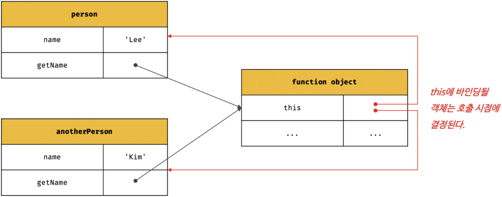
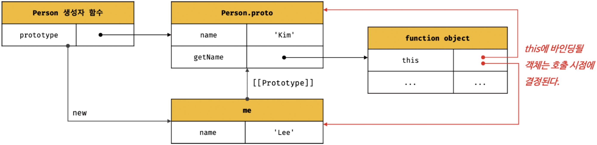

# Modern JavaScript - 22장. this

### this

- 자신이 속한 객체 또는 자신이 생성할 인스턴스를 가리키는 자기 참조 변수
- 이를 통해 자신이 속한 객체 또는 자신이 생성할 인스턴스의 프로퍼티나 메서드를 참조 가능
- this는 자바스크립트 엔진에 의해 암묵적으로 생성되며, 코드 어디서든 참조할 수 있음
- 그러나 this가 가리키는 값, 즉 this 바인딩은 함수 호출 방식에 의해 동적으로 결정됨

### this 바인딩

- 바인딩은 식별자와 값을 연결하는 과정
- this 바인딩은 식별자 역할을 수행할 this와 this가 가리킬 객체를 바인딩

1. 객체 리터럴

```javascript
const circle = {
  radius: 5,
  getDiameter() {
    return 2 * this.radius;
  },
};
console.log(circle.getDiameter());
```

2. 생성자 함수

```javascript
function Circle(radius) {
  this.radius = radius;
}

Circle.prototype.getDiameter = function () {
  return 2 * this.radius;
};

const circle = new Circle(5);
console.log(circle.getDiameter());
```

### 함수 호출 방식에 따른 this 바인딩 상태

- this 바인딩(this에 바인딩될 값)은 함수 호출 방식, 즉 함수가 어떻게 호출되었는지에 따라 동적으로 결정됨
- 함수 호출 방식은 4가지가 있음
  1.  일반 함수 호출
  2.  메서드 호출
  3.  생성자 함수 호출
  4.  Function.prototype.apply/call/bind 메서드에 의한 간접 호출

| 함수 호출 방식                                             | this 바인딩                                                            |
| ---------------------------------------------------------- | ---------------------------------------------------------------------- |
| 일반 함수 호출                                             | 전역 객체                                                              |
| 메서드 호출                                                | 메서드를 호출한 객체                                                   |
| 생성자 함수 호출                                           | 생성자 함수가 생성할 인스턴스                                          |
| Function.prototype.apply/call/bind 메서드에 의한 간접 호출 | Function.prototype.apply/call/bind 메서드에 첫 번째 인수로 전달한 객체 |

### 일반 함수에서의 this 바인딩

- 기본적으로 this에 전역 객체 바인딩
- 객체를 생성하지 않는 일반 함수에서 this는 의미 없음

```javascript
function foo() {
  // use strict;  // strict mode에서 일반 함수의 this는 undefined와 바인딩됨
  console.log("foo's this: ", this); // window
  function bar() {
    console.log("bar's this: ", this); // window
  }
  bar();
}
foo();
```

- 일반함수로 호출되는 모든 함수(중첩 함수, 콜백 함수 포함) 내부의 this에는 전역 객체가 바인딩됨

```javascript
var value = 1;
const obj = {
  value: 100,
  foo() {
    console.log("foo's this: ", this); // {value: 100, foo: f}
    console.log("foo's this.value: ", this.value); // 100
    function bar() {
      console.log("bar's this: ", this); // window
      console.log("bar's this.value: ", this.value); // 1
    }
    // 메서드 내에서 정의한 중첩 함수
    bar();
  },
};

obj.foo();
```

- 만일 메서드 내부의 중첩 함수나 콜백 함수의 this 바인딩을 메서드의 this 바인딩과 일치시키기 위한 방법은 아래와 같다.

1. 메서드를 가진 객체에 대한 this를 다른 변수가 저장해서 해당 this에 담을 변수를 참조

```javascript
var value = 1;

const obj = {
  value: 100,
  foo() {
    // this 바인딩(obj)을 변수 that에 할당
    const that = this;

    // 콜백 함수 내부에서 this 대신 that을 참조
    setTimeout(function () {
      console.log(that.value); // 100
    }, 100);
  },
};

obj.foo();
```

2. Function.prototype.apply, Function.prototype.call, Function.prototype.bind 메서드에 의한 간접 호출

```javascript
var value = 1;
const obj = {
  value: 100,
  foo() {
    setTimeout(
      function () {
        console.log(this.value);
      }.bind(this),
      100
    );
  },
};

obj.foo();
```

3. 화살표 함수 사용으로 this 바인딩 일치

```javascript
var value = 1;
const obj = {
  value: 100,
  foo() {
    // 화살표 함수 내부의 this는 상위 스코프의 this를 가리킴
    setTimeout(() => console.log(this.value), 100);
  },
};

obj.foo();
```

### 생성자 함수에서의 this 바인딩

- 생성자 함수 내부의 this에는 생성자 함수의 인스턴스가 바인딩된다.

```javascript
function Circle(radius) {
  this.radius = radius;
  this.getDiameter = function () {
    return 2 * this.radius;
  };
}

const circle1 = new Circle(5);
const circle2 = new Circle(10);

console.log(circle1.getDiameter()); // 10
console.log(circle2.getDiameter()); // 20
```

- 생성자 함수의 인스턴스를 생성하기 위해선 반드시 new 연산자와 함께 생성자 함수를 호출해야 한다.
- new 연산자 없이 호출하면 일반 함수로 동작한다.

```javascript
const circle3 = Circle(100);
console.log(circle3); // undefined
console.log(radius); // 100
console.log(circle3.radius); // TypeError: Cannot read properties of undefined (reading 'radius')
console.log(circle3.getDiameter()); // TypeError: Cannot read properties of undefined (reading 'getDiameter')
```

### 메서드 호출에서의 this 바인딩

- this에 메서드를 호출한 객체의 식별자가 바인딩됨

```javascript
const person = {
  name: "Lee",
  getName() {
    return this.name;
  },
};

console.log(person.getName()); // Lee
```

- 주의할 점은 메서드 내부의 this는 메서드를 소유한 객체가 아닌 메서드를 호출한 객체에 바인딩됨
- 메서드도 객체의 프로퍼티로 구성되어 있고 해당 프로퍼티는 함수 객체를 값으로 저장하고 있기 때문에 객체에 종속된 것이 아닌 독립적으로 존재하는 별도의 객체이다.
- 어떤 객체의 메서드를 다른 객체의 메서드로 등록한다면 다른 객체의 메서드의 this는 다른 객체에 바인딩됨

```javascript
const anotherPerson = {
  name: "Kim",
};
anotherPerson.getName = person.getName;

console.log(anotherPerson.getName()); // Kim

const getName = person.getName;

// 해당 명령문은 getName 메서드를 일반 함수로 호출함
console.log(getName()); // ''
// 일반 함수로 호출된 getName 함수 내부의 this.name은 브라우저 환경에서 window.name과 동일
```

<div align="center">
	
</div>

- 프로토타입 메서드 내부에서 사용된 this도 일반 메서드와 마찬가지로 해당 메서드를 호출한 객체에 바인딩된다.

```javascript
function Person(name) {
  this.name = name;
}
Person.prototype.getName = function () {
  return this.name;
};
const me = new Person("Lee");
console.log(me.getName()); // Lee
Person.prototype.name = "Kim";
console.log(Person.prototype.getName()); // Kim
```

<div align="center">
	
</div>

### apply, call, bind 메서드

- Function.prototype의 메서드
- 이들 메서드는 모든 함수가 상속받아서 사용할 수 있다.

### Docstring

```javascript
/**
* 주어진 this 바인딩과 인수 리스트 배열을 사용하여 함수를 호출한다.
* @param thisArg - this로 사용할 객체
* @param argsArray - 함수에게 전달할 인수 리스트의 배열 또는 유사 배열 객체
* @returns 호출된 함수의 반환값
*/
Function.prototype.apply(thisArg[, argsArray])

/**
* 주어진 this 바인딩과 ,로 구분된 인수 리스트를 사용하여 함수를 호출한다.
* @param thisArg - this로 사용할 객체
* @param arg1, arg2, ... - 함수에게 전달할 인수 리스트
* @returns 호출된 함수의 반환값
*/
Function.prototype.call(thisArg[, arg1[, arg2[, ...]]])
```

### Function.prototype.apply/call

- 두 메서드의 본질적 기능은 함수를 호출하는 것이다.
- apply와 call 메서드는 함수를 호출하면서 첫 번째 인수로 전달한 특정 객체를 호출한 함수의 this에 바인딩시킴
- 호출할 함수에 인수를 전달하는 방식만 다를 뿐 동일하게 동작

```javascript
function getThisBinding() {
	console.log(arguments);
	return this;
}

const thisArg = { a: 1 };

console.log(getThisBinding.apply(thisArg, [1, 2, 3]));
// [Arguments] { '0': 1, '1': 2, '2': 3 }
// { a: 1 }
console.log(getThisBinding.call(thisArg, 1, 2, 3));
// [Arguments] { '0': 1, '1': 2, '2': 3 }
// { a: 1 }
```

- 대표적인 용도는 arguments 객체와 같은 유사 배열 객체에 배열 메서드를 사용하는 경우
- arguments 객체는 배열이 아니기 때문에 apply, call 메서드를 이용하면 가능

```javascript
function convertArgsToArray() {
	console.log(arguments);
	
	// arguments 객체를 배열로 변환
	// Array.prototype.slice를 인수 없이 호출하면 배열의 복사본을 생성
	const arr = Array.prototype.slice.call(arguments);
	// const arr = Array.prototype.slice.apply(arguments);
	console.log(arr);
	
	return arr;
}

convertArgsToArray(1, 2, 3);
// console.log(arguments); -> [Arguments] { '0': 1, '1': 2, '2': 3 }
// console.log(arr); -> [ 1, 2, 3 ]
```

### Function.prototype.bind
 
- apply, call 메서드와 달리 함수를 호출하지 않음
- 첫 번째 인수로 전달한 값으로 this 바인딩이 교체된 함수를 새롭게 생성해 반환

```javascript
function getThisBinding() {
	return this;
}

// this로 사용할 객체
const thisArg = { a: 1 };

// bind 메서드는 첫 번째 인수로 전달한 thisArg로 this 바인딩이 교체된
// getThisBinding 함수를 새롭게 생성해 반환한다.
console.log(getThisBinding.bind(thisArg));    // getThisBinding
// bind 메서드는 함수를 호출하지는 않으므로 명시적으로 호출해야 한다.
console.log(getThisBinding.bind(thisArg)());  // { a: 1 }
```

- 해당 메서드의 목적은 메서드의 this와 메서드 내부의 중첩 함수 또는 콜백 함수의 this가 불일치하는 문제 해결을 위함

```javascript
const person = {
	name: 'Lee',
	foo(callback) {
		setTimeout(callback, 100);
	}
};

person.foo(function () {
	console.log(`Hi! my name is ${this.name}.`);
});
```

- 위 코드의 문제점은 foo 메서드의 콜백 함수의 this는 전역 객체를 바인딩한다.
- Function.prototype.bind 메서드로 콜백 함수 내부의 this를 외부 함수 내부의 this와 일치시킨다.

```javascript
const person = {
	name: 'Lee',
	foo(callback) {
		setTimeout(callback.bind(this), 100);
	}
};

person.foo(function () {
	console.log(`Hi! my name is ${this.name}.`);
});
```
