# Modern JavaScript - 23장. 실행 컨텍스트

### 실행 컨텍스트 중요성

- 자바스크립트 동작 원리를 담고 있는 개념
- 실행 컨텍스트를 이해하면 자바스크립트가 스코프를 기반으로 식별자와 식별자에 바인딩된 값(식별자 바인딩)을 관리하는 방식과 호이스팅 발생 이유, 클로저의 동작 방식, 그리고 태스크 큐와 함께 동작하는 이벤트 핸들러와 비동기 처리의 동작 방식을 이해할 수 있다.

### 소스코드의 타입

- ECMAScript 사양은 소스코드를 4가지 타입으로 구분한다.

1. 전역 코드(global code)
   - 전역에 존재하는 소스코드
   - 전역에 정의된 함수, 클래스 등의 내부 코드는 포함되지 않는다.
   - 전역 변수를 관리하기 위해 최상위 스코프인 전역 스코프를 생성
   - var 키워드로 선언된 전역 변수와 함수 선언문으로 정의된 전역 함수를 전역 객체의 프로퍼티와 메서드로 바인딩하고 참조하기 위해 전역 객체와 연결되어야 한다. 이를 위해 전역 코드가 평가되면 전역 실행 컨텍스트가 생성된다.

2. 함수 코드(function code)
   - 함수 내부에 존재하는 소스코드
   - 함수 내부에 중첩된 함수, 클래스 등의 내부 코드는 포함되지 않는다.
   - 지역 스코프를 생성하고 지역 변수, 매개변수, arguments 객체를 관리해야 한다.
   - 생성한 지역 스코프를 전역 스코프에서 시작하는 스코프 체인의 일원으로 연결해야 한다. 이를 위해 함수 코드가 평가되면 함수 실행 컨텍스트가 생성된다.

3. eval 코드(eval code)
   - 빌트인 전역 함수인 eval 함수에 인수로 전달되어 실행되는 소스코드
   - eval 코드는 strict mode에서 자신만의 독자적인 스코프를 생성한다. 이를 위해 eval 코드가 평가되면 eval 실행 컨텍스트가 생성된다.

4. 모듈 코드(module code)
   - 모듈 내부에 존재하는 소스코드
   - 모듈 내부의 함수, 클래스 등의 내부 코드는 포함되지 않는다.
   - 모듈별로 독립적인 모듈 스코프를 생성한다. 이를 위해 모듈 코드가 평가되면 모듈 실행 컨텍스트가 생성된다.

<div align="center">
  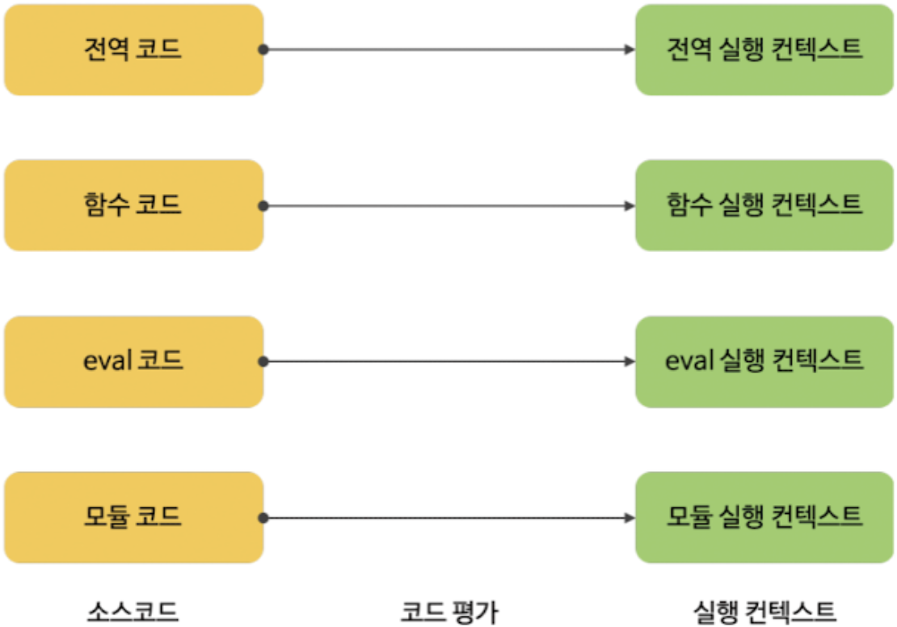
</div>

### 소스코드의 평가와 실행

- 자바스크립트 엔진은 '소스코드의 평가', '소스코드의 실행'과정으로 나누어 처리한다.
- 소스코드 평가
  - 실행 컨텍스트를 생성하고 변수, 함수 등의 선언문만 먼저 실행하여 생성된 변수나 함수 식별자를 키로 실행 컨텍스트가 관리하는 스코프(렉시컬 환경의 환경 레코드)에 등록한다.
- 소스코드 실행
  - 소스코드 평가 과정이 끝나면 비로소 선언무을 제외한 소스코드가 순차적으로 실행되기 시작한다.
  - 즉, 런타임이 시작된다.
  - 이때 소스코드 실행에 필요한 정보, 즉 변수나 함수의 참조를 실행 컨텍스트가 관리하는 스코프에서 검색해서 취득한다.
  - 그리고 변수 값의 변경 등 소스코드의 실행 결과는 다시 실행 컨텍스트가 관리하는 스코프에 등록한다.

<div align="center">
  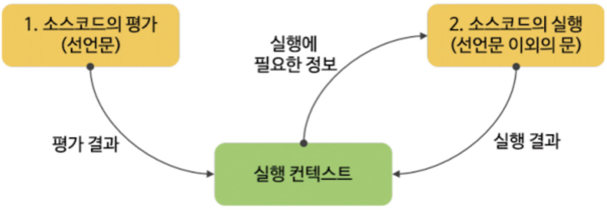
</div>

### 소스코드의 평가와 실행 예시

```javascript
var x;
x = 1;
```

- 소스코드 평가
  - 변수 선언문 var x 실행
  - 이때 생성된 변수 식별자 x는 실행 컨텍스트가 관리하는 스코프에 등록하고 undefined로 초기화
- 소스코드 실행
  - 컨텍스트가 관리하는 스코프에 x 변수가 등록되어 있는지 확인한다. 즉, 변수 x가 선언된 변수인지 확인한다.
  - 스코프에 등록되어 있다면 변수 할당문을 실행하여 할당 결과를 실행 컨텍스트에 등록하여 관리한다.

### 실행 컨텍스트

- 소스코드를 실행하는데 필요한 환경을 제공하고 코드의 실행 결과를 실제로 관리하는 영역
- 실행 컨텍스트는 식별자(변수, 함수, 클래스 등의 이름)를 등록하고 관리하는 스코프와 코드 실행 순서 관리를 구현한 내부 매커니즘으로, 모든 코드를 실행 컨텍스트를 통해 실행되고 관리된다.
- 식별자와 스코프는 실행 컨텍스트의 렉시컬 환경으로 관리하고 코드 실행 순서는 실행 컨텍스트 스택으로 관리한다.

### 실행 컨텍스트 역할

```javascript
// 전역 변수 선언
const x = 1;
const y = 2;

// 함수 정의
function foo(a) {
  // 지역 변수 선언
  const x = 10;
  const y = 20;

  // 메서드 호출
  console.log(a + x + y);
}

// 함수 호출
foo(100);

// 메서드 호출
console.log(x + y);
```

1. 전역 코드 평가
   - 전역 코드의 변수 선언문과 함수 선언문이 먼저 실행되고, 그 결과 생성된 전역 변수 및 전역 함수가 실행 컨텍스트가 관리하는 전역 스코프에 등록된다.
   - var 키워드로 선언된 전역 변수와 함수 선언문으로 정의된 전역 함수는 전역 객체의 프로퍼티와 메서드가 된다.

2. 전역 코드 실행
   - 전역 코드가 순차적으로 실행되기 시작한다.
   - 이때 전역 변수에 값이 할당되고 함수가 호출된다.
   - 함수가 호출되면 순차적으로 실행되던 전역 코드의 실행을 일시 중단하고 코드 실행 순서를 변경하여 함수 내부고 진입한다.

3. 함수 코드 평가
   - 함수 호출에 의해 코드 실행 순서가 변경되어 함수 내부로 진입하면 함수 내부의 문들을 실행하기에 앞서 함수 코드 평가 과정을 거치며 함수 코드를 실행하기 위한 준비를 한다.
   - 이때 매개변수와 지역 변수 선언문이 먼저 실행되고, 그 결과 생성된 매개변수와 지역 변수가 실행 컨텍스트가 관리하는 지역 스코프에 등록된다.
   - 또한 함수 내부에서 지역 변수처럼 사용할 수 있는 arguments 객체가 생성되어 지역 스코프에 등록되고 this 바인딩도 결정된다.

4. 함수 코드 실행
   - 매개변수와 지역 변수에 값이 할당되고 console.log 메서드가 호출된다.
   - console.log 메서드를 호출하기 위해 먼저 식별자인 console을 스코프 체인을 통해 검색한다.
   - 그 후 console.log 메서드에 인수로 전달된 표현식 a + x + y가 평가된다.
   - a, x, y 식별자는 스코프 체인을 통해 검색한다.
   - console.log 메서드의 실행이 종료되면 함수 코드 실행 과정이 종료되고 함수 호출 이전으로 되돌아가 전역 코드 실행을 계속한다.

**위 과정을 통해 실행 컨텍스트 역할 설명**

- 코드가 실행되려면 스코프를 구분하여 식별자와 바인딩된 값이 관리되어야 한다.
- 그리고 중첩 관계에 의해 스코프 체인을 형성하여 식별자를 검색할 수 있어야 하고, 전역 객체의 프로퍼티도 전역 변수처럼 검색할 수 있어야 한다.
- 또한 함수 호출이 종료되면 함수 호출 이전으로 되돌아가기 위해 현재 실행 중인 코드와 이전에 실행하던 코드를 구분하여 관리해야 한다.
- **이처럼 코드가 실행되려면 스코프, 식별자, 코드 실행 순서 등의 관리가 필요하다.**

### 실행 컨텍스트 스택

- 실행 컨텍스트는 스택 자료구조로 관리된다.
- 실행 컨텍스트 스택의 최상위에 존재하는 실행 컨텍스트는 실행 중인 실행 컨텍스트라 부른다.

```javascript
const x = 1;

function foo() {
  const y = 2;

  function bar() {
    const z = 3;
    console.log(x + y + z);
  }
  bar();
}

foo();
```

1. 전역 코드의 평가와 실행
   - 자바스크립트 엔진은 먼저 전역 코드를 평가하여 전역 실행 컨텍스트를 생성하고 실행 컨텍스트 스택에 푸시한다.
   - 이때 전역 변수 x와 전역 함수 foo는 전역 실행 컨텍스트에 등록된다.
   - 이후 전역 코드가 실행되기 시작하여 전역 변수 x에 값이 할당되고 전역 함수 foo가 호출된다.

2. foo 함수 코드의 평가와 실행
   - 전역 함수 foo가 호출되면 전역 코드의 실행은 일시 중단되고 코드의 제어권이 foo 함수 내부로 이동한다.
   - 자바스크립트 엔진은 foo 함수 내부의 함수 코드를 평가하여 foo 함수 실행 컨텍스트를 생성하고 실행 컨텍스트 스택에 푸시한다.
   - 이때 foo 함수의 지역 변수 y와 중첩 함수 bar가 foo 함수 실행 컨텍스트에 등록된다.
   - 이후 foo 함수 코드가 실행되기 시작하여 지역 변수 y에 값이 할당되고 중첩 함수 bar가 호출된다.

3. bar 함수 코드의 평가와 실행
   - 중첩 함수 bar가 호출되면 foo 함수 코드의 실행은 일시 중단되고 코드의 제어권이 bar 함수 내부로 이동한다.
   - 자바스크립트 엔진은 bar 함수 내부의 함수 코드를 평가하여 bar 함수 실행 컨텍스트를 생성하고 실행 컨텍스트 스택에 푸시한다.
   - 이때 bar 함수의 지역 변수 z가 bar 함수 실행 컨텍스트에 등록된다.
   - 이후 bar 함수 코드가 실행되기 시작하여 지역 변수 z에 값이 할당되고 console.log 메서드를 호출한 이후, bar 함수는 종료된다.

4. foo 함수 코드로 복귀
   - bar 함수가 종료되면 코드의 제어권은 다시 foo 함수로 이동한다.
   - 이때 자바스크립트 엔진은 bar 함수 실행 컨텍스트를 실행 컨텍스트 스택에서 pop하여 제거한다.
   - 그리고 foo 함수는 더 이상 실행할 코드가 없으므로 종료된다.

5. 전역 코드로 복귀
   - foo 함수가 종료되면 코드의 제어권은 다시 전역 코드로 이동한다.
   - 이때 자바스크립트 엔진은 foo 함수 실행 컨텍스트를 실행 컨텍스트 스택에서 pop하여 제거한다.
   - 그리고 더 이상 실행할 전역 코드가 남아있지 않으므로 전역 실행 컨텍스트도 실행 컨텍스트 스택에셔 pop되어 실행 컨텍스트 스택에는 아무것도 남아있지 않게 된다.

<div align="center">
  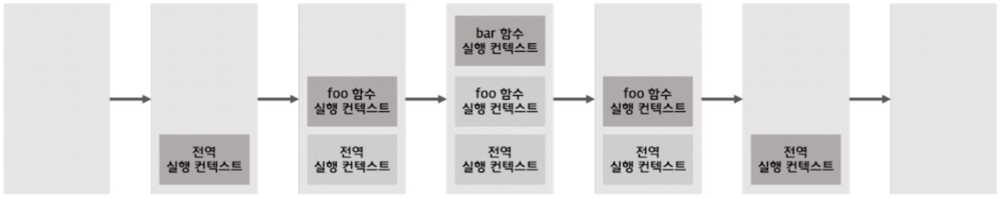
</div>

### 렉시컬 환경

- 식별자와 식별자와 바인딩된 값, 그리고 상위 스코프에 대한 참조를 기록하는 자료구조
- 실행 컨텍스트를 구성하는 컴포넌트
- **실행 컨텍스트 스택**은 코드의 실행 순서를 관리, **렉시컬 환경**은 스코프와 식별자를 관리
- 키와 값을 갖는 객체 형태의 스코프를 생성하여 식별자를 키로 등록하고 식별자에 바인딩된 값을 관리한다.
- 즉, 렉시컬 환경은 스코프를 구분하여 식별자를 등록하고 관리하는 저장소 역할을 하는 렉시컬 스코프의 실체다.

**실행 컨텍스트를 구성하는 두 개의 컴포넌트**

- 생성 초기에 두 컴포넌트(LexicalEnvironment, VariableEnvironment)는 하나의 동일한 렉시컬 환경을 참조한다.
- 이후 몇 가지 상황을 만나면 VariableEnvironment 컴포넌트를 위한 새로운 렉시컬 환경을 생성하고, 이때부터 VariableEnvironment 컴포넌트와 LexicalEnvironment 컴포넌트는 내용이 달라지는 경우도 있다.

**렉시컬 환경을 구성하는 두 개의 컴포넌트**

1. 환경 레코드(Environment Record)
   - 스코프에 포함된 식별자를 등록하고 등록된 식별자에 바인딩된 값을 관리하는 저장소
   - 환경 레코드는 소스코드의 타입에 따라 관리하는 내용에 차이가 있다.

2. 외부 렉시컬 환경에 대한 참조(Outer Lexical Environment Reference)
   - 외부 렉시컬 환경에 대한 참조는 상위 스코프를 가리킨다.
   - 상위 스코프는 외부 렉시컬 환경, 즉 해당 실행 컨텍스트를 생성한 소스코드를 포함하는 상위 코드의 렉시컬 환경을 말한다.
   - 외부 렉시컬 환경에 대한 참조를 통해 단방향 링크드 리스트인 스코프 체인을 구현한다.

### 실행 컨텍스트 생성과 식별자 검색 과정

```javascript
var x = 1;
const y = 2;

function foo(a) {
  var x = 3;
  const y = 4;

  function bar(b) {
    const z = 5;
    console.log(a + b + x + y + z);
  }
  bar(10);
}
foo(20);
```

**1. 전역 객체 생성**

    - 소스코드 평가 이전에 생성
    - 전역 객체에는 빌트인 전역 프로퍼티, 빌트인 전역 함수, 표준 빌트인 객체 추가
    - 동적 환경에 따른 호스트 객체도 추가
        - Web API
            - DOM
            - BOM
            - Canvas
            - XMLHttpRequest
            - fetch
            - requestAnimationFrame
            - SVG
            - Web Storage
            - Web Component
            - Web Worker 등
        - Node.js API
    - 전역 객체도 Object.prototype을 상속받는다. 즉, 전역 객체도 프로토타입의 일원이다.

**2. 전역 코드 평가**

(1) 전역 실행 컨텍스트 생성

- 비어있는 전역 실행 컨텍스트를 생성하여 실행 컨텍스트 스택에 푸시

(2) 전역 렉시컬 환경 생성

- 전역 렉시컬 환경 생성 후 전역 실행 컨텍스트에 바인딩

<div align="center">
  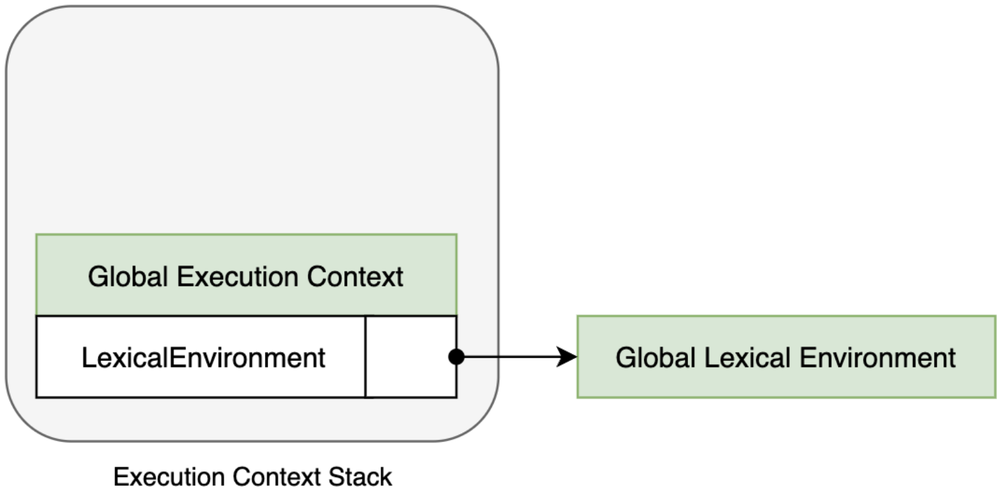
</div>

(2.1) 전역 환경 레코드 생성

- 전역 변수를 관리하는 전역 스코프, 전역 객체의 빌트인 전역 프로퍼티, 빌트인 전역 함수, 표준 빌트인 객체를 제공
- ES6 이전에는 전역 객체가 전역 환경 레코드의 역할을 수행.
- ES6 이후에는 let, const 키워드로 선언한 전역 변수는 전역 객체의 프로퍼티가 되지 않고 개념적인 블록 내에 존재
- 전역 환경 레코드는 객체 환경 레코드, 선언적 환경 레코드로 구성된다.

(2.1.1) 객체 환경 레코드 생성

- 전역 객체 생성 단계에서 생성된 BindingObject 객체와 연결된 레코드
- 전역 코드 평가 과정에서 var 키워드로 선언한 전역 변수와 함수 선언문으로 정의된 전역 함수는 전역 환경 레코드의 객체 환경 레코드에 연결된 BindingObject를 통해 전역 객체의 프로퍼티와 메서드가 된다.

<div align="center">
  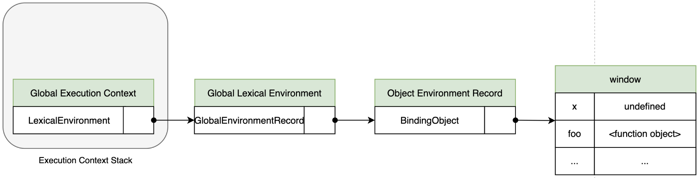
</div>

(2.1.2) 선언적 환경 레코드 생성

<div align="center">
  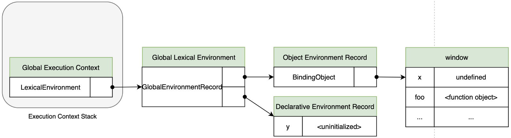
</div>

(2.2) this 바인딩

<div align="center">
  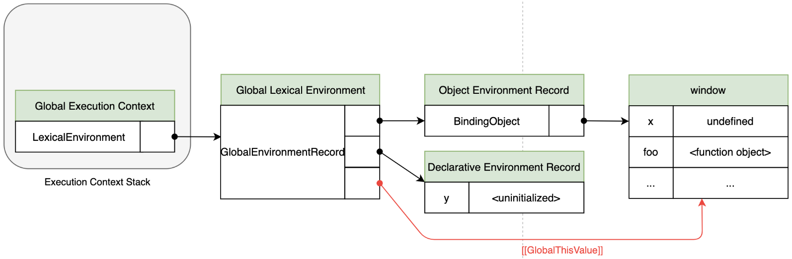
</div>

(2.3) 외부 렉시컬 환경에 대한 참조 결정

<div align="center">
  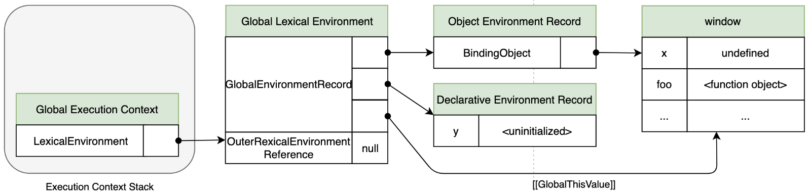
</div>

**3. 전역 코드 실행**

<div align="center">
  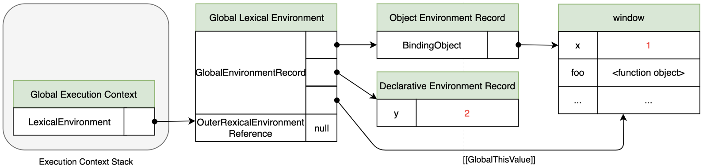
</div>

**4. foo 함수 코드 평가**

(1) 함수 실행 컨텍스트 생성

<div align="center">
  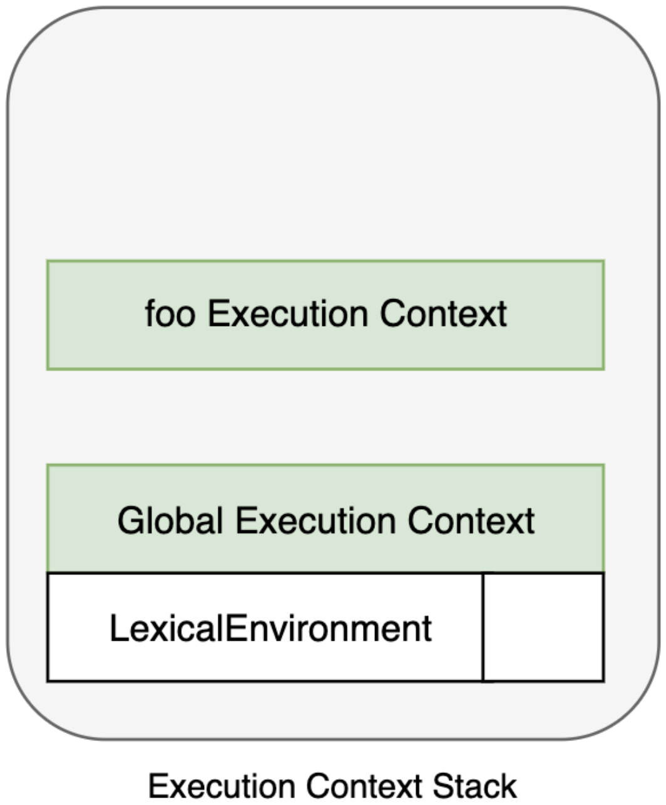
</div>

(2) 함수 렉시컬 환경 생성

<div align="center">
  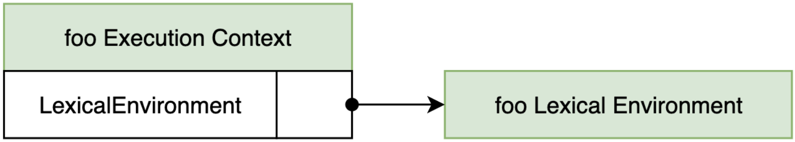
</div>

(2.1) 함수 환경 레코드 생성

<div align="center">
  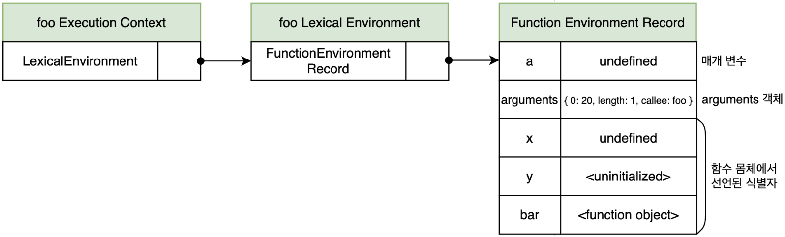
</div>

(2.2) this 바인딩

<div align="center">
  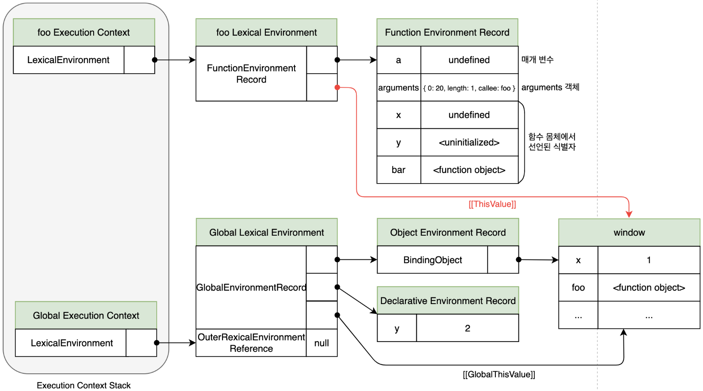
</div>

(2.3) 외부 렉시컬 환경에 대한 참조 결정

<div align="center">
  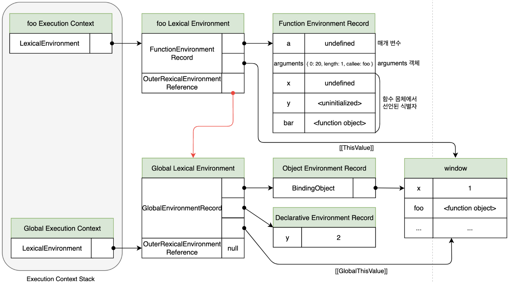
</div>

**5. foo 함수 코드 실행**

<div align="center">
  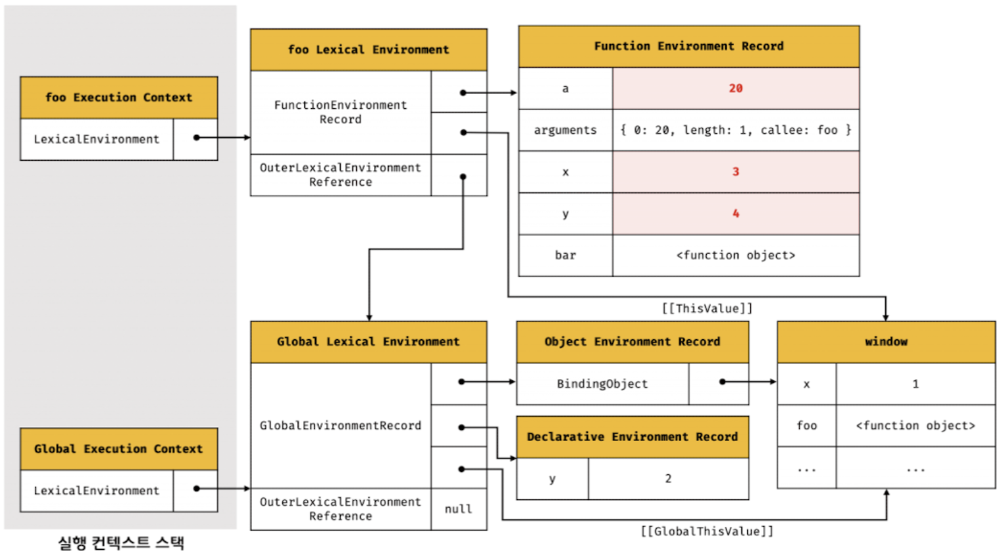
</div>

**6. bar 함수 코드 평가**

<div align="center">
  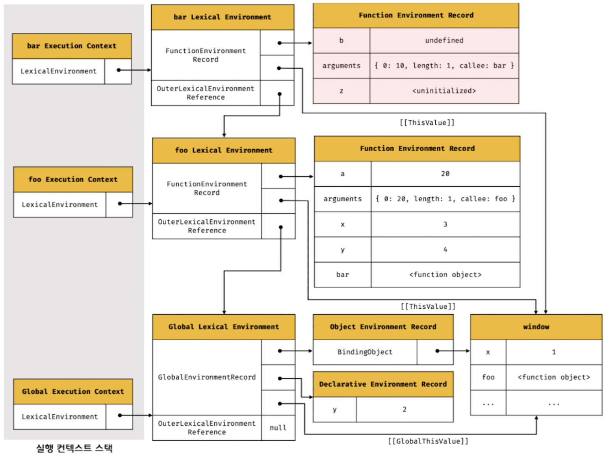
</div>

**7. bar 함수 코드 실행**

<div align="center">
  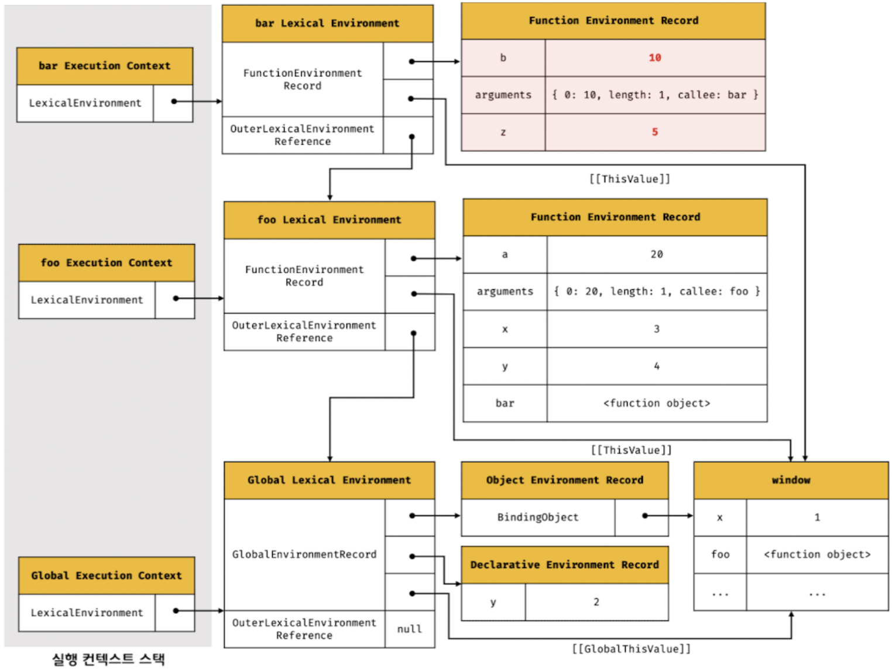
</div>

**8. bar 함수 코드 실행 종료**

- console.log 메서드가 호출되고 종료하면 더는 실행할 코드가 없으므로 bar 함수 코드의 실행이 종료된다.
- 이때 실행 컨텍스트 스택에서 bar 함수 실행 컨텍스트가 팝되어 제거되고 foo 실행 컨텍스트가 실행 중인 실행 컨텍스트가 된다.
- bar 함수 실행 컨텍스트가 소멸되었다 하더라도 만약 bar 함수 렉시컬 환경을 누군가 참조하고 있다면 bar 함수 렉시컬 환경은 소멸하지 않는다.

**9. foo 함수 코드 실행 종료**

- bar 함수가 종료하면 더 이상 실행할 코드가 없으므로 foo 함수 코드의 실행이 종료된다.
- 이때 실행 컨텍스트 스택에서 foo 함수 실행 컨텍스트가 팝되어 제거되고 전역 실행 컨텍스트가 실행 중인 실행 컨텍스트가 된다.

**10. 전역 코드 실행 종료**

- foo 함수가 종료되면 더는 실행할 전역 코드가 없으므로 전역 코드의 실행이 종료되고 전역 실행 컨텍스트도 실행 컨텍스트 스택에서 팝되어 실행 컨텍스트 스택에는 아무것도 남아있지 않게 된다.

### 블록 레벨 스코프

- var 키워드로 선언한 변수나 함수는 함수의 코드 블록만 지역 스코프로 인정하는 함수 레벨 스코프를 따른다.
- 그러나 let, const 키워드로 선언한 변수는 모든 코드 블록(함수, if문, for문, while문, try/catch문 등)을 지역 스코프로 인정하는 블록 레벨 스코프를 따른다.

```javascript
let x = 1;

if (true) {
  let x = 10;
  console.log(x); // 10
}

console.log(x); // 1
```

<div align="center">
  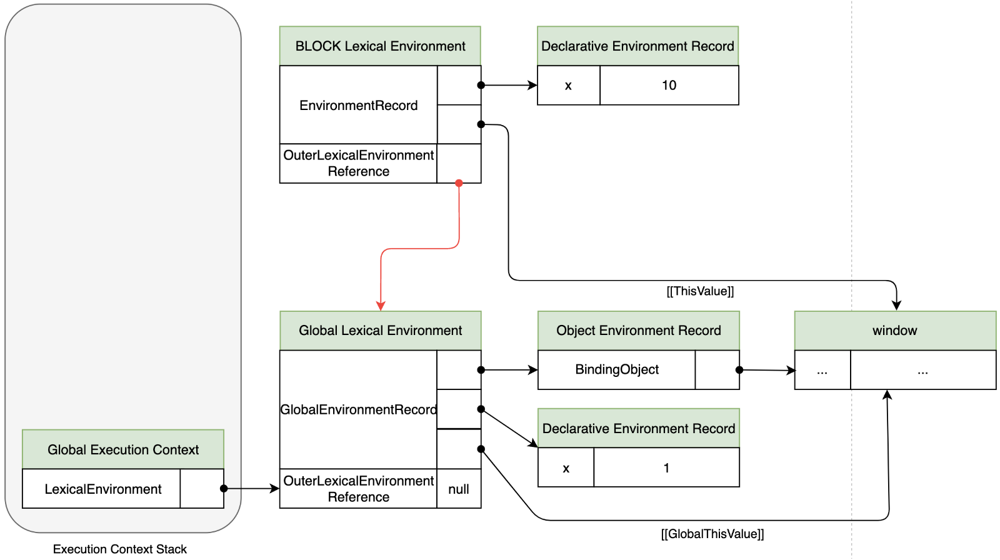
</div>
