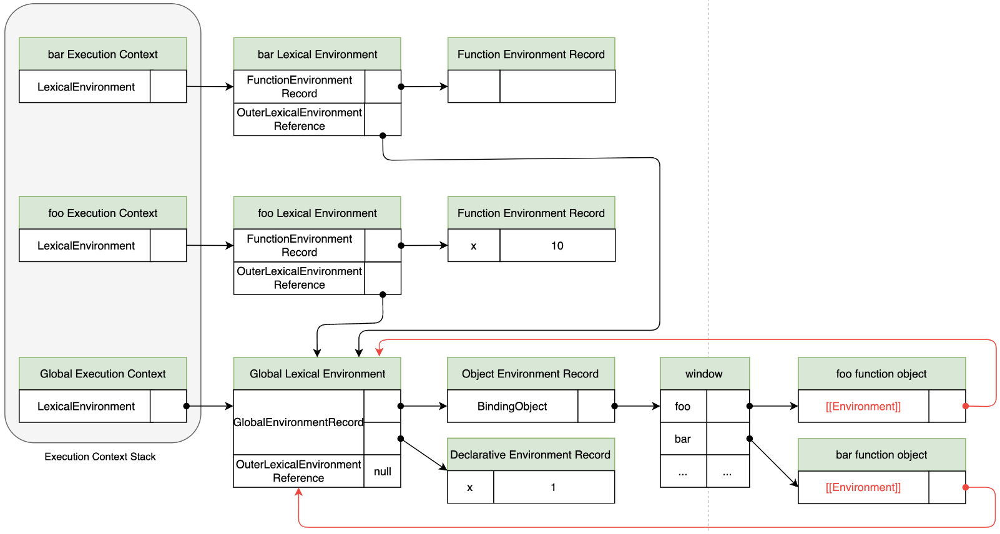
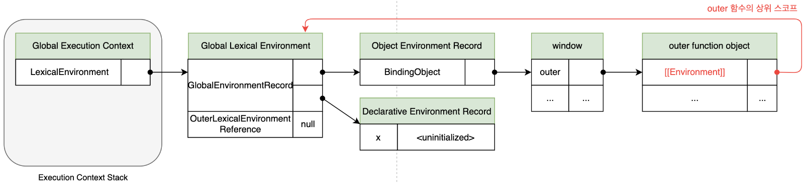
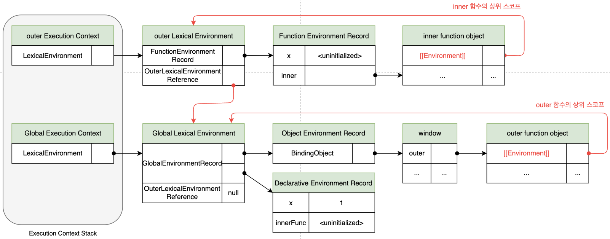
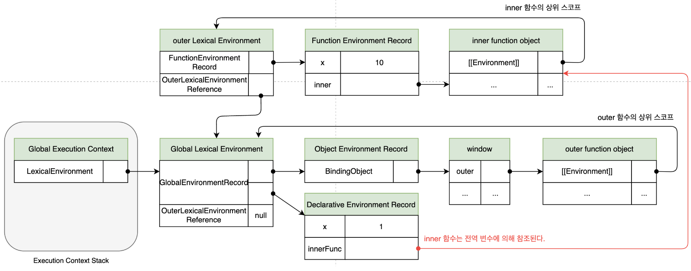
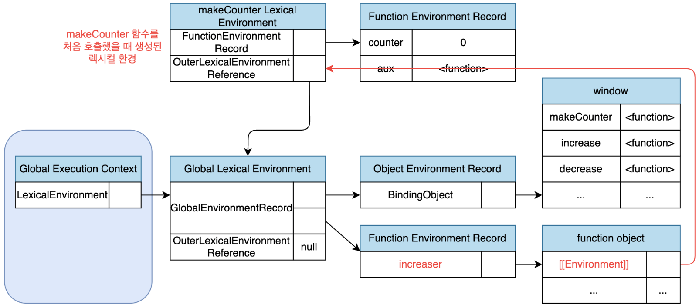
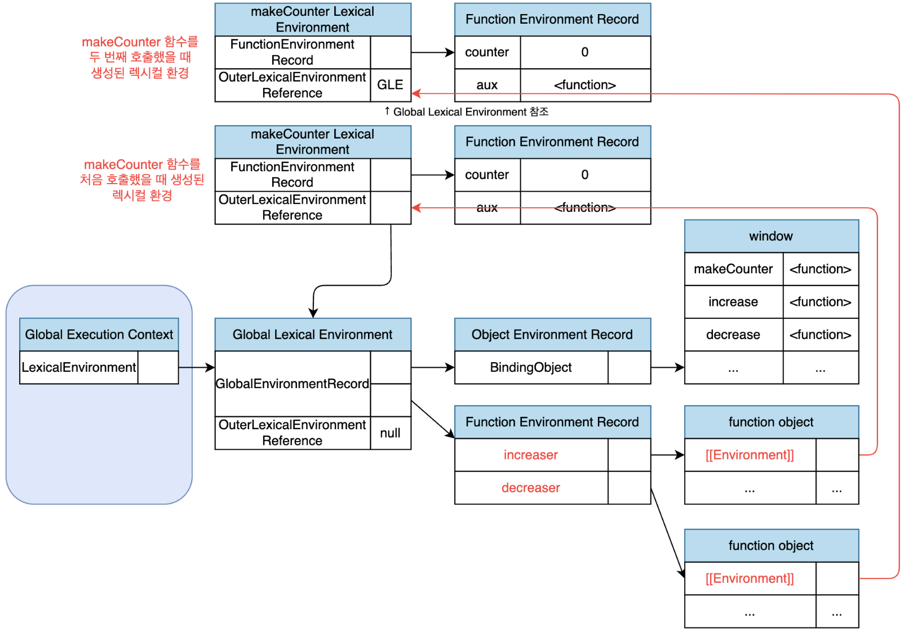
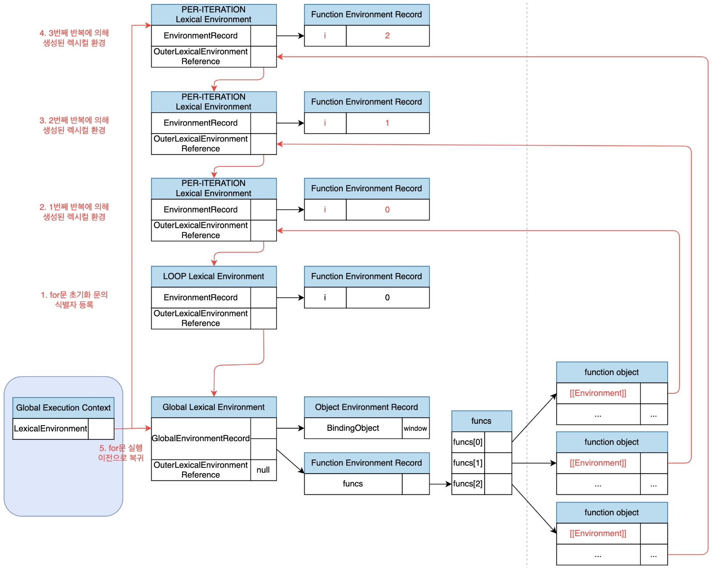

# Modern JavaScript - 24장. 클로저

### 클로저

- MDN 정의: 클로저는 함수와 그 함수가 선언된 렉시컬 환경과의 조합이다.
- 외부 함수보다 중첩 함수가 더 오래 유지되는 경우 중첩 함수는 이미 생명 주기가 죵로한 외부 함수의 변수를 참조할 수 있다. 이러한 중첩 함수를 클로저라 부른다.
- 자바스크립트뿐만 아니라 함수를 일급 객체로 취급하는 함수형 프로그래밍 언어(하스켈, 리스프, 얼랭, 스칼라 등)에서 사용되는 중요한 특성이다.

```javascript
const x = 1;

function outerFunc() {
  const x = 10;

  function innerFunc() {
    console.log(x);
  }

  innerFunc();
}

outerFunc();
```

- outerFunc 함수 내부에서 중첩 함수 innerFunc가 정의되고 호출되었다.
- 이때 중첩 함수 innerFunc의 상위 스코프는 외부 함수 outerFunc 스코프이다.
- 따라서 중첩 함수 innerFunc 내부에서 자신을 포함하고 있는 외부 함수 outerFunc의 x 변수에 접근할 수 있다.
- 만약 innerFunc 함수가 outerFunc 함수의 내부에서 정의된 중첩 함수가 아니라면 innerFunc 함수를 outerFunc 함수의 내부에서 호출한다 하더라도 outerFunc 함수의 변수에 접근할 수 없다.

```javascript
const x = 1;

function outerFunc() {
  const x = 10;
  innerFunc();
}

function innerFunc() {
  console.log(x);
}

outerFunc();
```

- 이 같은 현상이 발생하는 이유는 자바스크립트가 렉시컬 스코프를 따르는 프로그래밍 언어이기 때문이다.

### \[\[Environment\]\]

- 함수 객체가 정의된 환경, 즉 상위 스코프의 참조가 저장된 함수 객체의 내부 슬롯
- 내부 슬롯 \[\[Environment\]\]에 저장된 상위 스코프 참조는 현재 실행 중인 실행 컨텍스트의 렉시컬 환경을 가리킨다. 함수 정의가 평가되어 함수 객체를 생성하는 시점은 함수가 정의된 환경인 상위 함수가 평가 또는 실행되고 있는 시점이며, 이때 현재 실행 중인 실행 컨텍스트는 상위 함수(또는 전역 코드)의 실행 컨텍스트이기 때문이다.

### 렉시컬 스코프

- 자바스크립트 엔진은 함수를 어디서 호출했는지가 아니라 함수를 어디에 정의했는지에 따라 상위 스코프를 결정한다.
- 이러한 스코프를 렉시컬 스코프(정적 스코프)라 부른다.

### 렉시컬 스코프 상세 설명

```javascript
const x = 1;

function foo() {
  const x = 10;
  bar();
}

function bar() {
  console.log(x);
}

foo();
bar();
```

- foo 함수, bar 함수는 전역 함수다. 함수가 정의된 시점에서 함수의 상위 스코프가 결정되는데 두 함수의 상위 스코프는 전역 환경이기 때문에 전역 함수가 된다.
- 스코프는 실행 컨텍스트의 렉시컬 환경이다. 이 렉시컬 환경은 자신의 외부 렉시컬 환경에 대한 참조를 통해 상위 렉시컬 환경과 연결된다. 이를 통해 스코프 체인이 형성되는 것이다.
- 렉시컬 스코프의 정의를 재구성하면, 렉시컬 환경의 "외부 렉시컬 환경에 대한 참조"에 저장할 참조값, 즉 상위 스코프에 대한 참조는 함수 정의가 평가되는 시점에 함수가 정의된 환경(위치)에 따라 결정되는 것을 말한다.

### 렉시컬 스코프 예제

```javascript
const x = 1;

function foo() {
  const x = 10;
  bar();
}

function bar() {
  console.log(x);
}

foo();
bar();
```

<div align="center">
  
</div>

- foo 함수와 bar 함수는 전역 코드가 평가되는 시점에 평가되어 함수 객체를 생성하고 전역 객체 window의 메서드가 된다.
- 이때 생성된 함수 객체의 내부 슬롯 \[\[Environment\]\]에는 함수 정의가 평가된 시점, 즉 전역 코드 평가 시점에 실행 중인 실행 컨텍스트의 렉시컬 환경인 전역 렉시컬 환경의 참조가 저장된다.
- 함수가 호출되면 함수 내부로 코드의 제어권이 이동한다. 그리고 함수 코드를 평가하기 시작한다.
- 이때 함수 렉시컬 환경의 구성 요소인 외부 렉시컬 환경에 대한 참조에는 함수 객체의 내부 슬롯 \[\[Environment\]\]에 저장된 렉시컬 환경의 참조가 할당된다.

### 클로저 생명 주기

- outer 함수가 평가되어 함수 객체를 생성할 때 현재 실행 중인 실행 컨텍스트의 렉시컬 환경, 즉 전역 렉시컬 환경을 outer 함수 객체의 \[\[Environment\]\] 내부 슬롯에 상위 스코프로서 저장한다.

<div align="center">
  
</div>

- outer 함수를 호출하면 outer 함수의 렉시컬 환경이 생성되고 앞서 outer 함수 객체의 \[\[Environment\]\] 내부 슬롯에 저장된 전역 렉시컬 환경을 outer 함수 렉시컬 환경의 "외부 렉시컬 환경에 대한 참조"에 할당한다.
- 그리고 inner 함수가 평가된다. 이때 inner 함수는 현재 실행 중인 실행 컨텍스트의 렉시컬 환경, 즉 outer 함수 렉시컬 환경을 inner 함수 객체의 \[\[Environment\]\] 내부 슬롯에 상위 스코프로서 저장한다.

<div align="center">
  
</div>

- outer 함수의 실행이 종료되면 inner 함수를 반환하면서 outer 함수의 생명 주기가 종료된다. 즉, outer 실행 컨텍스트가 실행 컨텍스트 스택에서 제거된다.
- 그러나 outer 함수의 렉시컬 환경까지 소멸되지 않는다. outer 함수의 렉시컬 환경은 inner 함수의 \[\[Environment\]\] 내부 슬롯에 의해 참조되고 있고 inner 함수는 전역 변수 innerFunc에 의해 참조되고 있으므로 가비지 컬렉션의 대상이 되지 않기 때문이다. 가비지 컬렉터는 누군가가 참조하고 있는 메모리 공간을 함부로 해제하지 않는다.

<div align="center">
  
</div>

- outer 함수가 반환한 inner 함수를 호출하면 inner 함수의 실행 컨텍스트가 생성되고 실행 컨텍스트 스택에 푸시된다.
- 그리고 렉시컬 환경의 외부 렉시컬 환경에 대한 참조에는 inner 함수 객체의 \[\[Environment\]\] 내부 슬롯에 저장되어 있는 참조값이 할당된다.

- 중첩 함수 inner는 외부 함수 outer보다 더 오래 생존했다. 이때 외부 함수보다 더 오래 생존한 중첩 함수는 외부 함수의 생존 여부와 상관없이 자신이 정의된 위치에 의해 결정된 상위 스코프를 기억한다.
- 이처럼 중첩 함수 inner의 내부에서는 상위 스코프를 참조할 수 있으므로 상위 스코프의 식별자를 참조할 수 있고 식별자의 값을 변경할 수도 있다.

<div align="center">
  
</div>

### 클로저의 활용

1. 정보 은닉
   - 클로저는 상태를 안전하게 변경하고 유지하기 위해 사용한다.
   - 상태가 의도치 않게 변경되지 않도록 안전하게 은닉하고 특정 함수에게만 상태 변경을 허용한다.

   ```javascript
   let num = 0;

   const increase = function () {
     return ++num;
   };

   console.log(increase()); // 1
   console.log(increase()); // 2
   console.log(increase()); // 3

   num = 0;
   console.log(increase()); // 1
   ```

   - 위 예제는 전역 변수를 참조하여 1씩 증가하는 함수를 실행한 것이다.
   - 함수를 통해서만 변경되지 않고 어디에서든 누구나 접근하고 변경할 수 있기 때문에 좋지 않다.

   ```javascript
   const increase = function () {
     let num = 0;
     return ++num;
   };

   console.log(increase()); // 1
   console.log(increase()); // 1
   console.log(increase()); // 1
   ```

   - 이젠 카운트를 의미하는 num 변수는 함수 내부에서만 접근되고 변경될 수 있다.
   - 그러나 지역 변수 num은 함수가 종료되면 num도 소실되기 때문에 이전 상태를 유지할 수 없다.

   ```javascript
   const increase = (function () {
     let num = 0;
     return function () {
       return ++num;
     };
   })();

   console.log(increase()); // 1
   console.log(increase()); // 2
   console.log(increase()); // 3
   ```

   - 클로저를 사용하면 이제 num 변수가 0으로 초기화될 일은 없을 것이다. 그리고 즉시 실행 함수 내부의 num 지역 변수는 클로저 이외에 어떤 곳에서도 조작할 수 없다.

2. 생성자 함수

   ```javascript
   const counter = (function () {
     let num = 0;
     return {
       increase() {
         return ++num;
       },
       decrease() {
         return num > 0 ? --num : 0;
       },
     };
   })();

   console.log(counter.increase()); // 1
   console.log(counter.increase()); // 2

   console.log(counter.decrease()); // 1
   console.log(counter.decrease()); // 0
   ```

   - increase, decrease 메서드의 상위 스코프는 increase, decrease 메서드가 평가되는 시점에 실행 중인 실행 컨텍스트인 즉시 실행 함수 실행 컨텍스트의 렉시컬 환경이다. 따라서 increase, decrease 메서드가 언제 어디서 호출되든 상관없이 increase, decrease 메서드는 즉시 실행 함수의 스코프의 식별자를 참조할 수 있다.
   - 이런 기능을 제공하는 객체들을 여러 개 만들고 싶으면 생성자 함수를 클로저로 지정하면 된다.

   ```javascript
   const Counter = (function () {
     let num = 0;

     function Counter() {
       // this.num = 0  // 프로퍼티는 public 이므로 은닉되지 않는다.
     }

     Counter.prototype.increase = function () {
       return ++num;
     };

     Counter.prototype.decrease = function () {
       return num > 0 ? --num : 0;
     };

     return Counter;
   })();

   const counter = new Counter();

   console.log(counter.increase()); // 1
   console.log(counter.increase()); // 2

   console.log(counter.decrease()); // 1
   console.log(counter.decrease()); // 0
   ```

3. 함수형 프로그래밍
   - 외부 상태 변경이나 가변 데이터를 피하고 불변성을 지향하는 함수형 프로그래밍에서 부수 효과를 최대한 억제하여 오류를 피하고 프로그램의 안정성을 높이기 위해 클로저는 적극적으로 사용된다.

   ```javascript
   function makeCounter(aux) {
     let counter = 0;

     return function () {
       counter = aux(counter);
       return counter;
     };
   }

   function increase(n) {
     return ++n;
   }

   function decrease(n) {
     return --n;
   }

   const increaser = makeCounter(increase);
   console.log(increaser()); // 1
   console.log(increaser()); // 2

   const decreaser = makeCounter(decrease);
   console.log(decreaser()); // -1
   console.log(decreaser()); // -2
   ```

   - makeCounter 함수는 보조 함수를 인수로 전달받고 함수를 반환하는 고차 함수다.
   - makeCounter 함수가 반환하는 함수는 자신의 렉시컬 환경인 makeCounter 함수 스코프에 속한 counter 변수를 기억하는 클로저다.
   - makeCounter 함수를 호출해 함수를 반환할 때 반환된 함수는 자신만의 독립된 렉시컬 환경을 갖는다. 함수를 호출하면 그때마다 새로운 makeCounter 함수 실행 컨텍스트의 렉시컬 환경이 생성되기 때문이다.

<div align="center">
  
</div>

- increaser와 decreaser에 할당된 함수는 각각 자신만의 독립된 렉시컬 환경을 갖기 때문에 카운트를 유지하기 위한 자유 변수 counter를 공유하지 않아 카운터의 증감이 연동되지 않는다.

<div align="center">
  
</div>

- 따라서 독립된 카운터가 아니라 연동하여 증감이 가능한 카운터를 만들려면 렉시컬 환경을 공유하는 클로저를 만들어야 한다. 이를 위해서 makeCounter 함수를 두 번 호출하면 안 된다.

```javascript
const counter = (function () {
  let counter = 0;

  return function (aux) {
    counter = aux(counter);
    return counter;
  };
})();

function increase(n) {
  return ++n;
}

function decrease(n) {
  return --n;
}

console.log(counter(increase)); // 1
console.log(counter(increase)); // 2

console.log(counter(decrease)); // 1
console.log(counter(decrease)); // 0
```

### for문에 대한 실행 컨텍스트와 클로저

```javascript
const funcs = [];

for (let i = 0; i < 3; i++) {
  funcs[i] = function () {
    return i;
  };
}

for (let i = 0; i < 3; i++) {
  console.log(funcs[i]()); // 0 1 2
}
```

<div align="center">
  
</div>

- for 문이 평가되면 새로운 렉시컬 환경을 생성하고 초기화 변수 식별자와 값을 등록한다. 그리고 새롭게 생성된 렉시컬 환경을 현재 실행 중인 실행 컨텍스트의 렉시컬 환경으로 교체한다.
- for 문의 코드 블록이 반복 실행되기 시작되면 새로운 렉시컬 환경을 생성하고 for문 코드 블록 내의 생성자와 값을 등록한다. 그리고 새롭게 생성된 렉시컬 환경을 현재 실행 중인 실행 컨텍스트의 렉시컬 환경으로 교체한다.
- for 문의 코드 블록의 반복 실행이 모두 종료되면 for 문이 실행되기 이전의 렉시컬 환경을 실행 중인 컨텍스트의 렉시컬 환경으로 되돌린다.
- 위 코드에서 주의점은 함수 정의가 존재해야 한다. 반복문의 코드 블록 내부에 함수 정의가 없는 반복문이 생성하는 새로운 렉시컬 환경은 반복 직후, 아무도 참조하지 않기 때문에 가비지 컬렉션의 대상이 된다.

### 고차 함수 사용

- 변수와 반복문의 사용을 억제할 수 있다. 이런 이점덕분에 오류를 줄이고 가독성을 향상시킨다.

```javascript
const funcs = Array.from(new Array(3), (_, i) => () => i); // (3) [f, f, f]

funcs.forEach((f) => console.log(f())); // 0 1 2
```

### 캡슐화와 정보 은닉

- 캡슐화
  - 객체의 상태를 나타내는 프로퍼티와 프로퍼티를 참조하고 조작할 수 있는 동작인 메서드를 하나로 묶는 것
- 정보 은닉
  - 객체의 특정 프로퍼티나 메서드를 감추는 것
  - 외부에 공개할 필요가 없는 구현의 일부를 외부에 공개되지 않도록 감추어 적절치 못한 접근으로부터 객체의 상태가 변경되는 것을 방지해 정보를 보호하고, 객체 간의 상호 의존성, 즉 결합도를 낮추는 효과가 있다.

### 대부분의 객체지향 프로그래밍 언어

- 클래스 기반의 객체지향 언어는 클래스를 구성하는 멤버에 대하여 public, private, protected 같은 접근 제한자를 선언하여 공개 범위를 한정할 수 있다.
- public으로 선언된 프로퍼티와 메서드는 클래스 외부에서 참조할 수 있지만 private으로 선언된 경우는 클래스 외부에서 참조할 수 없다.

### 자바스크립트

- public, private, protected같은 접근 제한자를 제공하지 않는다. 따라서 자바스크립트 객체의 모든 프로퍼티 및 메서드는 기본적으로 외부에 공개된다.
- private으로 재현하려면 this 식별자를 활용하지 않고, 클로저를 사용하면 된다.

```javascript
function Person(name, age) {
  this.name = name; // public
  let _age = age; // private
}

Person.prototype.sayHi = function () {
  console.log(`Hi! My name is ${this.name}. I am ${_age}`);
};
```

- 위 코드에서 \_age를 절대로 참조할 수 없다. private 처럼 사용하고 싶었지만 Person.prototype 객체와 Person 생성자 함수 객체가 함께 생성되어 쌍으로 이룰뿐, 서로 구분되어 있기 때문에 Person 함수 객체의 \_age 변수를 참조할 수 없다.

```javascript
const Person = (function () {
  let _age = 0; // private
  function Person(name, age) {
    this.name = name;
    _age = age;
  }

  Person.prototype.sayHi = function () {
    console.log(`Hi! My name is ${this.name}. I am ${_age}`);
  };

  return Person;
})();

const me = new Person("Lee", 20);
me.sayHi(); // Hi! My name is Lee. I am 20
console.log(me.name); // Lee
console.log(me._age); // undefined

const you = new Person("Kim", 30);
you.sayHi(); // Hi! My name is Kim. I am 30
console.log(you.name); // Kim
console.log(you._age); // undefined
```

- 위 코드처럼 작성하면 중첩 함수 Person의 상위 스코프인 즉시 실행 함수의 변수 \_age를 참조하여 변경할 수 있고 중첩 함수 Person을 반환하므로 클로저로 동작할 수 있다.
- 외부에서 \_age 변수를 참조하지 못하면서 해소가 되지 않았던 Person.prototype.sayHi 메서드는 \_age 변수를 참조할 수 있게 됐다.

### 자바스크립트는 정보 은닉을 지원하지 않는다.

- Person 생성자 함수가 여러 개의 인스턴스를 생성할 경우 \_age 변수의 상태가 유지되지 않는다.

```javascript
const me = new Person("Lee", 20);
me.sayHi();

const you = new Person("Kim", 30);
you.sayHi();

me.sayHi();
```

- 이는 Person.prototype.sayHi 메서드가 단 한 번 생성되는 클로저이기 때문에 발생하는 현상이다.
- Person.prototype.sayHi 메서드는 즉시 실행 함수가 호출될 때 생성되는데, 이때 Person.prototype.sayHi 메서드는 자신의 상위 스코프인 즉시 실행 함수의 실행 컨텍스트의 렉시컬 환경의 참조를 \[\[Environment\]\]에 저장하여 기억한다.
- 따라서 Person 생성자 함수의 모든 인스턴스가 상속을 통해 호출할 수 있는 Person.prototype.sayHi 메서드의 상위 스코프는 어떤 인스턴스를 호출하더라도 하나의 동일한 상위 스코프를 사용하게 된다.

### private 필드 정의 제안

- 인스턴스 메서드를 사용하면 인스턴스 별로 메서드를 독립적으로 호출하여 사용할 수 있다. 그러나 이 방식은 같은 메서드 코드를 중복 생성하여 불필요한 메모리 낭비를 초래한다.
- ES6의 Symbol, 또는 WeakMap을 사용하여 private한 프로퍼티를 흉내낼 수 있다고 하지만 근본적인 해결책이 되지는 않는다.
- 2021년 1월, TC39 프로세스의 stage 3(candidate)에는 클래스에 private 필드를 정의할 수 있는 새로운 표준 사양이 제안되었다. 모든 자바스크립트 환경에 구현되어 있다.

### 클로저가 아닌 함수

- 자바스크립트의 모든 함수는 상위 스코프를 기억하므로 이론적으로 모든 함수는 클로저다.
- 그러나 일반적으로 모든 함수를 클로저라 부르지 않는다.

```html
<!DOCTYPE html>
<html>
  <body>
    <script>
      function foo() {
        const x = 1;
        const y = 2;

        // 클로저가 아니다.
        function bar() {
          const z = 3;

          debugger;
          console.log(z);
        }
        return bar;
      }
      const bar = foo();
      bar();
    </script>
  </body>
</html>
```

- 중첩 함수 bar 는 외부 함수 foo보다 오래 살아남지만 상위 스코프의 어떤 식별자도 참조하지 않기 때문에 브라우저 최적화로 인해 상위 스코프를 기억하지 않는다.
- 참조하지도 않은 식별자를 기억하는 것은 메모리 낭비이다.

```HTML
<!DOCTYPE html>
<html>
<body>
	<script>
		function foo() {
			const x = 1;

			// 클로저이지만 외부 함수가 반환하지 않으므로 소멸한다.
			// 이 또한 클로저라고 부르지 않는다.
			function bar() {
				debugger;
				console.log(x);
			}
		}
		const bar = foo();
		bar();
	</script>
</body>
</html>
```

- 외부 함수 foo의 식별자 x를 참조했지만 반환되지 않았기 때문에 외부 함수 foo보다 중첩 함수 bar가 먼저 소멸된다.
- 이 case도 클로저라고 부르지 않는다.

### 클로저인 함수

```HTML
<!DOCTYPE html>
<html>
<body>
	<script>
		function foo() {
			const x = 1;
			const y = 2;

			// 클로저
			// 중첩 함수 bar가 상위 스코프의 식별자 x를 참조
			function bar() {
				debugger;
				console.log(x);
			}
			return bar;
		}
		const bar = foo();
		bar();
	</script>
</body>
</html>
```

- bar 함수는 상위 스코프를 참조하고 있고, 외부 함수의 외부로 반환되기 때문에 bar 함수는 클로저다.
- 참고로 중첩 함수 bar는 상위 스코프의 x, y 식별자 중에서 x만 참조하고 있어서 브라우저는 최적화를 통해 bar가 참조하고 있는 식별자인 x만 기억한다.

### 자유 변수

- 클로저에 의해 참조되는 상위 스코프의 변수
- 클로저는 자유 변수 키워드를 가지고 "함수가 자유 변수에 대해 닫혀있다", "자유 변수에 묶여 있다"고 표현될 수 있다.
